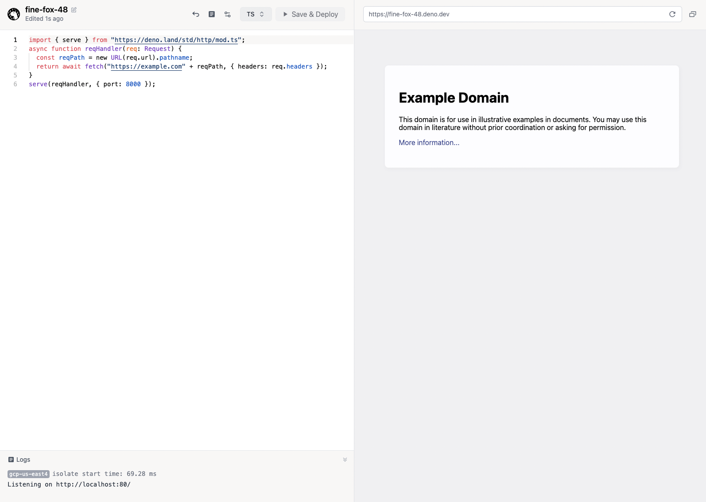

:::info 旧版文档

您正在查看 Deno Deploy Classic 的旧版文档。我们建议迁移到新的
<a href="/deploy/">Deno Deploy</a> 平台。

:::

本快速入门将介绍如何部署一个小型的中间件，它反向代理另一个服务器（在这个例子中是 example.com）。有关常见中间件功能的其他示例，请参见
[示例画廊](../tutorials/index.md)。

## **步骤 1：** 在 Deno Deploy 上创建一个新的 Playground 项目

导航到 https://dash.deno.com/projects 并点击 "新建 Playground" 按钮。

## **步骤 2：** 通过 Playground 部署中间件代码

在下一个页面，将以下代码复制并粘贴到编辑器中。这是一个将所有请求代理到 https://example.com 的 HTTP 服务器。

```ts
async function reqHandler(req: Request) {
  const reqPath = new URL(req.url).pathname;
  return await fetch("https://example.com" + reqPath, { headers: req.headers });
}

Deno.serve(reqHandler);
```

点击 **保存并部署**。

您应该看到类似以下内容的界面：

