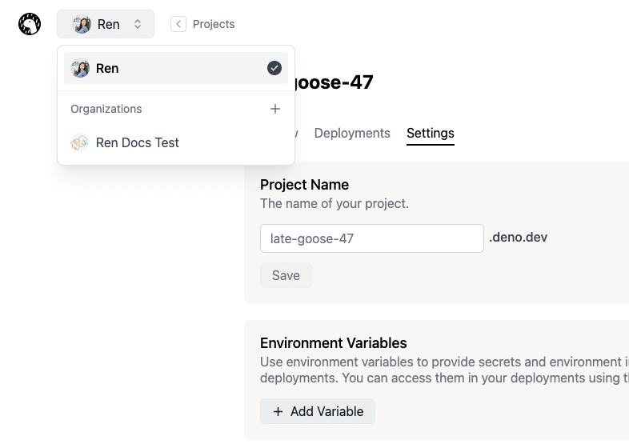

:::warning 2026年7月20日停止服务

Deno Deploy Classic 将于 2026年7月20日关闭。我们建议迁移到新的 <a href="/deploy/">Deno Deploy</a> 平台。详情请参阅 <a href="/deploy/migration_guide/">迁移指南</a>。

:::

**组织** 允许您与其他用户协作。在一个组织中创建的项目对该组织的所有成员都是可访问的。用户应首先注册 Deno Deploy Classic，然后才能被添加到组织中。

目前，所有组织成员都拥有对组织的完全访问权限。他们可以添加/移除成员，并创建/删除/修改该组织中的所有项目。

### 创建组织

1. 在您的 Classic 控制台上，点击屏幕左上角导航栏中的组织下拉菜单。
   
2. 选择 **组织 +**。
3. 输入您的组织名称，然后点击 **创建**。

### 添加成员

1. 在屏幕左上角导航栏中的组织下拉菜单中选择所需的组织。
2. 点击 **成员** 图标按钮。
3. 在 **成员** 面板下，点击 **+ 邀请成员**。
   > **注意：** 用户应首先使用
   > [此链接](https://dash.deno.com/signin) 在 Deno Deploy Classic 注册，之后您才能邀请他们。
4. 输入用户的 GitHub 用户名，然后点击 **邀请**。

Deno Deploy Classic 会向用户发送邀请邮件。用户可以选择接受或拒绝邀请。一旦接受，用户将被添加到您的组织中并在成员面板中显示。

待处理的邀请将在 **邀请** 面板中显示。您可以通过点击待处理邀请旁边的删除图标来撤销待处理的邀请。

### 移除成员

1. 在屏幕左上角导航栏中的组织下拉菜单中选择所需的组织。
2. 点击 **成员** 图标按钮。
3. 在 **成员** 面板中，点击要移除的用户旁边的删除按钮。