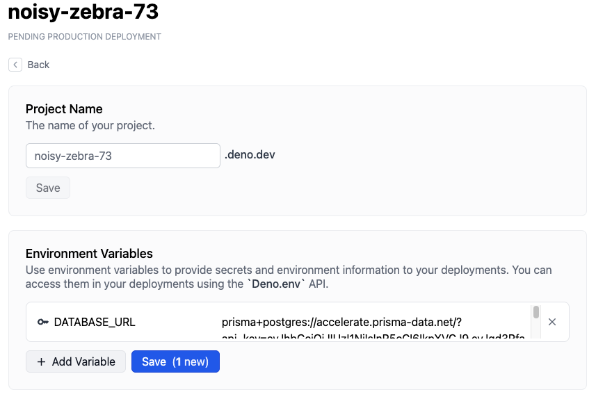

:::warning 2026 年 7 月 20 日停止服务

Deno Deploy Classic 将于 2026 年 7 月 20 日关闭。我们建议迁移到新的 <a href="/deploy/">Deno Deploy</a> 平台。详情请参阅 <a href="/deploy/migration_guide/">迁移指南</a>。

:::

本教程介绍如何从部署在 Deno Deploy 上的应用程序连接到 Prisma Postgres 数据库。

## 设置 Postgres

为你的 Prisma 项目设置 Prisma Postgre 数据库有几种方法。本指南涵盖最常见的几种方式。

### 方法 1：使用 Prisma CLI

运行以下命令，用数据库初始化一个新的 Prisma 项目：

```bash
npx prisma init --db
```

这会提示你选择偏好的区域和数据库名称。完成后，你会在 `.env` 文件中找到 `DATABASE_URL` 连接字符串。

### 方法 2：使用 `npx create-db`

或者，你也可以使用专门的数据库创建工具：

```bash
npx create-db@latest
```

该命令会为你提供两条指向同一数据库的连接字符串：

**Prisma ORM 优化连接字符串：**

```txt
prisma+postgres://accelerate.prisma-data.net/?api_key=<api_key>
```

**标准 Prisma Postgres 连接字符串：**

```txt
postgresql://<username>:<password>@db.prisma.io:5432/postgres
```

为了保留通过 `npx create-db` 创建的数据库，你必须完成认领流程。可以通过终端中提供的认领链接来完成。

Prisma ORM 优化连接字符串（`prisma+postgres://`）只能与 Prisma ORM 一起使用，而标准 Prisma Postgre 连接字符串可用于其他数据库工具和库。

## 在 Deno Deploy 中创建项目

接下来，让我们在 Deno Deploy Classic 中创建一个项目，并设置所需的环境变量：

1. 访问 [https://dash.deno.com/new](https://dash.deno.com/new)（如果你还没有登录，请使用 GitHub 登录），然后在 **部署你自己的代码（Deploy your own code）** 下点击 **创建一个空项目（Create an empty project）**。
2. 现在点击项目页面上的 **设置（Settings）** 按钮。
3. 导航到 **环境变量（Environment Variables）** 部分，并添加以下密钥。

- `DATABASE_URL` - 其值应设置为你在上一步保存的连接字符串。



## 编写连接到 Postgres 的代码

既然数据库已经设置好了，我们来创建一个使用 Prisma ORM 连接到 Prisma Postgres 数据库的简单应用。

### 1. 安装依赖

首先，安装所需的依赖项：

```bash
deno install npm:@prisma/client
deno install npm:@prisma/extension-accelerate
deno install npm:dotenv-cli
```

:::note

之所以需要 `dotenv-cli` 包，是因为 Prisma Client 默认不会在 Deno 上读取 `.env` 文件。

:::

### 2. 创建数据库模式

配置好数据库连接后，你现在可以将数据模型应用到数据库中：

```bash
deno run -A npm:prisma migrate dev --name init
```

该命令会创建一个新的 SQL 迁移文件，并将其应用到你的数据库上。

### 3. 更新你的 Prisma schema

编辑你的 `prisma/schema.prisma` 文件，定义一个 `Log` 模型并为 Deno 进行配置：

```ts
generator client {
  provider = "prisma-client"
  output   = "../generated/prisma"
  runtime  = "deno"
}

datasource db {
  provider = "postgresql"
  url      = env("DATABASE_URL")
}

model Log {
  id      Int    @id @default(autoincrement())
  level   Level
  message String
  meta    Json
}

enum Level {
  Info
  Warn
  Error
}
```

### 4. 创建你的应用程序

在项目根目录中创建 `index.ts`，内容如下：

```typescript
import { serve } from "https://deno.land/std@0.140.0/http/server.ts";
import { withAccelerate } from "npm:@prisma/extension-accelerate";
import { PrismaClient } from "./generated/prisma/client.ts";

const prisma = new PrismaClient().$extends(withAccelerate());

async function handler(request: Request) {
  // 忽略对 /favicon.ico 的请求：
  const url = new URL(request.url);
  if (url.pathname === "/favicon.ico") {
    return new Response(null, { status: 204 });
  }

  const log = await prisma.log.create({
    data: {
      level: "Info",
      message: `${request.method} ${request.url}`,
      meta: {
        headers: JSON.stringify(request.headers),
      },
    },
  });
  const body = JSON.stringify(log, null, 2);
  return new Response(body, {
    headers: { "content-type": "application/json; charset=utf-8" },
  });
}

serve(handler);
```

### 4. 在本地测试你的应用程序

在本地启动你的应用程序以测试数据库连接：

```bash
npx dotenv -- deno run -A ./index.ts
```

在浏览器中访问 `http://localhost:8000`。每个请求都会在你的数据库中创建一条新的日志记录，并以 JSON 形式返回日志数据。

## 将应用部署到 Deno Deploy Classic

完成应用程序编写后，你可以将其部署到 Deno Deploy Classic。

要这样做，请返回到你的项目页面 `https://dash.deno.com/projects/<project-name>`。

你应该会看到几个部署选项：

- [GitHub 集成](ci_github)
- [`deployctl`](./deployctl.md)
  ```sh
  deployctl deploy --project=<project-name> <application-file-name>
  ```

除非你想添加构建步骤，否则我们建议你选择 GitHub 集成。

有关在 Deno Deploy Classic 上部署的不同方式以及不同配置选项的更多详细信息，请阅读[这里](how-to-deploy)。
