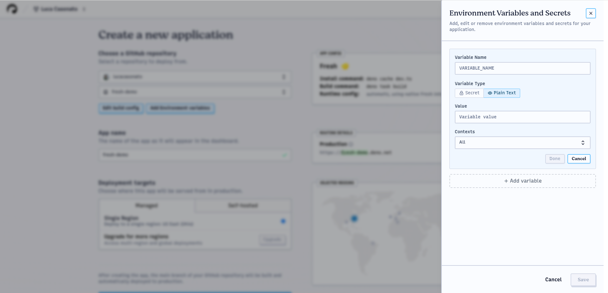

:::info

您正在查看 Deno DeployEA 的文档。想要查看 Deploy Classic 文档吗？[在这里查看](/deploy/)。

:::

:::note

Deno DeployEA 处于私测阶段。要使用 Deno Deploy
EA，您必须通过
[Deploy Classic 账户设置页面](https://dash.deno.com/account#early-access)加入早期访问计划。

:::

## 创建组织

开始使用 Deno DeployEA：

1. 访问 [app.deno.com](http://app.deno.com)
2. 创建一个组织：

注意，您不能使用与 Deploy Classic 中已存在项目相同的 slug 来创建组织。组织名称和 slug 创建后不可更改。

## 创建应用

创建组织后，系统会跳转至组织应用页面，展示您所有的应用并可访问组织设置及自定义域名。

要创建应用，请点击 `+ New App` 按钮：

应用是一个单一部署的 Web 服务，拥有构建配置、构建历史、环境变量、附加自定义域名、关联的 GitHub 仓库等。

## 选择仓库

1. 选择您的应用对应的 GitHub 仓库：

如果您的仓库未显示，点击 `Add another GitHub account` 或 `Configure GitHub App permissions` 按钮，授权 Deno Deploy GitHub 应用访问您的仓库。

> ⏳ 目前尚不支持 Mono-repos（应用位于仓库子目录中的多仓库结构）。

## 配置您的应用

Deno DeployEA 会自动尝试检测您的应用类型并配置相应的构建设置。您可以在 `App Config` 框中查看检测到的配置：

要修改配置，请点击 `Edit build config`。

## 配置构建

在构建配置抽屉中，您可以自定义：

### 框架预设

选择您的框架，或者如果使用自定义配置，则选择 `No Preset`。

### 安装命令

安装依赖的命令（例如 `npm install`、`deno install`）。如果是没有 `package.json` 的 Deno 应用此项可留空。

### 构建命令

用于编译/打包应用的命令（例如 `next build`、`deno task build`）。如果您的应用不需要构建，可留空。

### 运行时配置

对于大多数框架，此处无需配置，Deno DeployEA 会根据框架预设自动确定最优的运行时配置。若未配置框架，您可以在此选择应用是需要针对每个请求执行服务端代码的 `Dynamic` 应用（如 API 服务、服务端渲染应用等），还是仅由一组静态文件组成的 `Static` 应用。

### 动态入口文件

启动应用时应执行的 JavaScript 或 TypeScript 文件。这个路径应与您本地通过 `deno run` 或 `node` 启动应用时传入的路径相同，且相对于工作目录。

### 动态参数

启动时传递给应用的额外命令行参数（入口文件后），这些参数传递给应用而非 Deno 本身。

### 静态目录

工作目录中存放静态文件的目录，例如 `dist`、`_site` 或 `.output`。

### 单页应用模式

应用是否为单页应用（SPA），当静态目录中不存在路径对应文件时，是否应返回根目录 `index.html` 而非 404 页面。

关闭抽屉即保存设置。

### 环境变量

添加环境变量的方法：

1. 点击 `Add/Edit environment variables`
2. 点击抽屉中的 `+ Add variable`
3. 输入变量名称和数值
4. 选择其为普通变量还是密钥
5. 选择其可用的上下文环境：
   - **Production**：针对生产域名的请求
   - **Development**：针对预览/分支域名的请求
6. 点击 `Save` 以应用更改

## 构建并部署您的应用

1. 点击 `Create App` 创建应用并启动首次构建。
2. 通过实时日志查看构建进度：

构建日志分为以下阶段：

- **Prepare（准备）**：克隆仓库并恢复缓存
- **Install（安装）**：执行安装命令和框架特定设置
- **Build（构建）**：执行构建命令并生成部署产物
- **Warm up（预热）**：测试部署，通过请求确认应用正常启动
- **Route（部署）**：将构建版本部署至全球节点

您可以通过界面左上角按钮取消构建，失败时也可从此处重新启动构建。

构建完成后，右上角显示预览 URL，下方列出构建所部署的所有时间线。

## 监控您的应用程序

部署完成后，您可以使用监控工具来观察您的应用：

### 日志

浏览应用日志，支持通过上下文、版本和文本内容筛选：

使用搜索栏过滤日志（如 `context:production`、`revision:<id>`）。时间选择器调整日志显示区间。

当日志关联到追踪时，您会看到 “查看跟踪” 按钮，点击即可查看追踪详情。

### 跟踪

查看请求追踪及详细的时间信息：

点击任意追踪打开带有瀑布流视图的追踪详情页，展示所有跨度信息：

追踪视图包括：

- 跨度时间线及持续时长
- 跨度详情及属性
- 在跨度期间产生日志的信息

要保存环境变量，请点击保存按钮。您也可以重新打开抽屉编辑或删除已有环境变量。

您还可以在此页面编辑应用名称，选择应用服务的区域。

## 构建并部署您的应用（重复部分）

最后，您可以点击 `Create App` 按钮创建应用，系统将立即触发首次构建：

构建页面实时显示多阶段的构建日志：

- **Prepare（准备）**：克隆 GitHub 仓库与恢复缓存
- **Install（安装）**：执行安装命令及框架预安装步骤
- **Build（构建）**：执行构建命令及框架预设操作，为部署生成产物
- **Warm up（预热）**：向部署预览 URL 发送请求，保证应用正常启动。此处显示的日志为运行时日志，不是构建日志。
- **Route（部署）**：Deno Deploy 将新版本推送到全球所有区域

左上角有取消构建按钮，失败时也可重新启动。

完成后右上角显示预览 URL，及构建版本所部署所有时间线（如 `Production` 或 `Git Branch`）。

您可查看构建触发方式：  
- `manual action` 表示手动触发  
- `GitHub repo` 表示通过 GitHub 集成触发

可通过预览 URL 或时间线列表中的其他 URL 访问您的应用。

## 监控您的应用程序（重复部分）

访问应用后，您可查看遥测信息，包括日志和追踪数据，通过左侧栏访问对应页面。

### 日志

日志页面显示项目中的最近所有日志。默认显示生产和开发环境日志，可通过顶部筛选或搜索栏限制显示内容，例如输入 `context:production` 过滤生产环境日志，`revision:<id>` 过滤特定版本。

支持全文搜索，仅匹配日志中写入文本（不区分大小写）。

默认显示最近一小时日志，通过右上角时间选择器调整时间范围，时间戳显示按选择器时区。

日志行右侧出现“查看跟踪”按钮，点击后可查看该日志关联的追踪详情。

### 跟踪

跟踪页面显示项目中的最新追踪，默认展示所有环境的追踪，通过顶部筛选和搜索限制显示范围，例如 `context:production` 仅显示生产环境追踪，`revision:<id>` 筛选特定版本。

列表包括所有传入 HTTP 请求追踪，显示请求路径和耗时（毫秒）。点击追踪项打开详情视图，显示包含的全部跨度和日志。

每个跨度包括持续时间、名称、开始和结束时间，以及记录的属性。点击时间线上跨度即可在底部摘要面板查看详细信息。

对应跨度的日志内容显示在底部“日志”标签页，切换跨度时日志内容也会随之更新。