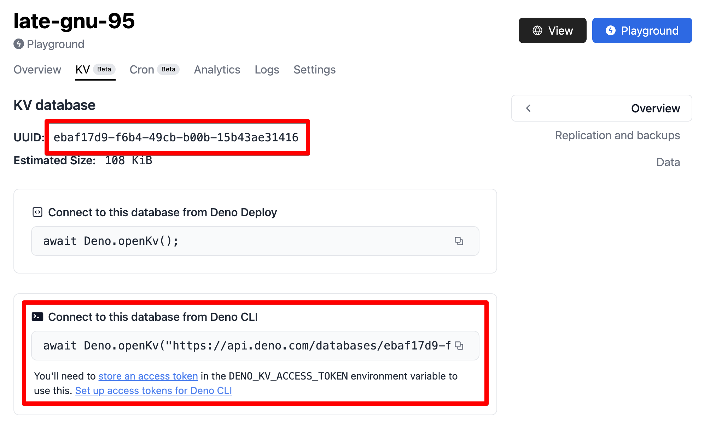

在 Node.js 中连接 Deno KV 数据库可以通过我们的
[官方客户端库在 npm 上](https://www.npmjs.com/package/@deno/kv)进行支持。您可以在下面找到此选项的使用说明。

## 安装和使用

使用您喜欢的 npm 客户端通过以下命令之一来安装 Node.js 的客户端库。

<deno-tabs group-id="npm-client">
<deno-tab value="npm" label="npm" default>

```sh
npm install @deno/kv
```

</deno-tab>
<deno-tab value="pnpm" label="pnpm">

```sh
pnpm add @deno/kv
```

</deno-tab>
<deno-tab value="yarn" label="yarn">

```sh
yarn add @deno/kv
```

</deno-tab>
</deno-tabs>

一旦您将包添加到 Node 项目中，就可以导入 `openKv` 函数（支持 ESM `import` 和 CJS `require` 基于的用法）：

```js
import { openKv } from "@deno/kv";

// 连接到一个 KV 实例
const kv = await openKv("<KV 连接 URL>");

// 写入一些数据
await kv.set(["users", "alice"], { name: "Alice" });

// 读取数据
const result = await kv.get(["users", "alice"]);
console.log(result.value); // { name: "Alice" }
```

默认情况下，用于身份验证的访问令牌来自 `DENO_KV_ACCESS_TOKEN` 环境变量。您也可以明确传递它：

```js
import { openKv } from "@deno/kv";

const kv = await openKv("<KV 连接 URL>", { accessToken: myToken });
```

一旦您的 Deno KV 客户端初始化，Deno 中可用的相同 API 也可以在 Node 中使用。

## KV 连接 URL

在 Deno 之外连接到 KV 数据库需要一个
[KV Connect](https://github.com/denoland/denokv/blob/main/proto/kv-connect.md)
URL。一个在 Deno Deploy 中托管的数据库的 KV 连接 URL 将是这种格式：`https://api.deno.com/databases/<database-id>/connect`。

您项目的 `database-id` 可以在
[Deno Deploy 仪表板](https://dash.deno.com/projects)中找到，在项目的 "KV" 标签下。



## 更多信息

有关如何在 Node 中使用 Deno KV 模块的更多信息可以在项目的 [README 页面](https://www.npmjs.com/package/@deno/kv)上找到。