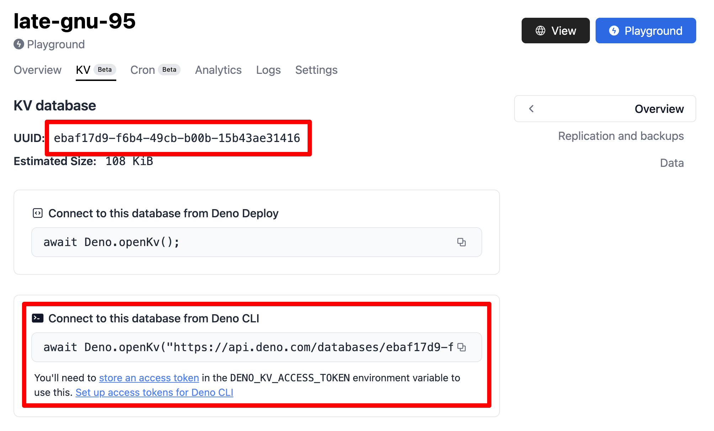

:::warning 将于 2026 年 7 月 20 日停止服务

本页面介绍如何连接到托管在
<strong>Deno Deploy Classic</strong>
（<a href="https://dash.deno.com">dash.deno.com</a>）上的 Deno KV 数据库。Deploy Classic 将于
2026 年 7 月 20 日关闭——详情请参阅
<a href="/deploy/migration_guide/">迁移指南</a>。

在新的 <a href="/deploy/">Deno Deploy</a> 平台上，KV 数据库会通过
<a href="/deploy/reference/databases/">Databases</a> 功能按应用进行配置，并可在您的应用代码中通过
<a href="/api/deno/~/Deno.openKv"><code>Deno.openKv()</code></a> 访问，无需连接 URL——请参阅
<a href="/deploy/reference/deno_kv/">Deno Deploy 上的 Deno KV</a>。当前不提供对新 Deploy KV 数据库的外部 KV Connect 访问。

:::

通过我们在 npm 上的
[官方客户端库](https://www.npmjs.com/package/@deno/kv)，可以从 Node.js 连接到托管在 Deno Deploy Classic 上的 Deno KV 数据库。下面介绍此选项的使用说明。同一个库也可以连接到任何实现了开放
[KV Connect](https://github.com/denoland/denokv/blob/main/proto/kv-connect.md)
协议的其他端点，例如自托管的 [`denokv`](https://github.com/denoland/denokv)
实例。

## 安装和使用

使用您喜欢的 npm 客户端通过以下命令之一来安装 Node.js 的客户端库。

<deno-tabs group-id="npm-client">
<deno-tab value="npm" label="npm" default>

```sh
npm install @deno/kv
```

</deno-tab>
<deno-tab value="pnpm" label="pnpm">

```sh
pnpm add @deno/kv
```

</deno-tab>
<deno-tab value="yarn" label="yarn">

```sh
yarn add @deno/kv
```

</deno-tab>
</deno-tabs>

一旦您将包添加到 Node 项目中，就可以导入 `openKv` 函数（支持 ESM `import` 和 CJS `require` 基于的用法）：

```js
import { openKv } from "@deno/kv";

// 连接到一个 KV 实例
const kv = await openKv("<KV 连接 URL>");

// 写入一些数据
await kv.set(["users", "alice"], { name: "Alice" });

// 读取数据
const result = await kv.get(["users", "alice"]);
console.log(result.value); // { name: "Alice" }
```

默认情况下，用于身份验证的访问令牌来自 `DENO_KV_ACCESS_TOKEN` 环境变量。您也可以明确传递它：

```js
import { openKv } from "@deno/kv";

const kv = await openKv("<KV 连接 URL>", { accessToken: myToken });
```

一旦您的 Deno KV 客户端初始化，Deno 中可用的相同 API 也可以在 Node 中使用。

## KV 连接 URL

在 Deno 之外连接到 KV 数据库需要一个
[KV Connect](https://github.com/denoland/denokv/blob/main/proto/kv-connect.md)
URL。托管在 Deno Deploy Classic 上的数据库的 KV Connect URL 形式如下：`https://api.deno.com/databases/<database-id>/connect`。

您项目的 `database-id` 可以在
[Deno Deploy Classic 仪表板](https://dash.deno.com)中找到，位于您项目的
“KV” 选项卡下。



## 更多信息

有关如何在 Node 中使用 Deno KV 模块的更多信息可以在项目的 [README 页面](https://www.npmjs.com/package/@deno/kv)上找到。