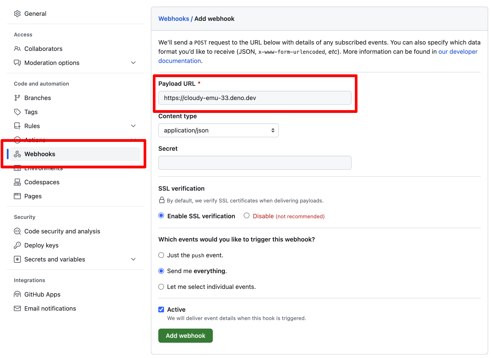

在网络应用中，通常希望将异步任务的处理（客户端不需要立即响应的任务）offload 到一个队列中。这样可以保持你的网络应用快速响应，而不是占用宝贵的资源等待长时间运行的进程完成。

一个你可能想要部署此技术的实例是[处理 webhooks](https://en.wikipedia.org/wiki/Webhook)。当收到来自不需要响应的非人类客户端的 webhook 请求时，您可以立即将该工作 offload 到一个队列中，在那里可以更有效地处理。

在本教程中，我们将向您展示如何在[处理 GitHub 仓库的 webhook 请求](https://docs.github.com/en/webhooks/about-webhooks-for-repositories)时执行此技术。

## 在 playground 中尝试

✏️
[**查看这个 playground，它实现了一个 GitHub 仓库的 webhook 处理程序**](https://dash.deno.com/playground/github-webhook-example)。

使用 Deno Deploy [playgrounds](/deploy/manual/playgrounds)，您可以立即部署自己的 GitHub webhook 处理程序，该处理程序同时使用队列和 Deno KV。我们将在稍后介绍这个代码的作用。

## 为一个仓库配置 GitHub webhooks

要尝试您刚刚在 playground 中启动的 webhook，请为您控制的 GitHub 仓库设置一个新的 webhook 配置。您可以在仓库的“设置”下找到 webhook 配置。



## 代码逐步讲解

我们的 webhook 处理程序函数相对简单——没有注释时，它总共有 23 行代码。它连接到一个 Deno KV 数据库，设置一个队列侦听器以处理传入的消息，并使用 [`Deno.serve`](https://docs.deno.com/api/deno/~/Deno.serve) 设置一个简单的服务器，该服务器响应传入的 webhook 请求。

请按照下面的注释逐步了解每个步骤在做什么。

```ts title="server.ts"
// 获取 Deno KV 数据库实例的句柄。KV 是内置于 Deno
// 运行时中的，可在本地和 Deno Deploy 上零配置访问
const kv = await Deno.openKv();

// 设置一个侦听器来处理从我们的服务器 offload 的工作。
// 在这个例子中，它只是将传入的 webhook 负载添加到 KV
// 数据库中，并带有时间戳。
kv.listenQueue(async (message) => {
  await kv.set(["github", Date.now()], message);
});

// 这是一个简单的 HTTP 服务器，将处理来自
// GitHub webhooks 的传入 POST 请求。
Deno.serve(async (req: Request) => {
  if (req.method === "POST") {
    // GitHub 将 webhook 请求作为 POST 请求发送到您的服务器。您可以
    // 配置 GitHub 以在 POST 正文中发送 JSON，您可以从
    // 请求对象解析。
    const payload = await req.json();
    await kv.enqueue(payload);
    return new Response("", { status: 200 });
  } else {
    // 如果服务器处理 GET 请求，这将列出所有记录的
    // webhook 事件，在我们的 KV 数据库中。
    const iter = kv.list<string>({ prefix: ["github"] });
    const github = [];
    for await (const res of iter) {
      github.push({
        timestamp: res.key[1],
        payload: res.value,
      });
    }
    return new Response(JSON.stringify(github, null, 2));
  }
});
```