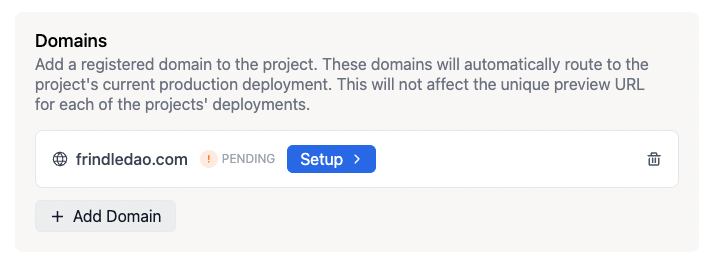
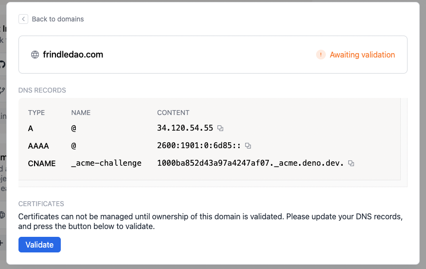
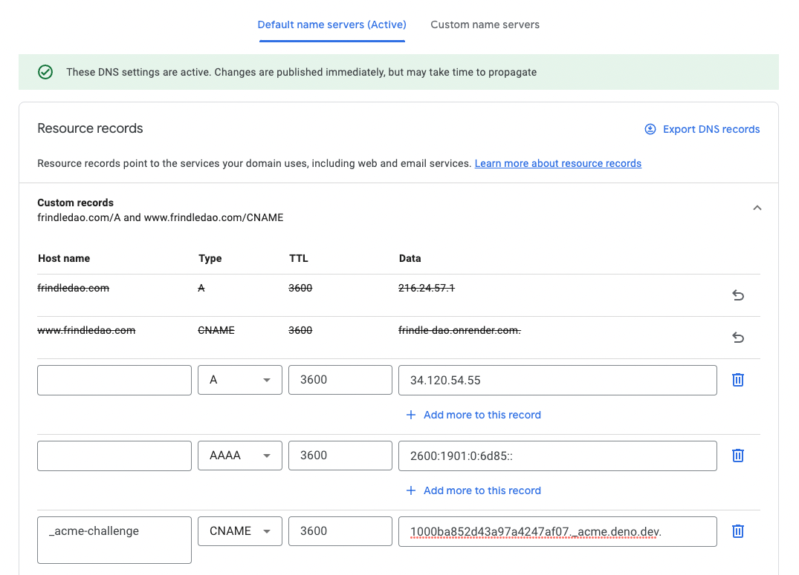
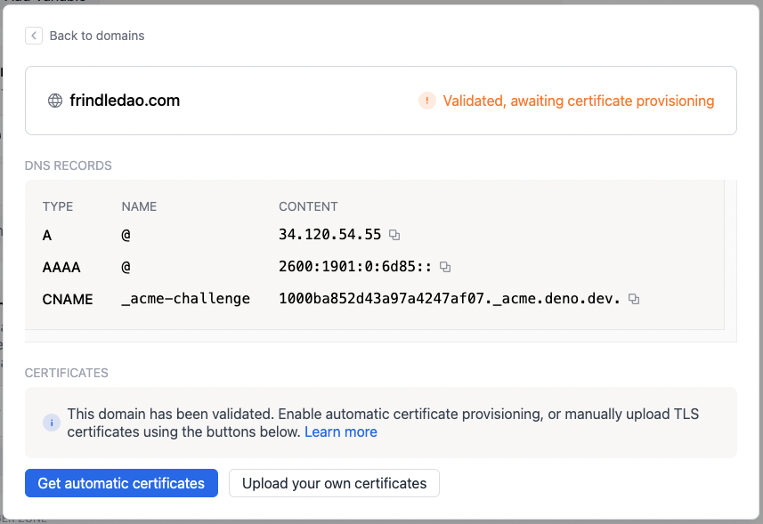
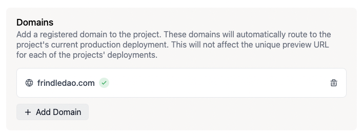

默认情况下，项目可以通过其预览URL访问，格式为 `$PROJECT_ID.deno.dev`，例如 `dead-clam-55.deno.dev`。您还可以按照下面的说明添加自定义域名。

## **步骤 1：** 在 Deno Deploy 控制面板中添加您的自定义域名

1. 在项目页面上点击 "设置" 按钮，然后从侧边栏选择 "域名"。
2. 输入您希望添加到项目中的域名，然后按 "添加"。请注意，您必须拥有要添加到该项目的域名。如果您尚未拥有域名，可以在 Google Domains、Namecheap 或 gandi.net 等域名注册商处注册一个。
   

3. 域名将被添加到域名列表中，并会显示 "设置" 标签。
4. 点击 "设置" 标签以访问域名设置页面，该页面将显示需要为您的域名创建/更新的 DNS 记录列表。
   

## **步骤 2：** 更新您的自定义域名的 DNS 记录

前往您的域名注册商的 DNS 配置面板（或您用于管理 DNS 的服务），并按照域名设置页面上的描述输入记录。

## **步骤 3：** 验证 DNS 记录是否已更新

返回 Deno Deploy 控制面板，点击域名设置页面上的 **验证** 按钮。它将检查 DNS 记录是否正确设置，如果是，将状态更新为 "已验证，等待证书配置。"

## **步骤 4：** 为您的自定义域名配置证书

此时，您有两个选择。99% 的情况下，您应该选择第一个选项。

1. 让我们自动配置一个证书，使用 Let's Encrypt。

   为此，请按 **获取自动证书** 按钮。配置 TLS 证书可能需要最多一分钟。如果您的域名指定了 CAA 记录，阻止 [Let's Encrypt](https://letsencrypt.org/) 配置证书，则可能会导致配置失败。证书将在过期前大约 30 天自动续期。当您成功颁发证书时，您将看到一个绿色复选标记，如下所示：

   

2. 手动上传证书和私钥。

   要手动上传证书链和私钥，请按 **上传您自己的证书** 按钮。系统将提示您上传证书链和私钥。证书链需要完整且有效，并且您的叶证书需要位于链的顶部。