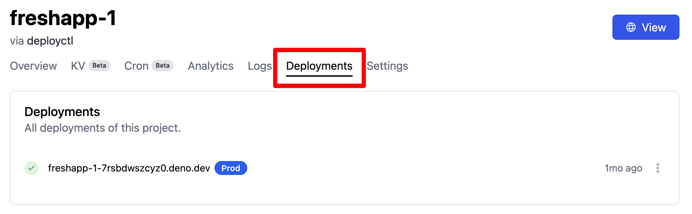
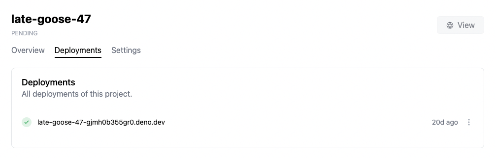
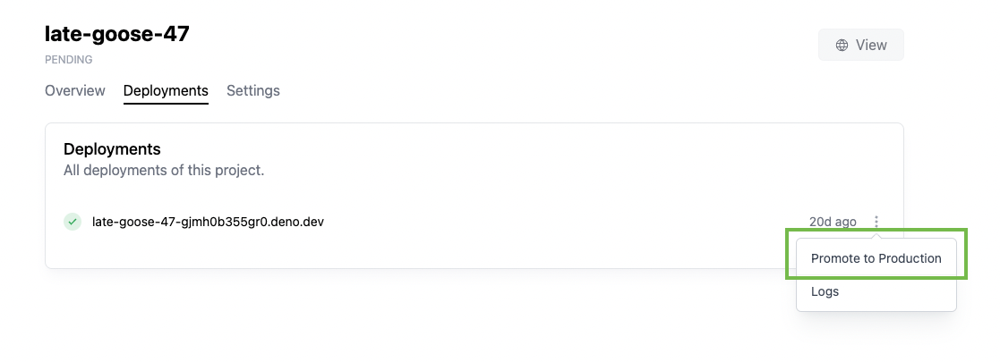

部署是运行应用程序所需的代码和环境变量的快照。可以通过
[使用 `deployctl`](./deployctl.md#deploy) 或者在配置后通过 Deploy 的 GitHub 集成自动创建新的部署。

部署在创建后是不可变的。要为应用程序部署新版本的代码，必须创建新的部署。一旦创建，部署将持续可访问。

所有可用的部署在您的项目页面的 `Deployments` 标签下列出，如下图所示。旧部署可以通过
[使用 `deployctl`](./deployctl.md#delete) 和
[通过 API](https://apidocs.deno.com/#delete-/deployments/-deploymentId-) 删除。



## 自定义域名

还可以有其他 URL 指向一个部署，比如
[自定义域名](custom-domains)。

## 分支域名

`<projectname--branchname>.deno.dev` 也受到支持。

## 生产部署与预览部署

所有部署都有一个预览 URL，可以用于查看该特定的部署。预览 URL 的格式为
`{project_name}-{deployment_id}.deno.dev`。



部署可以是生产部署或预览部署。这些部署在运行时功能上没有任何区别。唯一的区别是项目的生产部署将接收来自项目 URL（例如 `myproject.deno.dev`）和自定义域名的流量，以及指向部署的预览 URL 的流量。

## 通过 Deno Deploy UI 将预览部署提升为生产部署

可以通过 Deno Deploy UI 将预览部署“提升”为生产：

1. 导航到项目页面。
2. 点击 **Deployments** 标签。
3. 点击您想提升为生产的部署旁边的三个点，并选择 **Promote to Production**
   

将部署提升为生产是有限制的，仅限于已使用生产 KV 数据库的部署。这对于使用不同数据库进行预览和生产部署的 GitHub 部署尤其相关。部署（即使使用预览 KV 数据库的部署）始终可以使用
[the `deployctl deployments redeploy` 命令](./deployctl.md#production-domains) 重新部署到生产。

## 通过 `deployctl` 创建生产部署

如果您使用 `deployctl` 部署 Deno 代码，可以使用 `--prod` 标志直接部署到生产：

```sh
deployctl deploy --prod --project=helloworld main.ts
```