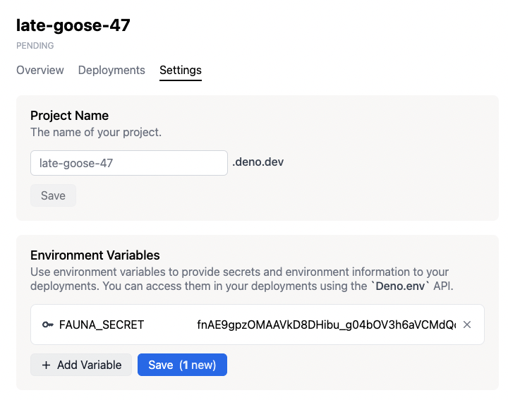

环境变量用于存储诸如web服务的访问令牌之类的值。每个部署在创建时都有一组环境变量，并且可以通过 `Deno.env` API 从代码中访问。定义部署的环境变量有两种方式：

## 项目环境变量

您可以在项目级别定义环境变量。当您创建一个部署时，它将获得在 _特定时刻_ 项目已定义的环境变量集。

为了方便起见，当您更改项目的环境变量时，当前的生产部署会 _重新部署_，创建一个新的生产部署，并附带一组新的环境变量。

:::note

部署是不可更改的，包括它们的环境变量。更改项目的环境变量不会更改现有部署的环境变量。

:::

要向您的项目添加环境变量，请点击项目页面上的 **设置** 按钮，然后从侧边栏中点击 **环境变量**。填写键/值字段，然后点击“添加”将环境变量添加到项目中。

更新现有环境变量的操作方法相同。点击“添加变量”按钮，输入您希望更新的环境变量的相同名称，并输入新值。点击“保存”按钮以完成更新。

## 部署环境变量

在使用 `deployctl` 进行部署时，可以通过 [使用 `--env` 或 `--env-file` 标志](./deployctl.md#environment-variables) 来指定环境变量，补充已有的项目环境变量。您还可以传递多个 `--env-file` 参数（例如， `--env-file=.env.one --env-file=.env.two`）以包括来自多个文件的变量。

:::note

当在单个 `.env` 文件中存在相同环境变量的多个声明时，将应用第一个出现的值。但是，如果在多个 `.env` 文件中定义了相同的变量（使用多个 `--env-file` 参数），则最后指定的文件中的值将优先。即在最后列出的 `.env` 文件中的第一个出现的值将被应用。

:::

这些环境变量将特定于正在创建的部署。

### 默认环境变量

每个部署都有以下预设环境变量，您可以从代码中访问它们。

1. `DENO_REGION`

   它包含部署运行区域的区域代码。您可以使用此变量提供区域特定的内容。

   您可以在 [区域页面](regions) 中查找区域代码。

1. `DENO_DEPLOYMENT_ID`

   它保存部署的 ID。