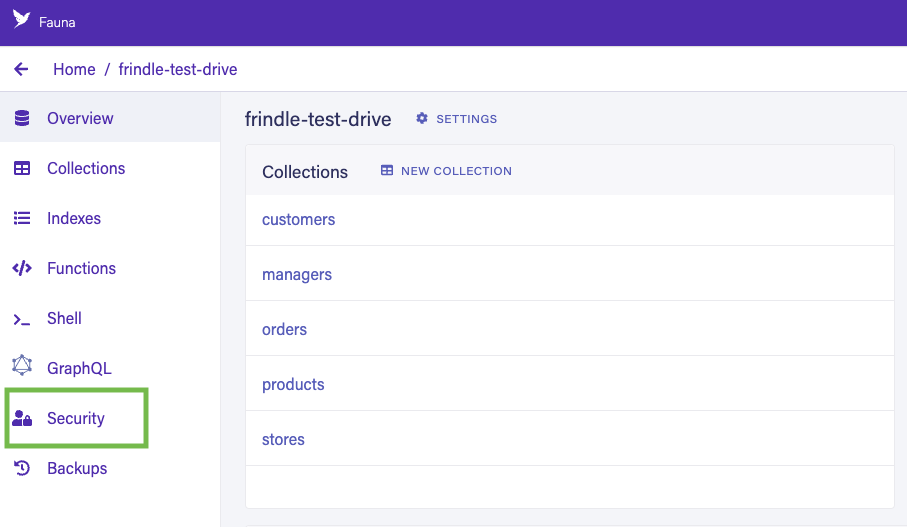

FaunaDB 自称为“现代应用程序的数据 API”。它是一个具有 GraphQL 接口的数据库，使您能够使用 GraphQL 与其交互。由于您通过 HTTP 请求进行通信，因此您无需管理连接，这非常适合无服务器应用程序。

本教程介绍如何从部署在 Deno Deploy 上的应用程序连接到 Fauna 数据库。

您可以在 [这里](../tutorials/tutorial-faunadb) 找到一个更全面的教程，构建一个基于 Fauna 的示例应用程序。

## 从 Fauna 获取凭证

我们假设您已经在 https://dashboard.fauna.com 创建了一个 Fauna 实例。

要以编程方式访问您的 Fauna 数据库，您需要生成一个凭证：

1. 点击您特定数据库中的 **Security** 部分，然后点击 **New Key**。 

2. 选择 **Server** 角色，并点击 **Save**。复制密钥。您将在下一步中需要它。

## 在 Deno Deploy 中创建项目

接下来，让我们在 Deno Deploy 上创建一个项目，并设置所需的环境变量：

1. 前往 [https://dash.deno.com/new](https://dash.deno.com/new)（如果您还没有登录，请使用 GitHub 登录）并在 **从命令行部署** 下点击 **+ 空项目**。
2. 现在点击项目页面上的 **Settings** 按钮。
3. 导航到 **环境变量** 部分并添加以下密钥。

- `FAUNA_SECRET` - 该值应为我们在前一步创建的密钥。 

## 编写连接到 Fauna 的代码

虽然在 Node 中有一个 Fauna JavaScript 驱动程序，但在 Deno 中，您应该使用 graphql 端点。

Fauna 为其数据库提供了一个 graphql 端点，并生成基本的变更，如 `create`、`update` 和 `delete`，以便用于在模式中定义的数据类型。例如，Fauna 将生成一个名为 `createQuote` 的变更，以在数据库中为数据类型 `Quote` 创建一个新引用。

要与 Fauna 交互，我们需要向其 graphql 端点发送一个 POST 请求，并使用适当的查询和参数来获取数据。让我们构建一个处理这些事情的通用函数。

```javascript
import query from "https://esm.sh/faunadb@4.7.1";
import Client from "https://esm.sh/faunadb@4.7.1";

// 从环境中获取密钥。
const token = Deno.env.get("FAUNA_SECRET");
if (!token) {
  throw new Error("环境变量 FAUNA_SECRET 未设置");
}

var client = new Client.Client({
  secret: token,
  // 如果您使用的是区域组，请调整端点
  endpoint: "https://db.fauna.com/",
});
// HEAD
client.query(query.ToDate("2018-06-06"));
//
client
  .query(query.ToDate("2018-06-06"))
  //1e2f378 (添加更多页面)
  .then(function (res) {
    console.log("结果:", res);
  })
  .catch(function (err) {
    console.log("错误:", err);
  });
```

## 部署应用程序到 Deno Deploy

完成应用程序的编写后，您可以将其部署到 Deno Deploy。

为此，请返回到您的项目页面 `https://dash.deno.com/projects/<project-name>`。

您应该会看到几个部署选项：

- [Github 集成](ci_github)
- [`deployctl`](./deployctl.md)
  ```sh
  deployctl deploy --project=<project-name> <application-file-name>
  ```

除非您想添加构建步骤，否则我们建议您选择 Github 集成。

有关在 Deno Deploy 上以不同方式部署和不同配置选项的更多详细信息，请阅读 [这里](how-to-deploy)。