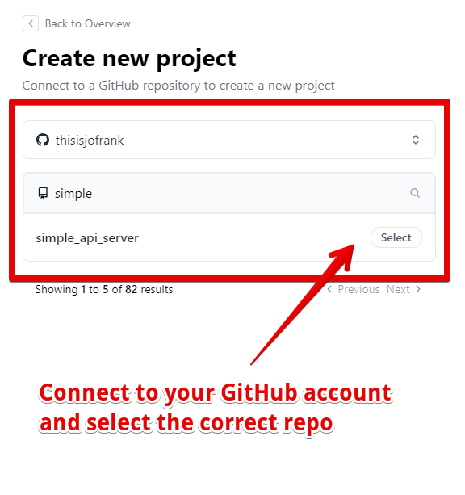
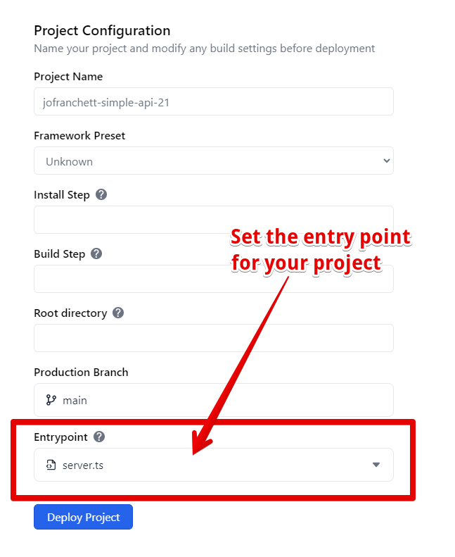
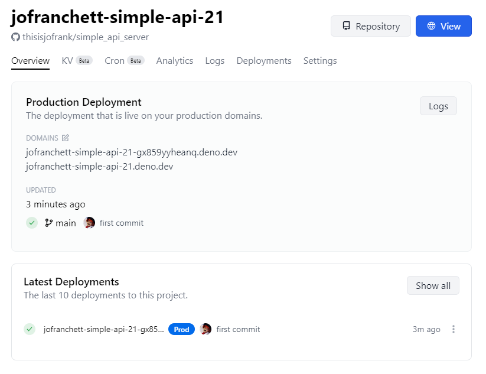

Deno 非常适合创建简单、轻量的 API 服务器。在本教程中学习如何使用 Deno Deploy 创建和部署一个。

## 创建本地 API 服务器

在终端中，创建一个名为 `server.ts` 的文件。

```shell
touch server.ts
```

我们将实现一个简单的链接缩短服务，使用
[Deno KV 数据库](/deploy/kv/manual)。

```ts title="server.ts"
const kv = await Deno.openKv();

Deno.serve(async (request: Request) => {
  // 创建短链接
  if (request.method == "POST") {
    const body = await request.text();
    const { slug, url } = JSON.parse(body);
    const result = await kv.set(["links", slug], url);
    return new Response(JSON.stringify(result));
  }

  // 重定向短链接
  const slug = request.url.split("/").pop() || "";
  const url = (await kv.get(["links", slug])).value as string;
  if (url) {
    return Response.redirect(url, 301);
  } else {
    const m = !slug ? "请提供一个短链接标识符。" : `短链接标识符 "${slug}" 未找到`;
    return new Response(m, { status: 404 });
  }
});
```

您可以使用以下命令在您的机器上运行此服务器：

```shell
deno run -A --unstable-kv server.ts
```

该服务器将响应 HTTP `GET` 和 `POST` 请求。`POST` 处理程序期望在请求正文中接收一个包含 `slug` 和 `url` 属性的 JSON 文档。`slug` 是短 URL 组件，`url` 是您希望重定向到的完整 URL。

这是使用 cURL 访问此 API 端点的示例：

```shell
curl --header "Content-Type: application/json" \
  --request POST \
  --data '{"url":"https://docs.deno.com/runtime/manual","slug":"denodocs"}' \
  http://localhost:8000/
```

作为响应，服务器应该向您发送 JSON，包含表示 `set` 操作结果的 KV 数据：

```json
{ "ok": true, "versionstamp": "00000000000000060000" }
```

对我们服务器的 `GET` 请求将把 URL 短链接作为路径参数并重定向到提供的 URL。您可以在浏览器中访问此 URL，或者发出另一个 cURL 请求查看其实际效果！

```shell
curl -v http://localhost:8000/denodocs
```

现在我们已经有了一个 API 服务器，让我们将其推送到一个 GitHub 存储库，稍后我们将链接到 Deno Deploy。

## 为您的应用创建一个 GitHub 存储库

登录到 [GitHub](https://github.com) 并
[创建一个新的存储库](https://docs.github.com/en/get-started/quickstart/create-a-repo)。
您可以暂时跳过添加 README 或其他文件 - 一个空存储库就足够我们的目的。

在您创建 API 服务器的文件夹中，按顺序运行以下命令初始化一个本地 git 存储库。请务必将 `your_username` 和 `your_repo_name` 替换为相应的值。

```sh
echo "# 我的 Deno 链接缩短器" >> README.md
git init
git add .
git commit -m "第一次提交"
git branch -M main
git remote add origin https://github.com/your_username/your_repo_name.git
git push -u origin main
```

您现在应该有一个包含 `server.ts` 文件的 GitHub 存储库，如
[这个示例存储库](https://github.com/kwhinnery/simple_api_server)所示。现在您准备好在 Deno Deploy 上导入并运行此应用程序。

## 导入并部署您的项目

接下来，在 [Deno Deploy](https://dash.deno.com) 上注册一个账户，并
[创建一个新项目](https://dash.deno.com/new_project)。连接您的 GitHub 账户，并选择我们刚才创建的存储库。



配置应该如下所示：



点击“部署项目”按钮。部署完成后，您的链接缩短服务将在 Deno Deploy 上上线！



## 测试您的新链接缩短器

在没有任何额外配置的情况下（Deno KV 在 Deploy 上正常工作），您的应用程序应该和在本地机器上一样运行。

您可以使用 `POST` 处理程序添加新的链接，如之前所做的那样。只需将 `localhost` URL 替换为您在 Deno Deploy 上的实际生产 URL：

```shell
curl --header "Content-Type: application/json" \
  --request POST \
  --data '{"url":"https://docs.deno.com/runtime/","slug":"denodocs"}' \
  https://your-deno-project-url-here.deno.dev/
```

同样，您可以在浏览器中访问您的缩短 URL，或者使用 cURL 命令查看重定向的返回：

```shell
curl -v https://your-deno-project-url-here.deno.dev/denodocs
```

如果您喜欢这个项目，接下来可以查看更高级的 Web 框架，如 [Fresh](https://fresh.deno.dev)，或者了解更多关于 [Deno KV 的内容](/deploy/kv/manual)。恭喜您成功部署了简单的 API 服务器！