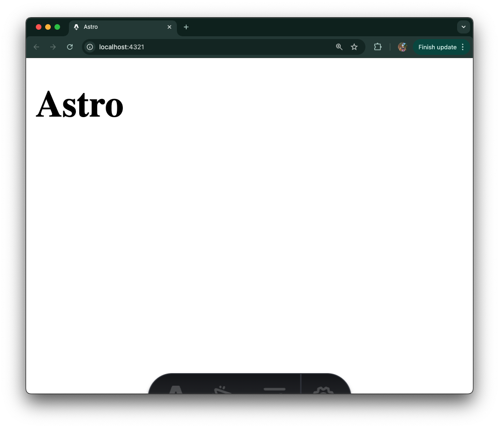
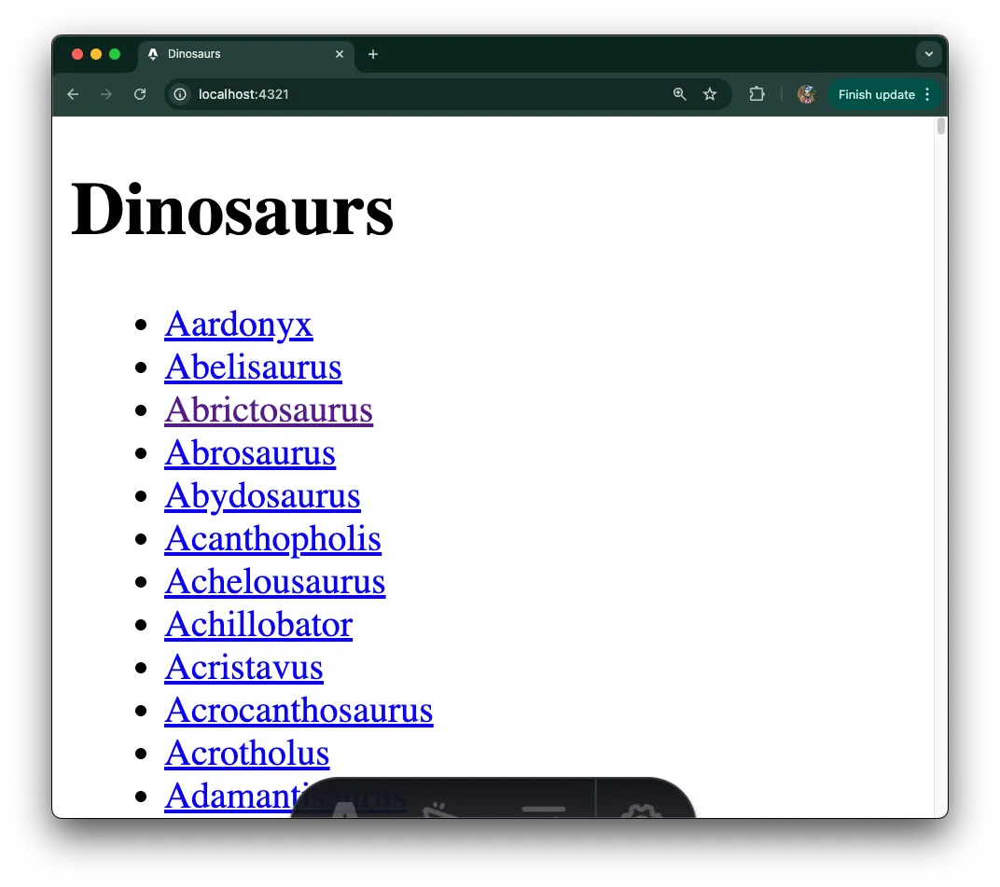
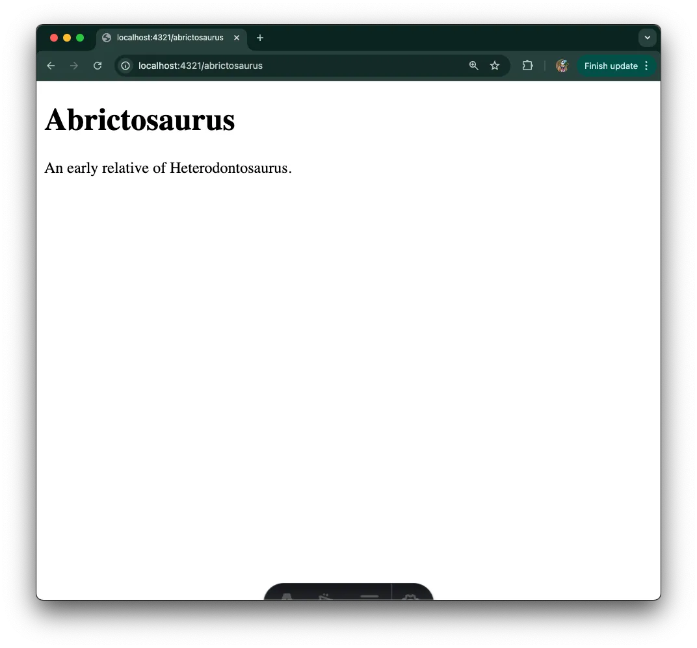

[Astro](https://astro.build/) 是一个专注于内容中心网站的现代网页框架，它采用岛屿架构，并默认不向客户端发送任何 JavaScript。随着最近 [Deno 2](https://deno.com/2) 的发布，现在
[与 Node 和 npm 向后兼容](https://deno.com/blog/v2.0#backwards-compatible-forward-thinking)，使用 Astro 和 Deno 的体验得到了提升。

我们将介绍如何使用 Deno 构建一个简单的 Astro 项目：

- [创建一个 Astro 项目](#scaffold-an-astro-project)
- [更新索引页面](#update-index-page-to-list-all-dinosaurs)
- [添加动态 SSR 页面](#add-a-dynamic-ssr-page)
- [接下来是什么？](#whats-next)

可以直接跳转到 [源代码](https://github.com/denoland/examples/tree/main/with-astro) 或在下面继续阅读！

## 创建一个 Astro 项目

Astro 提供了一个 CLI 工具，可以快速创建一个新的 Astro 项目。在终端中运行命令 `deno init --npm astro@latest` 来使用 Deno 创建一个新的 Astro 项目。对于本教程，我们将选择“空”模板，以便从头开始，并跳过安装依赖项，以便稍后使用 Deno 安装它们：

```jsx
deno -A npm:create-astro@latest

 astro   启动序列已启动。

   dir   我们应该在哪里创建您的新项目？
         ./dino-app

  tmpl   您希望如何开始您的新项目？
         空

    ts   您打算编写 TypeScript 吗？
         是

   use   TypeScript 的严格程度应该是多少？
         严格

  deps   安装依赖项？
         否
      ◼  没问题！
         请记得在设置后安装依赖项。

   git   初始化一个新的 git 代码库？
         是

      ✔  项目已初始化！
         ■ 模板已复制
         ■ TypeScript 已自定义
         ■ Git 已初始化

  next   起飞确认。探索您的项目！

  使用 cd ./dino-app 进入您的项目目录
  运行 npm run dev 启动开发服务器。CTRL+C 停止。
  使用 astro add 添加像 react 或 tailwind 这样的框架。

 有问题？加入我们 https://astro.build/chat

╭─────╮  休斯顿：
│ ◠ ◡ ◠  祝你好运，宇航员！ 🚀
╰──🍫─╯
```

从 Deno 2 开始，[Deno 还可以使用新的 `deno install` 命令安装包](https://deno.com/blog/v2.0#deno-is-now-a-package-manager-with-deno-install)。所以我们执行
[`deno install`](https://docs.deno.com/runtime/reference/cli/install/) 并使用 `--allow-scripts` 标志来执行任何 npm 生命周期脚本：

```bash
deno install --allow-scripts
```

要查看我们有哪些命令，请运行 `deno task`：

```bash
deno task
可用任务：
- dev (package.json)
    astro dev
- start (package.json)
    astro dev
- build (package.json)
    astro check && astro build
- preview (package.json)
    astro preview
- astro (package.json)
    astro
```

我们可以使用 `deno task dev` 启动 Astro 服务器：



## 更新索引页面以列出所有恐龙

我们的应用将显示有关各种恐龙的事实。我们要创建的第一页是索引页面，它将列出我们“数据库”中所有恐龙的链接。

首先，让我们创建将用于应用中的数据。在本示例中，我们将在一个 json 文件中硬编码数据，但您可以在实践中使用任何数据存储。我们将在项目根目录下创建一个 `data` 文件夹，然后创建一个 `dinosaurs.json` 文件，内容为
[此文本](https://github.com/denoland/tutorial-with-react/blob/main/api/data.json)。

> ⚠️️ 在本教程中，我们硬编码了数据。但您可以连接到
> [各种数据库](https://docs.deno.com/runtime/tutorials/connecting_to_databases/)
> 以及
> [甚至使用 Prisma 等 ORM](https://docs.deno.com/runtime/tutorials/how_to_with_npm/prisma/)
> 与 Deno。

一旦我们有了数据，就让我们创建一个列出所有恐龙的索引页面。在 `./src/pages/index.astro` 页面中，写入以下内容：

```jsx
---
import data from "../../data/dinosaurs.json";
---

<html lang="en">
	<head>
		<meta charset="utf-8" />
		<link rel="icon" type="image/svg+xml" href="/favicon.svg" />
		<meta name="viewport" content="width=device-width" />
		<meta name="generator" content={Astro.generator} />
		<title>恐龙</title>
	</head>
	<body>
		<h1>恐龙</h1>
		<ul>
			{data.map((dinosaur) => (
				<li>
					<a href={`/${dinosaur.name.toLowerCase()}`}>{ dinosaur.name }</a>
				</li>
			))}
		</ul>
	</body>
</html>
```

让我们使用 `deno task dev` 启动服务器，并将浏览器指向 `localhost:4321`：



太棒了！但是当您点击一个恐龙时，它会出现 404 错误。让我们修复它。

## 添加动态 SSR 页面

我们的应用将显示有关各种恐龙的事实。为此，我们将创建一个动态服务器端渲染（“SSR”）页面，
[这为最终用户提供了更好的性能，同时改善了您的页面 SEO](https://deno.com/blog/the-future-and-past-is-server-side-rendering)。

接下来，让我们在 `/src/pages/` 下创建一个名为 `[dinosaur].astro` 的新文件。在文件顶部，我们将添加一些逻辑，以从我们的硬编码数据源中提取数据，并将其与从 URL 路径中设置的 `dinosaur` 参数进行过滤。
在文件底部，我们将渲染数据。您的文件应该如下所示：

```jsx
---
import data from "../../data/dinosaurs.json";
const { dinosaur } = Astro.params;
const dinosaurObj = data.find((item) => item.name.toLowerCase() === dinosaur);
if (!dinosaurObj) return Astro.redirect("/404");
const { name, description } = dinosaurObj;
---

<h1>{ name }</h1>

<p>
    { description }
</p>
```

> ⚠️️ 当前
> [Deno 语言服务器](https://docs.deno.com/runtime/reference/lsp_integration/)
> 不支持 `.astro` 文件，因此您可能会遇到虚假的红色波浪线。我们正在努力改进这个体验。

让我们使用 `deno task dev` 运行它，并将浏览器指向 `localhost:4321/abrictosaurus`：



它工作正常！

## 接下来是什么

我们希望这个教程能让您对如何开始使用 Astro 和 Deno 构建有一个良好的了解。您可以了解更多关于 Astro 的信息，以及
[他们渐进式的网站构建方法](https://docs.astro.build/en/getting-started/)。如果您有兴趣更换我们硬编码的数据存储，这里有一些关于
[使用 Deno 连接数据库](https://docs.deno.com/runtime/tutorials/connecting_to_databases/) 的资源，包括
[Planetscale](https://docs.deno.com/runtime/tutorials/how_to_with_npm/planetscale/),
[Redis](https://docs.deno.com/runtime/tutorials/how_to_with_npm/redis/)等资源。或者您可以学习如何
[将您的 Astro 项目部署到 Deno Deploy](https://deno.com/blog/astro-on-deno)，或者按照这些指南了解如何将 Deno 自托管到
[AWS](https://docs.deno.com/runtime/tutorials/aws_lightsail/),
[Digital Ocean](https://docs.deno.com/runtime/tutorials/digital_ocean/)，以及
[Google Cloud Run](https://docs.deno.com/runtime/tutorials/google_cloud_run/)。