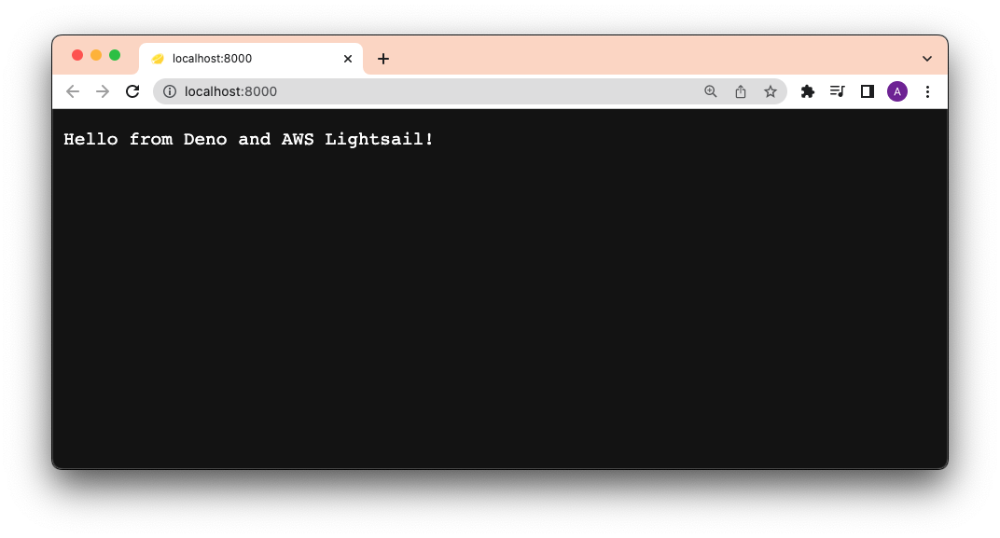
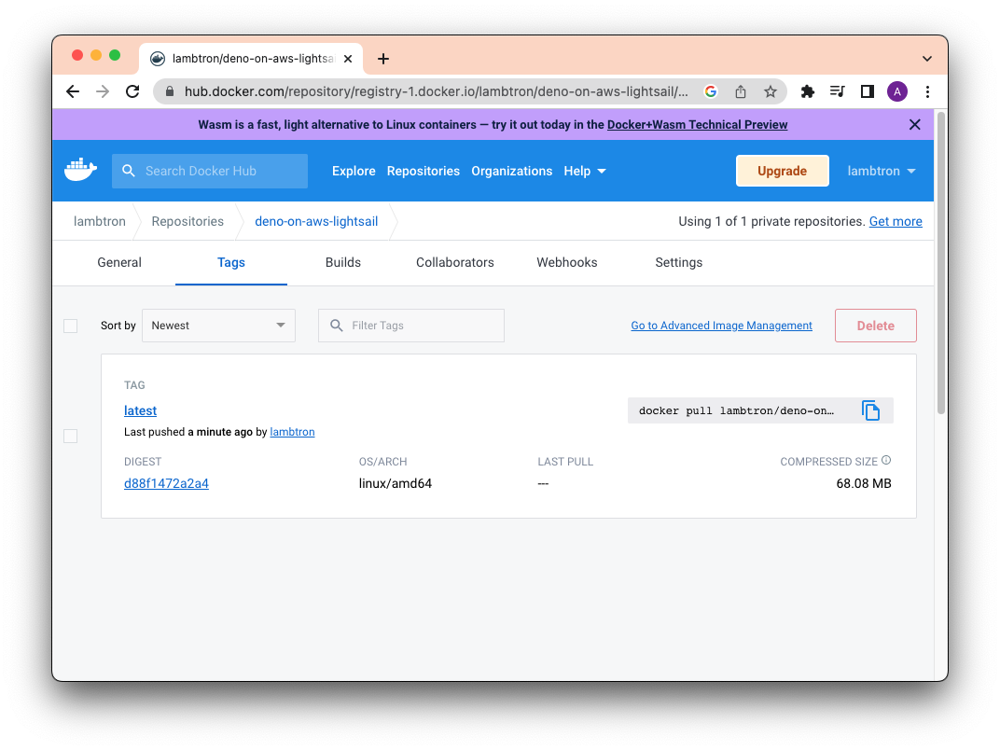
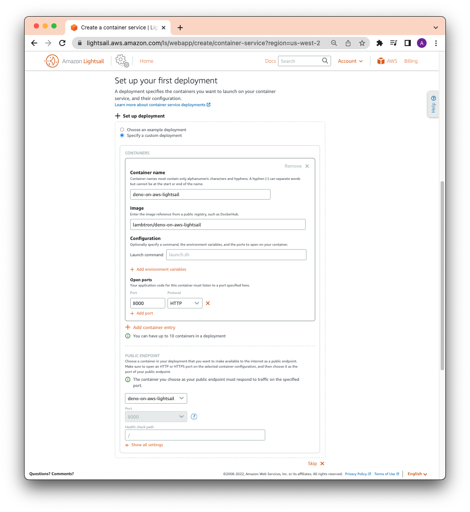
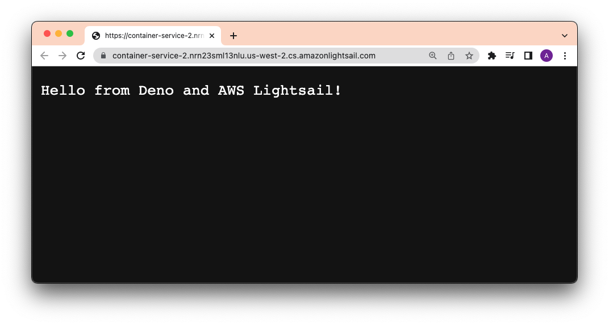

[Amazon Lightsail](https://aws.amazon.com/lightsail/) 是开始使用 Amazon Web Services 最简单和最便宜的方式。它允许您托管虚拟机甚至整个容器服务。

本教程将向您展示如何使用 Docker、Docker Hub 和 GitHub Actions 将 Deno 应用部署到 Amazon Lightsail。

在继续之前，请确保您已经准备好：

- [`docker` CLI](https://docs.docker.com/engine/reference/commandline/cli/)
- 一个 [Docker Hub 帐户](https://hub.docker.com)
- 一个 [GitHub 帐户](https://github.com)
- 一个 [AWS 帐户](https://aws.amazon.com/)

## 创建 Dockerfile 和 docker-compose.yml

为了专注于部署，我们的应用程序将简单地是一个返回字符串作为 HTTP 响应的 `main.ts` 文件：

```ts
import { Application } from "jsr:@oak/oak";

const app = new Application();

app.use((ctx) => {
  ctx.response.body = "Hello from Deno and AWS Lightsail!";
});

await app.listen({ port: 8000 });
```

然后，我们将创建两个文件 -- `Dockerfile` 和 `docker-compose.yml` -- 来构建 Docker 镜像。

在我们的 `Dockerfile` 中，我们将添加：

```Dockerfile
FROM denoland/deno

EXPOSE 8000

WORKDIR /app

ADD . /app

RUN deno install --entrypoint main.ts

CMD ["run", "--allow-net", "main.ts"]
```

然后，在我们的 `docker-compose.yml` 中：

```yml
version: "3"

services:
  web:
    build: .
    container_name: deno-container
    image: deno-image
    ports:
      - "8000:8000"
```

让我们通过运行 `docker compose -f docker-compose.yml build` 来在本地测试，然后 `docker compose up`，并前往 `localhost:8000`。



它工作正常！

## 构建、标记并推送到 Docker Hub

首先，让我们登录到 [Docker Hub](https://hub.docker.com/repositories) 并创建一个仓库。我们将其命名为 `deno-on-aws-lightsail`。

然后，我们将标记并推送我们的新镜像，将 `username` 替换为您的用户名：

然后，让我们在本地构建镜像。请注意我们的 `docker-compose.yml` 文件将名称构建为 `deno-image`。

```shell
docker compose -f docker-compose.yml build
```

让我们 [标记](https://docs.docker.com/engine/reference/commandline/tag/) 本地镜像为 `{{ username }}/deno-on-aws-lightsail`：

```shell
docker tag deno-image {{ username }}/deno-on-aws-lightsail
```

现在我们可以将镜像推送到 Docker Hub：

```shell
docker push {{ username }}/deno-on-aws-lightsail
```

在成功之后，您应该能在您的 Docker Hub 仓库中看到新镜像：



## 创建并部署到 Lightsail 容器

让我们前往 [Amazon Lightsail 控制台](https://lightsail.aws.amazon.com/ls/webapp/home/container-services)。

然后单击“容器”和“创建容器服务”。在页面中间，单击“设置您的第一次部署”，选择“指定自定义部署”。

您可以输入任何您想要的容器名称。

在 `Image` 中，请务必使用您在 Docker Hub 中设置的 `{{ username }}/{{ image }}`。在本例中，它是 `lambtron/deno-on-aws-lightsail`。

让我们单击 `添加开放端口` 并添加 `8000`。

最后，在 `公共端点` 下，选择您刚创建的容器名称。

完整的表单应如下所示：



当您准备好时，单击“创建容器服务”。

几秒钟后，您的新容器应该被部署。单击公共地址，您应该能够看到您的 Deno 应用：



## 使用 GitHub Actions 进行自动化

为了自动化该过程，我们将使用 `aws` CLI 及其 [`lightsail` 子命令](https://awscli.amazonaws.com/v2/documentation/api/latest/reference/lightsail/push-container-image.html)。

我们在 GitHub Actions 工作流中的步骤将是：

1. 检出仓库
2. 在本地构建我们的应用程序为 Docker 镜像
3. 安装并验证 AWS CLI
4. 通过 CLI 将本地 Docker 镜像推送到 AWS Lightsail 容器服务

让这个 GitHub Action 工作流正常工作的前提条件：

- 已创建 AWS Lightsail 容器实例（见上文）
- 设置了 IAM 用户和相关权限。
  ([了解有关为 IAM 用户管理 Amazon Lightsail 访问权限的更多信息。](https://docs.aws.amazon.com/lightsail/latest/userguide/amazon-lightsail-managing-access-for-an-iam-user.html))
- 为您的用户拥有权限的 `AWS_ACCESS_KEY_ID` 和 `AWS_SECRET_ACCESS_KEY`。 (请按照 [此 AWS 指南](https://lightsail.aws.amazon.com/ls/docs/en_us/articles/lightsail-how-to-set-up-access-keys-to-use-sdk-api-cli) 来获取生成的 `AWS_ACCESS_KEY_ID` 和 `AWS_SUCCESS_ACCESS_KEY`。)

让我们创建一个新文件 `container.template.json`，其中包含关于如何进行服务容器部署的配置。请注意这些选项值与我们在上一节手动输入的值的相似性。

```json
{
  "containers": {
    "app": {
      "image": "",
      "environment": {
        "APP_ENV": "release"
      },
      "ports": {
        "8000": "HTTP"
      }
    }
  },
  "publicEndpoint": {
    "containerName": "app",
    "containerPort": 8000,
    "healthCheck": {
      "healthyThreshold": 2,
      "unhealthyThreshold": 2,
      "timeoutSeconds": 5,
      "intervalSeconds": 10,
      "path": "/",
      "successCodes": "200-499"
    }
  }
}
```

让我们将以下内容添加到 `.github/workflows/deploy.yml` 文件中：

```yml
name: Build and Deploy to AWS Lightsail

on:
  push:
    branches:
      - main

env:
  AWS_REGION: us-west-2
  AWS_LIGHTSAIL_SERVICE_NAME: container-service-2
jobs:
  build_and_deploy:
    name: Build and Deploy
    runs-on: ubuntu-latest
    steps:
      - name: Checkout main
        uses: actions/checkout@v4

      - name: Install Utilities
        run: |
          sudo apt-get update
          sudo apt-get install -y jq unzip
      - name: Install AWS Client
        run: |
          curl "https://awscli.amazonaws.com/awscli-exe-linux-x86_64.zip" -o "awscliv2.zip"
          unzip awscliv2.zip
          sudo ./aws/install || true
          aws --version
          curl "https://s3.us-west-2.amazonaws.com/lightsailctl/latest/linux-amd64/lightsailctl" -o "lightsailctl"
          sudo mv "lightsailctl" "/usr/local/bin/lightsailctl"
          sudo chmod +x /usr/local/bin/lightsailctl
      - name: Configure AWS credentials
        uses: aws-actions/configure-aws-credentials@v1
        with:
          aws-region: ${{ env.AWS_REGION }}
          aws-access-key-id: ${{ secrets.AWS_ACCESS_KEY_ID }}
          aws-secret-access-key: ${{ secrets.AWS_SECRET_ACCESS_KEY }}
      - name: Build Docker Image
        run: docker build -t ${{ env.AWS_LIGHTSAIL_SERVICE_NAME }}:release .
      - name: Push and Deploy
        run: |
          service_name=${{ env.AWS_LIGHTSAIL_SERVICE_NAME }}
          aws lightsail push-container-image \
            --region ${{ env.AWS_REGION }} \
            --service-name ${service_name} \
            --label ${service_name} \
            --image ${service_name}:release
          aws lightsail get-container-images --service-name ${service_name} | jq --raw-output ".containerImages[0].image" > image.txt
          jq --arg image $(cat image.txt) '.containers.app.image = $image' container.template.json > container.json
          aws lightsail create-container-service-deployment --service-name ${service_name} --cli-input-json file://$(pwd)/container.json
```

哇，这里有很多内容！最后两个步骤是最重要的：
`Build Docker Image` 和 `Push and Deploy`。

```shell
docker build -t ${{ env.AWS_LIGHTSAIL_SERVICE_NAME }}:release .
```

此命令使用名称 `container-service-2` 构建我们的 Docker 镜像并标记为 `release`。

```shell
aws lightsail push-container-image ...
```

此命令将本地镜像推送到我们的 Lightsail 容器。

```shell
aws lightsail get-container-images --service-name ${service_name} | jq --raw-output ".containerImages[0].image" > image.txt
```

此命令检索镜像信息，并使用 [`jq`](https://stedolan.github.io/jq/) 进行解析，将镜像名称保存在本地文件 `image.txt` 中。

```shell
jq --arg image $(cat image.txt) '.containers.app.image = $image' container.template.json > container.json
```

此命令使用保存在 `image.txt` 中的镜像名称和 `container.template.json` 创建一个名为 `container.json` 的新选项文件。这个选项文件将被传递给 `aws lightsail` 进行下一步的最终部署。

```shell
aws lightsail create-container-service-deployment --service-name ${service_name} --cli-input-json file://$(pwd)/container.json
```

最后，此命令使用 `service_name` 创建一个新的部署，以及 `container.json` 中的配置设置。

当您将代码推送到 GitHub 并且 Action 成功后，您将能够在 AWS 上看到您的新 Deno 应用：


🦕 现在您可以使用 Docker、Docker Hub 和 GitHub Actions 将 Deno 应用程序部署到 Amazon Lightsail。