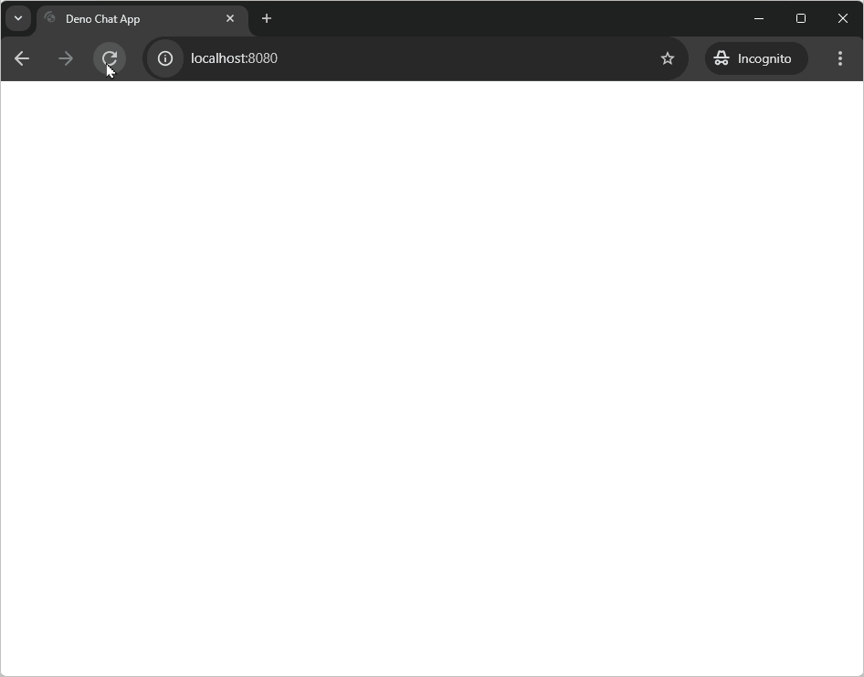

WebSockets 是构建实时应用程序的强大工具。它们允许客户端和服务器之间的双向通信，而无需不断轮询。WebSockets 的一个常见用例是聊天应用程序。

在本教程中，我们将使用 Deno 和内置的
[WebSockets API](/api/web/websockets) 创建一个简单的聊天应用程序。该聊天应用程序将允许多个聊天客户端连接到同一后端并发送群组消息。在客户端输入用户名后，他们可以开始向其他在线客户端发送消息。每个客户端还会显示当前活跃用户的列表。

您可以在
[GitHub 上查看完成的聊天应用程序](https://github.com/denoland/tutorial-with-websockets)。



## 初始化新项目

首先，为您的项目创建一个新目录并导航到该目录。

```sh
deno init chat-app
cd deno-chat-app
```

## 构建后端

我们将首先构建处理 WebSocket 连接并向所有连接的客户端广播消息的后端服务器。我们将使用 [`oak`](https://jsr.io/@oak/oak) 中间件框架来设置我们的服务器，客户端可以连接到服务器，发送消息并接收有关其他连接用户的更新。此外，服务器将提供构成聊天客户端的静态 HTML、CSS 和 JavaScript 文件。

### 导入依赖项

首先，我们需要导入必要的依赖项。使用 `deno add` 命令将 Oak 添加到您的项目中：

```sh
deno add jsr:@oak/oak
```

### 设置服务器

在您的 `main.ts` 文件中，添加以下代码：

```ts title="main.ts"
import { Application, Context, Router } from "@oak/oak";
import ChatServer from "./ChatServer.ts";

const app = new Application();
const port = 8080;
const router = new Router();
const server = new ChatServer();

router.get("/start_web_socket", (ctx: Context) => server.handleConnection(ctx));

app.use(router.routes());
app.use(router.allowedMethods());
app.use(async (context) => {
  await context.send({
    root: Deno.cwd(),
    index: "public/index.html",
  });
});

console.log("Listening at http://localhost:" + port);
await app.listen({ port });
```

接下来，在与 `main.ts` 文件相同的目录中创建一个名为 `ChatServer.ts` 的新文件。在此文件中，我们将放置处理 WebSocket 连接的逻辑：

```ts title="ChatServer.ts"
import { Context } from "@oak/oak";

type WebSocketWithUsername = WebSocket & { username: string };
type AppEvent = { event: string; [key: string]: any };

export default class ChatServer {
  private connectedClients = new Map<string, WebSocketWithUsername>();

  public async handleConnection(ctx: Context) {
    const socket = await ctx.upgrade() as WebSocketWithUsername;
    const username = ctx.request.url.searchParams.get("username");

    if (this.connectedClients.has(username)) {
      socket.close(1008, `用户名 ${username} 已被占用`);
      return;
    }

    socket.username = username;
    socket.onopen = this.broadcastUsernames.bind(this);
    socket.onclose = () => {
      this.clientDisconnected(socket.username);
    };
    socket.onmessage = (m) => {
      this.send(socket.username, m);
    };
    this.connectedClients.set(username, socket);

    console.log(`新客户端连接：${username}`);
  }

  private send(username: string, message: any) {
    const data = JSON.parse(message.data);
    if (data.event !== "send-message") {
      return;
    }

    this.broadcast({
      event: "send-message",
      username: username,
      message: data.message,
    });
  }

  private clientDisconnected(username: string) {
    this.connectedClients.delete(username);
    this.broadcastUsernames();

    console.log(`客户端 ${username} 已断开连接`);
  }

  private broadcastUsernames() {
    const usernames = [...this.connectedClients.keys()];
    this.broadcast({ event: "update-users", usernames });

    console.log("发送用户名列表:", JSON.stringify(usernames));
  }

  private broadcast(message: AppEvent) {
    const messageString = JSON.stringify(message);
    for (const client of this.connectedClients.values()) {
      client.send(messageString);
    }
  }
}
```

这段代码设置了一个 `handleConnection` 方法，当建立新的 WebSocket 连接时会被调用。它从 Oak 框架接收一个 Context 对象，并将其升级为 WebSocket 连接。它从 URL 查询参数中提取用户名。如果用户名已经被占用（即存在于 connectedClients 中），它就用适当的消息关闭这个 socket。否则，它在 socket 上设置 username 属性，分配事件处理程序，并将 socket 添加到 `connectedClients`。

当 socket 打开时，它会触发 `broadcastUsernames` 方法，将连接的用户名列表发送给所有客户端。当 socket 关闭时，它会调用 `clientDisconnected` 方法，从连接的客户端列表中删除该客户端。

当收到类型为 `send-message` 的消息时，它将该消息广播给所有连接的客户端，包括发送者的用户名。

## 构建前端

我们将构建一个简单的用户界面，显示文本输入框和发送按钮，并显示发送的消息，以及聊天中的用户列表。

### HTML

在您的新项目目录中，创建一个 `public` 文件夹并添加一个 `index.html` 文件，并添加以下代码：

```html title="index.html"
<!DOCTYPE html>
<html>
  <head>
    <title>Deno 聊天应用程序</title>
    <link rel="stylesheet" href="/public/style.css" />
    <script defer type="module" src="/public/app.js"></script>
  </head>

  <body>
    <header>
      <h1>🦕 Deno 聊天应用程序</h1>
    </header>
    <aside>
      <h2>在线用户</h2>
      <ul id="users"></ul>
    </aside>
    <main>
      <div id="conversation"></div>
      <form id="form">
        <input
          type="text"
          id="data"
          placeholder="发送消息"
          autocomplete="off"
        />
        <button type="submit" id="send">发送 ᯓ✉︎</button>
      </form>
    </main>
    <template id="user">
      <li></li>
    </template>
    <template id="message">
      <div>
        <span></span>
        <p></p>
      </div>
    </template>
  </body>
</html>
```

### CSS

如果您想要为聊天应用程序添加样式，请在 `public` 文件夹中创建一个 `style.css` 文件，并添加此
[预制的 CSS](https://raw.githubusercontent.com/denoland/tutorial-with-websockets/refs/heads/main/public/style.css)。

### JavaScript

我们将在 `app.js` 文件中设置客户端 JavaScript，您在刚刚编写的 HTML 文件中已经看到它的链接。在 `public` 文件夹中添加一个 `app.js` 文件，包含以下代码：

```js title="app.js"
const myUsername = prompt("请输入您的名字") || "匿名";
const url = new URL(`./start_web_socket?username=${myUsername}`, location.href);
url.protocol = url.protocol.replace("http", "ws");
const socket = new WebSocket(url);

socket.onmessage = (event) => {
  const data = JSON.parse(event.data);

  switch (data.event) {
    case "update-users":
      updateUserList(data.usernames);
      break;

    case "send-message":
      addMessage(data.username, data.message);
      break;
  }
};

function updateUserList(usernames) {
  const userList = document.getElementById("users");
  userList.replaceChildren();

  for (const username of usernames) {
    const listItem = document.createElement("li");
    listItem.textContent = username;
    userList.appendChild(listItem);
  }
}

function addMessage(username, message) {
  const template = document.getElementById("message");
  const clone = template.content.cloneNode(true);

  clone.querySelector("span").textContent = username;
  clone.querySelector("p").textContent = message;
  document.getElementById("conversation").prepend(clone);
}

const inputElement = document.getElementById("data");
inputElement.focus();

const form = document.getElementById("form");

form.onsubmit = (e) => {
  e.preventDefault();
  const message = inputElement.value;
  inputElement.value = "";
  socket.send(JSON.stringify({ event: "send-message", message }));
};
```

这段代码提示用户输入用户名，然后使用该用户名作为查询参数创建与服务器的 WebSocket 连接。它监听来自服务器的消息，并根据需要更新连接用户列表或向聊天窗口添加新消息。当用户通过按下回车或点击发送按钮提交表单时，它还会将消息发送到服务器。我们使用
[HTML 模板](https://developer.mozilla.org/en-US/docs/Web/HTML/Element/template) 来构建将在聊天窗口中显示的新消息。

## 运行服务器

要运行服务器，我们需要为 Deno 授予必要的权限。在您的 `deno.json` 文件中，更新 `dev` 任务以允许读取和网络访问：

```diff title="deno.json"
-"dev": "deno run --watch main.ts"
+"dev": "deno run --allow-net --allow-read --watch main.ts"
```

现在，如果您访问 [http://localhost:8080](http://localhost:8080/)，您将能够开始聊天会话。您可以同时打开 2 个标签页，尝试与自己聊天。


🦕 现在您可以使用 Deno 的 WebSockets，您准备好构建各种实时应用程序了！WebSockets 可用于构建实时仪表板、游戏和协作编辑工具等等！如果您想扩展聊天应用程序，可以考虑向消息中添加数据，以便在消息是由您发送还是其他人发送时能够以不同的样式显示。无论您在构建什么，Deno 都将 WebSocket 传递给您！