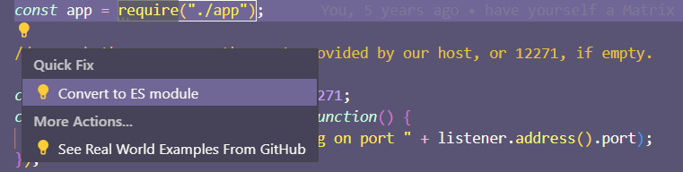

如果您的 Node.js 项目使用 CommonJS 模块（例如，它使用 `require`），您将需要更新代码以使用
[ECMAScript 模块（ESM）](https://developer.mozilla.org/en-US/docs/Web/JavaScript/Guide/Modules)
以便在 Deno 中运行。本指南将帮助您更新代码以使用 ESM 语法。

## 模块导入和导出

Deno 独占支持 [ECMAScript 模块](/runtime/fundamentals/modules/)。
如果您的 Node.js 代码使用
[`require`](https://nodejs.org/api/modules.html#modules-commonjs-modules)，
您应该将其更新为使用 `import` 语句。如果您的内部代码使用 CommonJS 风格的导出，则也需要更新这些。

一个典型的 CommonJS 风格项目可能看起来像这样：

```js title="add_numbers.js"
module.exports = function addNumbers(num1, num2) {
  return num1 + num2;
};
```

```js title="index.js"
const addNumbers = require("./add_numbers");
console.log(addNumbers(2, 2));
```

要将它们转换为 [ECMAScript 模块](/runtime/fundamentals/modules/)，我们将进行一些小改动：

```js title="add_numbers.js"
export function addNumbers(num1, num2) {
  return num1 + num2;
}
```

```js title="index.js"
import { addNumbers } from "./add_numbers.js";
console.log(addNumbers(2, 2));
```

导出：

| CommonJS                             | ECMAScript 模块                  |
| ------------------------------------ | -------------------------------- |
| `module.exports = function add() {}` | `export default function add() {}` |
| `exports.add = function add() {}`    | `export function add() {}`         |

导入：

| CommonJS                                   | ECMAScript 模块                       |
| ------------------------------------------ | -------------------------------------- |
| `const add = require("./add_numbers");`    | `import add from "./add_numbers.js";`  |
| `const { add } = require("./add_numbers")` | `import { add } from "./add_numbers.js"` |

### 使用 VS Code 的快速修复

如果您使用 VS Code，可以利用其内置功能将 CommonJS 转换为 ES6 模块。右键单击 `require` 语句或灯泡图标，选择 `快速修复`，然后选择 `转换为 ES 模块`。



### CommonJS 与 ECMAScript 解析

这两种模块系统之间的重要区别是 ECMAScript 解析要求完整的标识符 **包括文件扩展名**。
省略文件扩展名和特殊处理 `index.js` 是 CommonJS 独有的特性。
ECMAScript 解析的好处在于，它在浏览器、Deno 和其他运行时中具有一致性。

| CommonJS             | ECMAScript 模块            |
| -------------------- | --------------------------- |
| `"./add_numbers"`    | `"./add_numbers.js"`        |
| `"./some/directory"` | `"./some/directory/index.js"` |

:::tip

Deno 可以通过运行 `deno lint --fix` 为您添加所有缺失的文件扩展名。
Deno 的 linter 具有 `no-sloppy-imports` 规则，当导入路径不包含文件扩展名时，将显示 linting 错误。

:::

🦕 现在您知道如何将 CJS 移植到 ESM，您可以利用 ESM 提供的现代功能，例如异步模块加载、与浏览器的互操作性、可读性更好、标准化和未来兼容性。