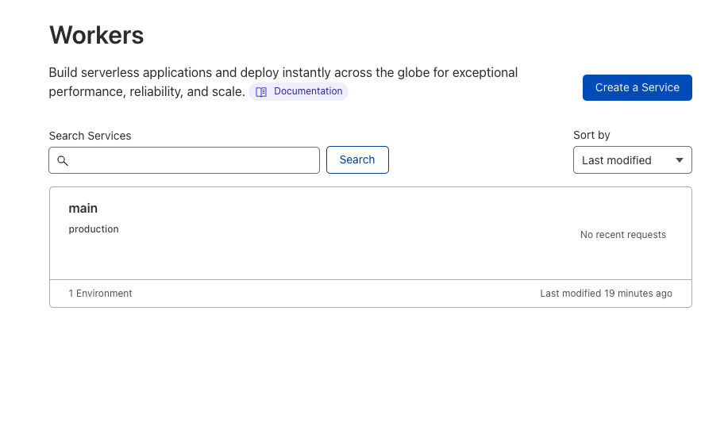

Cloudflare Workers 允许您在 Cloudflare 的边缘网络上运行 JavaScript。

这是一个关于将 Deno 函数部署到 Cloudflare Workers 的简短指南。

注意：您只能部署
[模块 Worker](https://developers.cloudflare.com/workers/learning/migrating-to-module-workers/)
而不是网页服务器或应用程序。

## 设置 `denoflare`

为了将 Deno 部署到 Cloudflare，我们将使用这个社区创建的 CLI
[`denoflare`](https://denoflare.dev/)。

[安装它](https://denoflare.dev/cli/#installation):

```shell
deno install --unstable-worker-options --allow-read --allow-net --global --allow-env --allow-run --name denoflare --force \
https://raw.githubusercontent.com/skymethod/denoflare/v0.6.0/cli/cli.ts
```

## 创建您的函数

在一个新目录中，创建一个 `main.ts` 文件，里面将包含我们的模块 Worker 函数：

```ts
export default {
  fetch(request: Request): Response {
    return new Response("Hello, world!");
  },
};
```

最基本的模块 Worker 函数必须 `export default` 一个对象，该对象暴露一个 `fetch` 函数，返回一个 `Response` 对象。

您可以通过运行以下命令在本地测试它：

```shell
denoflare serve main.ts
```

如果您在浏览器中访问 `localhost:8080`，您将看到响应内容为：

```console
Hello, world!
```

## 配置 `.denoflare`

下一步是创建一个 `.denoflare` 配置文件。在其中，添加以下内容：

```json
{
  "$schema": "https://raw.githubusercontent.com/skymethod/denoflare/v0.5.11/common/config.schema.json",
  "scripts": {
    "main": {
      "path": "/absolute/path/to/main.ts",
      "localPort": 8000
    }
  },
  "profiles": {
    "myprofile": {
      "accountId": "abcxxxxxxxxxxxxxxxxxxxxxxxxxxxxxx",
      "apiToken": "abcxxxxxxxxx_-yyyyyyyyyyyy-11-dddddddd"
    }
  }
}
```

您可以通过访问您的
[Cloudflare 仪表板](https://dash.cloudflare.com/)，点击 "Workers"，并找到右侧的 "帐户 ID" 来查找您的 `accountId`。

您可以从您的
[Cloudflare API Token 设置](https://dash.cloudflare.com/profile/api-tokens)生成一个 `apiToken`。
创建 API 令牌时，请确保使用 "编辑 Cloudflare Workers" 模板。

在您将两者添加到 `.denoflare` 配置后，让我们尝试将其推送到 Cloudflare：

```console
denoflare push main
```

接下来，您可以在您的 Cloudflare 账户中查看您的新函数：



太好了！