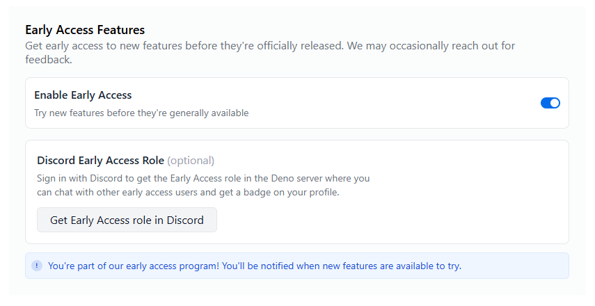

Deno Deploy 允许你在全球边缘网络上托管 Deno 应用，内置遥测和 CI/CD 工具。

本教程将指导你使用 Deno Deploy<sup>EA</sup> 创建并部署一个简单的 Deno 应用。

## 先决条件

1. 一个 [GitHub](https://github.com) 账号
2. 在本地机器上 [安装 Deno](https://docs.deno.com/runtime/manual/getting_started/installation)
3. 访问
   [Deno Deploy 早期访问计划](https://dash.deno.com/account#early-access)

## 用 Vite 创建一个简单的 Deno 应用

首先，使用 Vite 创建一个基本应用，初始化一个新的
[Vite](https://vite.dev/guide/) 项目：

```sh
deno init --npm vite
```

为你的项目命名，选择框架和变体。本教程中，我们将创建一个原生 TypeScript 应用。

使用 `cd my-project-name` 进入新建的项目目录，然后运行：

```sh
deno install
deno run dev
```

你应该能在 [http://127.0.0.1:5173/](http://127.0.0.1:5173/) 看到一个基本运行的应用。

编辑 `main.ts` 文件即可在浏览器中查看修改效果。

## 创建 GitHub 仓库

1. 访问 [GitHub](https://github.com) 并新建一个仓库。

2. 将本地目录初始化为 Git 仓库：

```sh
git init
git add .
git commit -m "Initial commit"
```

3. 添加 GitHub 仓库为远程仓库并推送代码：

```sh
git remote add origin https://github.com/your-username/my-first-deno-app.git
git branch -M main
git push -u origin main
```

## 注册 Deno Deploy 早期访问

1. 访问
   [Deno Deploy 账户设置](https://dash.deno.com/account#early-access)
2. 点击“加入早期访问计划”
3. 审核通过后，你将收到含有访问说明的邮件



## 创建 Deno Deploy 组织

1. 访问 [app.deno.com](https://app.deno.com)
2. 点击“+ 新建组织”
3. 选择“标准部署”组织类型
4. 输入组织名称和标识（slug，后续不可更改）
5. 点击“创建标准部署组织”

## 创建并部署应用

1. 从组织仪表盘点击“尝试新 Deno Deploy 早期访问”
2. 点击“+ 新建应用”
3. 选择你之前创建的 GitHub 仓库
4. 应用配置会自动检测，你可以点击“编辑构建配置”按钮确认：
   - 框架预设：无预设
   - 运行时配置：静态站点
   - 安装命令：`deno install`
   - 构建命令：`deno task build`
   - 静态目录：`dist`

5. 点击“创建应用”开始部署流程

## 监控你的部署

1. 查看构建日志，了解应用部署进度
2. 部署完成后，你将看到预览链接（通常为
   `https://your-app-name.your-org-name.deno.net`）
3. 点击链接浏览已部署的应用！

## 修改并重新部署

现在我们更新应用，并查看变动如何部署：

本地修改你的 `main.ts` 文件：

```ts title="main.ts"
import './style.css'
import typescriptLogo from './typescript.svg'
import viteLogo from '/vite.svg'
import { setupCounter } from './counter.ts'

document.querySelector<HTMLDivElement>('#app')!.innerHTML = `
  <div>
    <a href="https://vite.dev" target="_blank">
      
    </a>
    <a href="https://www.typescriptlang.org/" target="_blank">
      
    </a>
    <h1>Hello from Deno Deploy!</h1>
    <div class="card">
      <button id="counter" type="button"></button>
    </div>
    <p class="read-the-docs">
      点击 Vite 和 TypeScript 标志了解更多
    </p>
  </div>

setupCounter(document.querySelector<HTMLButtonElement>('#counter')!)
```

2. 提交并推送更改：

```sh
git add .
git commit -m "Update application"
git push
```

返回 Deno Deploy 仪表盘，你将看到自动触发的新构建。构建完成后访问应用链接查看更新。

## 探索可观测性功能

Deno Deploy<sup>EA</sup> 提供完整的可观测性工具：

1. 在应用仪表盘点击侧边栏的“日志”
   - 查看应用输出的控制台日志
   - 通过搜索栏过滤日志（例如 `context:production`）

2. 点击“追踪”查看请求追踪
   - 选择某个追踪查看详细时间信息
   - 审查跨度以理解请求处理流程

3. 点击“指标”查看应用性能指标
   - 监控请求次数、错误率和响应时间

🦕 既然你已经部署了第一个应用，接下来你可能会想：

1. 为应用添加 [自定义域名](/deploy/early-access/reference/domains/)
2. 探索对 Next.js、Astro 等框架的 [支持](/deploy/early-access/reference/frameworks/)
3. 学习如何使用 [缓存策略](/deploy/early-access/reference/caching/) 提升性能
4. 为开发和生产环境设置不同的
   [环境变量和上下文](/deploy/early-access/reference/env-vars-and-contexts/)
