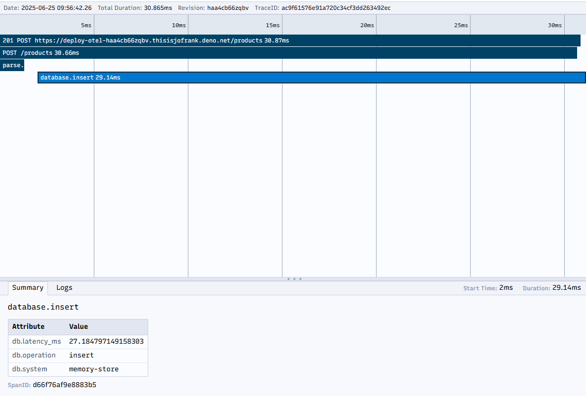

Deno Deploy<sup>EA</sup> 内置了 OpenTelemetry 支持，能够自动捕获 HTTP 请求、数据库查询和其他操作的追踪信息。本教程展示如何为您的应用添加自定义 OpenTelemetry 仪表，以实现更详细的可观测性。

## 先决条件

1. 一个 [GitHub](https://github.com) 账号
2. 在本地机器上安装 [Deno](https://docs.deno.com/runtime/manual/getting_started/installation)
3. 访问 [Deno Deploy 早期体验计划](https://dash.deno.com/account#early-access)
4. 基本了解 [OpenTelemetry 概念](https://opentelemetry.io/docs/concepts/)

## 创建一个基础 API 应用

首先，让我们创建一个简单的 API 服务器，稍后将使用 OpenTelemetry 对其进行仪表：

```ts title="main.ts"
const dataStore: Record<string, string> = {};

async function handler(req: Request): Promise<Response> {
  const url = new URL(req.url);

  // 模拟随机延迟
  await new Promise((resolve) => setTimeout(resolve, Math.random() * 200));

  try {
    // 处理产品列表
    if (url.pathname === "/products" && req.method === "GET") {
      return new Response(JSON.stringify(Object.values(dataStore)), {
        headers: { "Content-Type": "application/json" },
      });
    }

    // 处理产品创建
    if (url.pathname === "/products" && req.method === "POST") {
      const data = await req.json();
      const id = crypto.randomUUID();
      dataStore[id] = data;
      return new Response(JSON.stringify({ id, ...data }), {
        status: 201,
        headers: { "Content-Type": "application/json" },
      });
    }

    // 按 ID 获取产品
    if (url.pathname.startsWith("/products/") && req.method === "GET") {
      const id = url.pathname.split("/")[2];
      const product = dataStore[id];

      if (!product) {
        return new Response("Product not found", { status: 404 });
      }

      return new Response(JSON.stringify(product), {
        headers: { "Content-Type": "application/json" },
      });
    }

    // 处理根路由
    if (url.pathname === "/") {
      return new Response("Product API - Try /products endpoint");
    }

    return new Response("Not Found", { status: 404 });
  } catch (error) {
    console.error("Error handling request:", error);
    return new Response("Internal Server Error", { status: 500 });
  }
}

console.log("Server running on http://localhost:8000");
Deno.serve(handler, { port: 8000 });
```

保存此文件并在本地运行：

```sh
deno run --allow-net main.ts
```

使用 curl 或浏览器测试 API，以确保其正常工作：

```sh
# 列出产品（初始为空）
curl http://localhost:8000/products

# 添加一个产品
curl -X POST http://localhost:8000/products \
  -H "Content-Type: application/json" \
  -d '{"name": "Test Product", "price": 19.99}'
```

## 添加 OpenTelemetry 仪表

现在，给我们的应用添加自定义的 OpenTelemetry 仪表。创建一个新文件 `instrumented-main.ts`：

```ts title="instrumented-main.ts"
import { trace } from "npm:@opentelemetry/api@1";

// 获取 OpenTelemetry tracer
const tracer = trace.getTracer("product-api");

const dataStore: Record<string, string> = {};

// 模拟数据库操作并创建自定义 span
async function queryDatabase(
  operation: string,
  data?: unknown,
): Promise<unknown> {
  return await tracer.startActiveSpan(`database.${operation}`, async (span) => {
    try {
      // 为 span 添加属性以便提供更好的上下文
      span.setAttributes({
        "db.system": "memory-store",
        "db.operation": operation,
      });

      // 模拟数据库延迟
      const delay = Math.random() * 100;
      await new Promise((resolve) => setTimeout(resolve, delay));

      // 将延迟信息添加到 span 属性
      span.setAttributes({ "db.latency_ms": delay });

      if (operation === "list") {
        return Object.values(dataStore);
      } else if (operation === "get") {
        return dataStore[data as string];
      } else if (operation === "insert") {
        const id = crypto.randomUUID();
        dataStore[id] = data as string;
        return { id, data };
      }

      return null;
    } catch (error) {
      // 记录任何错误到 span
      span.recordException(error);
      span.setStatus({ code: trace.SpanStatusCode.ERROR });
      throw error;
    } finally {
      // 结束 span
      span.end();
    }
  });
}

async function handler(req: Request): Promise<Response> {
  // 为整个请求创建父 span
  return await tracer.startActiveSpan(
    `${req.method} ${new URL(req.url).pathname}`,
    async (parentSpan) => {
      const url = new URL(req.url);

      // 为 span 添加请求详情属性
      parentSpan.setAttributes({
        "http.method": req.method,
        "http.url": req.url,
        "http.route": url.pathname,
      });

      try {
        // 处理产品列表
        if (url.pathname === "/products" && req.method === "GET") {
          const products = await queryDatabase("list");
          return new Response(JSON.stringify(products), {
            headers: { "Content-Type": "application/json" },
          });
        }

        // 处理产品创建
        if (url.pathname === "/products" && req.method === "POST") {
          // 创建一个解析请求 JSON 的 span
          const data = await tracer.startActiveSpan(
            "parse.request.body",
            async (span) => {
              try {
                const result = await req.json();
                return result;
              } catch (error) {
                span.recordException(error);
                span.setStatus({ code: trace.SpanStatusCode.ERROR });
                throw error;
              } finally {
                span.end();
              }
            },
          );

          const result = await queryDatabase("insert", data);
          return new Response(JSON.stringify(result), {
            status: 201,
            headers: { "Content-Type": "application/json" },
          });
        }

        // 根据 ID 获取产品
        if (url.pathname.startsWith("/products/") && req.method === "GET") {
          const id = url.pathname.split("/")[2];
          parentSpan.setAttributes({ "product.id": id });

          const product = await queryDatabase("get", id);

          if (!product) {
            parentSpan.setAttributes({
              "error": true,
              "error.type": "not_found",
            });
            return new Response("Product not found", { status: 404 });
          }

          return new Response(JSON.stringify(product), {
            headers: { "Content-Type": "application/json" },
          });
        }

        // 处理根路由
        if (url.pathname === "/") {
          return new Response("Product API - Try /products endpoint");
        }

        parentSpan.setAttributes({ "error": true, "error.type": "not_found" });
        return new Response("Not Found", { status: 404 });
      } catch (error) {
        console.error("Error handling request:", error);
        // 在 span 中记录错误
        parentSpan.recordException(error);
        parentSpan.setAttributes({
          "error": true,
          "error.type": error.name,
          "error.message": error.message,
        });
        parentSpan.setStatus({ code: trace.SpanStatusCode.ERROR });

        return new Response("Internal Server Error", { status: 500 });
      } finally {
        // 结束父 span
        parentSpan.end();
      }
    },
  );
}

console.log(
  "Server running with OpenTelemetry instrumentation on http://localhost:8000",
);
Deno.serve(handler, { port: 8000 });
```

在本地运行带有仪表的版本：

```sh
deno run --allow-net instrumented-main.ts
```

再次使用 curl 测试 API 以生成一些追踪。

## 创建 GitHub 仓库

1. 访问 [GitHub](https://github.com) 并创建一个新仓库。

2. 初始化本地目录为 Git 仓库：

```sh
git init
git add .
git commit -m "Add OpenTelemetry instrumented API"
```

3. 添加 GitHub 仓库作为远程仓库并推送代码：

```sh
git remote add origin https://github.com/your-username/otel-demo-app.git
git branch -M main
git push -u origin main
```

## 部署到 Deno Deploy 早期体验

1. 访问 [app.deno.com](https://app.deno.com)
2. 选择您的组织，或根据需要新建一个
3. 点击 "+ New App"
4. 选择您之前创建的 GitHub 仓库
5. 配置构建设置：
   - 框架预设：无预设
   - 运行时配置：动态
   - 入口文件：`instrumented-main.ts`

6. 点击 "Create App" 开始部署过程

## 生成示例流量

为了生成示例追踪和指标，让我们向部署的应用发送一些流量：

1. 从 Deno Deploy 控制台复制您的部署 URL

2. 发送多个请求到不同的端点：

```sh
# 将应用 URL 存入变量
APP_URL=https://your-app-name.your-org-name.deno.net

# 访问根路由
curl $APP_URL/

# 列出产品（初始为空）
curl $APP_URL/products

# 添加一些产品
curl -X POST $APP_URL/products -H "Content-Type: application/json" -d '{"name": "Laptop", "price": 999.99}'
curl -X POST $APP_URL/products -H "Content-Type: application/json" -d '{"name": "Headphones", "price": 129.99}'
curl -X POST $APP_URL/products -H "Content-Type: application/json" -d '{"name": "Mouse", "price": 59.99}'

# 再次列出产品
curl $APP_URL/products

# 尝试访问一个不存在的产品（将生成错误 span）
curl $APP_URL/products/nonexistent-id
```

## 探索 OpenTelemetry 追踪和指标

现在，让我们探索 Deno Deploy 收集的可观测性数据：

1. 在应用仪表盘，点击侧边栏的 "Traces"
   - 您将看到针对每个请求的追踪列表
   - 可以使用搜索栏按 HTTP 方法或状态码过滤追踪

2. 选择一个 `/products` 的 POST 追踪以查看详细信息：
   - 整个请求的父 span
   - 数据库操作的子 span
   - 解析请求体的 span

   

3. 点击单个 span 查看详情：
   - 持续时间和时间信息
   - 您设置的属性，如 `db.operation` 和 `db.latency_ms`
   - 任何已记录的异常

4. 点击侧边栏的 "Logs" 查看带有追踪上下文的控制台输出：
   - 注意追踪期间发出的日志如何被自动关联到追踪
   - 点击日志行的 "View trace" 可查看关联的追踪

5. 点击 "Metrics" 查看应用性能指标：
   - 按端点的 HTTP 请求计数
   - 错误率
   - 响应时间分布

🦕 Deno Deploy<sup>EA</sup> 的自动仪表结合您的自定义仪表，为您的应用性能和行为提供了全面的可视化。

更多关于 Deno 中 OpenTelemetry 的信息，请参考以下资源：

- [Deno 中的 OpenTelemetry 文档](/runtime/fundamentals/open_telemetry/)
- [Deno Deploy<sup>EA</sup> 可观测性参考](/deploy/early-access/reference/observability/)
- [OpenTelemetry 官方文档](https://opentelemetry.io/docs/)