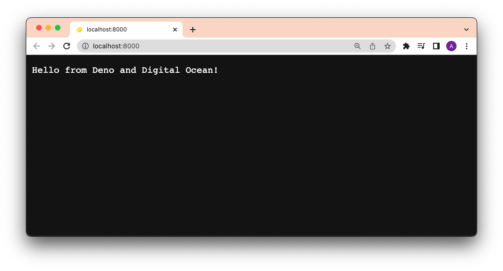
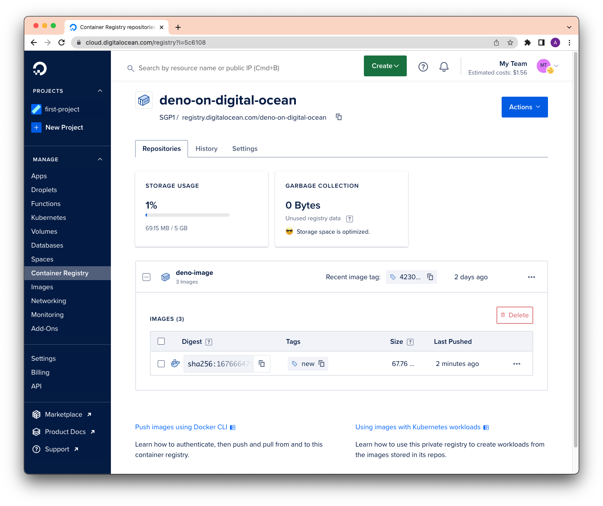
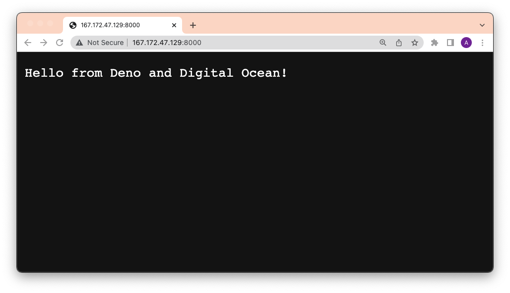

Digital Ocean 是一个受欢迎的云基础设施提供商，提供多种托管服务，从网络到计算再到存储。

以下是将 Deno 应用程序通过 Docker 和 GitHub Actions 部署到 Digital Ocean 的逐步指南。

此过程的先决条件包括：

- [`docker` CLI](https://docs.docker.com/engine/reference/commandline/cli/)
- 一个 [GitHub 帐户](https://github.com)
- 一个 [Digital Ocean 帐户](https://digitalocean.com)
- [`doctl` CLI](https://docs.digitalocean.com/reference/doctl/how-to/install/)

## 创建 Dockerfile 和 docker-compose.yml

为了专注于部署，我们的应用程序仅为一个返回 HTTP 响应字符串的 `main.ts` 文件：

```ts title="main.ts"
import { Application } from "jsr:@oak/oak";

const app = new Application();

app.use((ctx) => {
  ctx.response.body = "Hello from Deno and Digital Ocean!";
});

await app.listen({ port: 8000 });
```

接下来，我们将创建两个文件 -- `Dockerfile` 和 `docker-compose.yml` -- 来构建 Docker 镜像。

在我们的 `Dockerfile` 中，添加如下内容：

```Dockerfile title="Dockerfile"
FROM denoland/deno

EXPOSE 8000

WORKDIR /app

ADD . /app

RUN deno install --entrypoint main.ts

CMD ["run", "--allow-net", "main.ts"]
```

然后，在我们的 `docker-compose.yml` 中：

```yml
version: "3"

services:
  web:
    build: .
    container_name: deno-container
    image: deno-image
    ports:
      - "8000:8000"
```

让我们通过运行 `docker compose -f docker-compose.yml build`，然后 `docker compose up`，并访问 `localhost:8000` 来测试这个应用程序。



它工作正常！

## 构建、标记并将 Docker 镜像推送到 Digital Ocean 容器注册表

Digital Ocean 有自己的私有容器注册表，我们可以在其中推送和拉取 Docker 镜像。为了使用该注册表，让我们
[在命令行中安装并认证 `doctl`](https://docs.digitalocean.com/reference/doctl/how-to/install/)。

之后，我们将创建一个名为 `deno-on-digital-ocean` 的新私有注册表：

```shell
doctl registry create deno-on-digital-ocean
```

使用我们的 Dockerfile 和 docker-compose.yml，我们将构建一个新镜像，标记它，并将其推送到注册表。请注意，`docker-compose.yml` 将在本地将构建命名为 `deno-image`。

```shell
docker compose -f docker-compose.yml build
```

让我们 [标记](https://docs.docker.com/engine/reference/commandline/tag/) 它为 `new`：

```shell
docker tag deno-image registry.digitalocean.com/deno-on-digital-ocean/deno-image:new
```

现在我们可以将其推送到注册表。

```shell
docker push registry.digitalocean.com/deno-on-digital-ocean/deno-image:new
```

你应该在你的 [Digital Ocean 容器注册表](https://cloud.digitalocean.com/registry) 中看到新的带有 `new` 标签的 `deno-image`：



完美！

## 通过 SSH 部署到 Digital Ocean

一旦我们的 `deno-image` 在注册表中，我们可以使用 `docker run` 在任何地方运行它。在这种情况下，我们将在我们的
[Digital Ocean Droplet](https://www.digitalocean.com/products/droplets) 上运行，那里是他们托管的虚拟机。

在你的 [Droplet 页面](https://cloud.digitalocean.com/droplets) 上，点击你的 Droplet，然后点击 `console` 通过 SSH 进入虚拟机。（或者你可以从你的命令行 [直接 ssh](https://docs.digitalocean.com/products/droplets/how-to/connect-with-ssh/)）。

要拉取 `deno-image` 镜像并运行它，我们可以运行：

```shell
docker run -d --restart always -it -p 8000:8000 --name deno-image registry.digitalocean.com/deno-on-digital-ocean/deno-image:new
```

使用我们的浏览器访问 Digital Ocean 地址，我们现在看到：



太棒了！

## 通过 GitHub Actions 自动化部署

让我们通过 GitHub Actions 自动化整个过程。

首先，让我们获取所有需要的环境变量，以便登录到 `doctl` 和 SSH 进入 Droplet：

- [DIGITALOCEAN_ACCESS_TOKEN](https://docs.digitalocean.com/reference/api/create-personal-access-token/)
- DIGITALOCEAN_HOST（你的 Droplet 的 IP 地址）
- DIGITALOCEAN_USERNAME（默认是 `root`）
- DIGITALOCEAN_SSHKEY（关于这一点，稍后会详细说明）

### 生成 `DIGITALOCEAN_SSHKEY`

`DIGITALOCEAN_SSHKEY` 是一个私钥，其公钥位于虚拟机的 `~/.ssh/authorized_keys` 文件中。

为此，首先在你的本地机器上运行 `ssh-keygen`：

```shell
ssh-keygen
```

当出现提醒输入电子邮件时，**确保使用你的 GitHub 电子邮件** 以便 GitHub Action 正确验证。最终输出应该类似于：

```console
Output
Your identification has been saved in /your_home/.ssh/id_rsa
Your public key has been saved in /your_home/.ssh/id_rsa.pub
The key fingerprint is:
SHA256:/hk7MJ5n5aiqdfTVUZr+2Qt+qCiS7BIm5Iv0dxrc3ks user@host
The key's randomart image is:
+---[RSA 3072]----+
|                .|
|               + |
|              +  |
| .           o . |
|o       S   . o  |
| + o. .oo. ..  .o|
|o = oooooEo+ ...o|
|.. o *o+=.*+o....|
|    =+=ooB=o.... |
+----[SHA256]-----+
```

接下来，我们需要将新生成的公钥上传到你的 Droplet。你可以使用 [`ssh-copy-id`](https://www.ssh.com/academy/ssh/copy-id) 或手动复制它，SSH 进入你的 Droplet，并将其粘贴到 `~/.ssh/authorized_keys`。

使用 `ssh-copy-id`：

```shell
ssh-copy-id {{ username }}@{{ host }}
```

这个命令会提示你输入密码。请注意，这将自动从你的本地机器复制 `id_rsa.pub` 密钥并粘贴到你的 Droplet 的 `~/.ssh/authorized_keys` 文件中。如果你将密钥命名为其他名称，可以通过 `-i` 标志将其传递给命令：

```shell
ssh-copy-id -i ~/.ssh/mykey {{ username }}@{{ host }}
```

要测试是否成功执行：

```shell
ssh -i ~/.ssh/mykey {{ username }}@{{ host }}
```

太好了！

### 定义 yml 文件

最后一步是将这一切结合在一起。我们基本上是在手动部署的每一步中，将其添加到一个 GitHub Actions 工作流的 yml 文件中：

```yml
name: Deploy to Digital Ocean

on:
  push:
    branches:
      - main

env:
  REGISTRY: "registry.digitalocean.com/deno-on-digital-ocean"
  IMAGE_NAME: "deno-image"

jobs:
  build_and_push:
    name: Build, Push, and Deploy
    runs-on: ubuntu-latest
    steps:
      - name: Checkout main
        uses: actions/checkout@v2

      - name: Set $TAG from shortened sha
        run: echo "TAG=`echo ${GITHUB_SHA} | cut -c1-8`" >> $GITHUB_ENV

      - name: Build container image
        run: docker compose -f docker-compose.yml build

      - name: Tag container image
        run: docker tag ${{ env.IMAGE_NAME }} ${{ env.REGISTRY }}/${{ env.IMAGE_NAME }}:${{ env.TAG }}

      - name: Install `doctl`
        uses: digitalocean/action-doctl@v2
        with:
          token: ${{ secrets.DIGITALOCEAN_ACCESS_TOKEN }}

      - name: Log in to Digital Ocean Container Registry
        run: doctl registry login --expiry-seconds 600

      - name: Push image to Digital Ocean Container Registry
        run: docker push ${{ env.REGISTRY }}/${{ env.IMAGE_NAME }}:${{ env.TAG }}

      - name: Deploy via SSH
        uses: appleboy/ssh-action@master
        with:
          host: ${{ secrets.DIGITALOCEAN_HOST }}
          username: ${{ secrets.DIGITALOCEAN_USERNAME }}
          key: ${{ secrets.DIGITALOCEAN_SSHKEY }}
          script: |
            # 登录到 Digital Ocean 容器注册表
            docker login -u ${{ secrets.DIGITALOCEAN_ACCESS_TOKEN }} -p ${{ secrets.DIGITALOCEAN_ACCESS_TOKEN }} registry.digitalocean.com
            # 停止并删除正在运行的镜像
            docker stop ${{ env.IMAGE_NAME }}
            docker rm ${{ env.IMAGE_NAME }}
            # 从新镜像运行一个新容器
            docker run -d --restart always -it -p 8000:8000 --name ${{ env.IMAGE_NAME }} ${{ env.REGISTRY }}/${{ env.IMAGE_NAME }}:${{ env.TAG }}
```

当你推送到 GitHub 时，这个 yml 文件会被自动检测，从而触发部署动作。