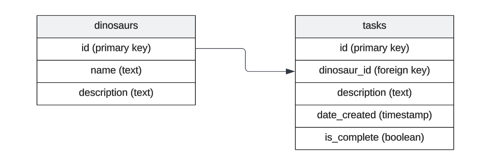

[Drizzle ORM](https://orm.drizzle.team/) 是一个 TypeScript ORM，提供了一种类型安全的方式与数据库进行交互。在本教程中，我们将设置 Drizzle ORM 与 Deno 和 PostgreSQL，以便创建、读取、更新和删除恐龙数据：

- [安装 Drizzle](#install-drizzle)
- [配置 Drizzle](#configure-drizzle)
- [定义模式](#define-schemas)
- [与数据库交互](#interact-with-the-database)
- [接下来做什么？](#whats-next)

您可以在[this GitHub repo](https://github.com/denoland/examples/tree/main/with-drizzle)中找到本教程的所有代码。

## 安装 Drizzle

首先，我们将使用 Deno 的 npm 兼容性安装所需的依赖项。我们将与 [Postgres](https://orm.drizzle.team/docs/get-started-postgresql) 一起使用 Drizzle，但您也可以使用 [MySQL](https://orm.drizzle.team/docs/get-started-mysql) 或 [SQLite](https://orm.drizzle.team/docs/get-started-sqlite) 。（如果您没有 PostgreSQL，可以在 [这里安装](https://www.postgresql.org/download/)。）

```bash
deno install npm:drizzle-orm npm:drizzle-kit npm:pg npm:@types/pg
```

这将安装 Drizzle ORM 及其相关工具——用于模式迁移的 [drizzle-kit](https://orm.drizzle.team/docs/kit-overview)，用于 PostgreSQL 连接的 [pg](https://www.npmjs.com/package/pg)，以及 PostgreSQL 的 [TypeScript 类型](https://www.npmjs.com/package/@types/pg)。这些包将允许我们以类型安全的方式与数据库交互，同时保持与 Deno 的运行环境的兼容性。

它还将在您的项目根目录中创建一个 `deno.json` 文件以管理 npm 依赖项：

```json
{
  "imports": {
    "@types/pg": "npm:@types/pg@^8.11.10",
    "drizzle-kit": "npm:drizzle-kit@^0.27.2",
    "drizzle-orm": "npm:drizzle-orm@^0.36.0",
    "pg": "npm:pg@^8.13.1"
  }
}
```

## 配置 Drizzle

接下来，让我们在项目根目录中创建一个 `drizzle.config.ts` 文件。此文件将配置 Drizzle 以与您的 PostgreSQL 数据库配合使用：

```tsx
import { defineConfig } from "drizzle-kit";

export default defineConfig({
  out: "./drizzle",
  schema: "./src/db/schema.ts",
  dialect: "postgresql",
  dbCredentials: {
    url: Deno.env.get("DATABASE_URL")!,
  },
});
```

这些配置设置决定：

- 迁移文件的输出位置（`./drizzle`）
- 查找模式定义的位置（`./src/db/schema.ts`）
- PostgreSQL 作为您的数据库方言，
- 如何使用存储在环境变量中的 URL 连接到您的数据库

`drizzle-kit` 将使用此配置管理您的数据库模式并自动生成 SQL 迁移。

我们还需要在项目根目录中添加一个 `.env` 文件，其中包含 `DATABASE_URL` 连接字符串：

```bash
DATABASE_URL=postgresql://[user[:password]@][host][:port]/[dbname]
```

确保将登录凭据替换为您自己的。

接下来，让我们连接到数据库，并使用 Drizzle 填充我们的表。

## 定义模式

使用 Drizzle 定义表模式有两种方法。如果您已经定义了 Postgres 表，您可以使用 `pull` 推断它们；否则，您可以在代码中定义它们，然后使用 Drizzle 创建新表。我们将在下面探讨这两种方法。

### 使用 `pull` 推断模式

如果您在添加 Drizzle 之前已经有 Postgres 表，则可以 introspect 您的数据库模式，以使用命令 [`npm:drizzle-kit pull`](https://orm.drizzle.team/docs/drizzle-kit-pull) 自动生成 TypeScript 类型和表定义。这在处理现有数据库时特别有用，或者当您希望确保代码与数据库结构保持同步时。

假设我们当前的数据库已经具有以下表模式：



我们将运行以下命令以 introspect 数据库并在 `./drizzle` 目录下填充多个文件：

<figure>

```bash
deno --env -A --node-modules-dir npm:drizzle-kit pull

Failed to find Response internal state key
No config path provided, using default 'drizzle.config.ts'
Reading config file '/private/tmp/deno-drizzle-example/drizzle.config.ts'
Pulling from ['public'] list of schemas

Using 'pg' driver for database querying
[✓] 2 tables fetched
[✓] 8 columns fetched
[✓] 0 enums fetched
[✓] 0 indexes fetched
[✓] 1 foreign keys fetched
[✓] 0 policies fetched
[✓] 0 check constraints fetched
[✓] 0 views fetched

[i] No SQL generated, you already have migrations in project
[✓] Your schema file is ready ➜ drizzle/schema.ts 🚀
[✓] Your relations file is ready ➜ drizzle/relations.ts 🚀
```

<figcaption>
我们使用 <code>--env</code> 标志来读取包含我们数据库 URL 的 <code>.env</code> 文件，以及 <code>--node-modules-dir</code> 标志来创建一个 <code>node_modules</code> 文件夹，使我们能够正确使用 <code>drizzle-kit</code>。
</figcaption>
</figure>
</br>

上述命令将在 `./drizzle` 目录中创建一些文件，这些文件定义了模式、跟踪更改，并提供了进行数据库迁移所需的信息：

- `drizzle/schema.ts`：此文件使用 Drizzle ORM 的模式定义语法定义数据库模式。
- `drizzle/relations.ts`：此文件用于定义使用 Drizzle ORM 的关系 API 的表之间的关系。
- `drizzle/0000_long_veda.sql`：一个 SQL 迁移文件，其中包含创建数据库表的 SQL 代码。该代码被注释掉 — 如果要运行此迁移以在新环境中创建表，可以取消注释该代码。
- `drizzle/meta/0000_snapshot.json`：一个快照文件，表示您数据库模式的当前状态。
- `drizzle/meta/_journal.json`：此文件跟踪已应用于数据库的迁移。它帮助 Drizzle ORM 知道哪些迁移已运行，哪些仍需应用。

### 首先在 Drizzle 中定义模式

如果您还没有在 Postgres 中定义任何现有表（例如，您正在开始一个全新的项目），则可以在代码中定义表和类型，并让 Drizzle 创建它们。

让我们创建一个新的目录 `./src/db/`，并在其中创建一个 `schema.ts` 文件，填入以下内容：

<figure>

```ts
// schema.ts
import {
  boolean,
  foreignKey,
  integer,
  pgTable,
  serial,
  text,
  timestamp,
} from "drizzle-orm/pg-core";

export const dinosaurs = pgTable("dinosaurs", {
  id: serial().primaryKey().notNull(),
  name: text(),
  description: text(),
});

export const tasks = pgTable("tasks", {
  id: serial().primaryKey().notNull(),
  dinosaurId: integer("dinosaur_id"),
  description: text(),
  dateCreated: timestamp("date_created", { mode: "string" }).defaultNow(),
  isComplete: boolean("is_complete"),
}, (table) => {
  return {
    tasksDinosaurIdFkey: foreignKey({
      columns: [table.dinosaurId],
      foreignColumns: [dinosaurs.id],
      name: "tasks_dinosaur_id_fkey",
    }),
  };
});
```

<figcaption>
上述代码表示两个表 <code>dinosaurs</code> 和 <code>tasks</code> 及其关系。<a href="https://orm.drizzle.team/docs/schemas">了解有关使用 Drizzle 定义模式及其关系的更多信息</a>。
</figcaption>
</figure>
</br>

定义完 `./src/db/schema.ts` 后，我们可以通过创建迁移来创建表和指定的关系：

```bash
deno -A --node-modules-dir npm:drizzle-kit generate

Failed to find Response internal state key
No config path provided, using default 'drizzle.config.ts'
Reading config file '/private/tmp/drizzle/drizzle.config.ts'
2 tables
dinosaurs 3 columns 0 indexes 0 fks
tasks 5 columns 0 indexes 1 fks
```

上述命令将创建一个包含迁移脚本和日志的 `./drizzle/` 文件夹。

## 与数据库交互

现在我们已经设置了 Drizzle ORM，可以使用它来简化在 Postgres 数据库中管理数据。首先，Drizzle 建议将 `schema.ts` 和 `relations.ts` 复制到 `./src/db` 目录中，以便在应用程序中使用。

让我们创建一个 `./src/db/db.ts` 文件，导出一些助手函数，使我们更容易与数据库交互：

```ts
import { drizzle } from "drizzle-orm/node-postgres";
import { dinosaurs as dinosaurSchema, tasks as taskSchema } from "./schema.ts";
import { dinosaursRelations, tasksRelations } from "./relations.ts";
import pg from "pg";
import { integer } from "drizzle-orm/sqlite-core";
import { eq } from "drizzle-orm/expressions";

// 使用 pg 驱动程序。
const { Pool } = pg;

// 使用 pg 驱动程序和模式实例化 Drizzle 客户端。
export const db = drizzle({
  client: new Pool({
    connectionString: Deno.env.get("DATABASE_URL"),
  }),
  schema: { dinosaurSchema, taskSchema, dinosaursRelations, tasksRelations },
});

// 插入恐龙。
export async function insertDinosaur(dinosaurObj: typeof dinosaurSchema) {
  return await db.insert(dinosaurSchema).values(dinosaurObj);
}

// 插入任务。
export async function insertTask(taskObj: typeof taskSchema) {
  return await db.insert(taskSchema).values(taskObj);
}

// 按 id 查找恐龙。
export async function findDinosaurById(dinosaurId: typeof integer) {
  return await db.select().from(dinosaurSchema).where(
    eq(dinosaurSchema.id, dinosaurId),
  );
}

// 按名称查找恐龙。
export async function findDinosaurByName(name: string) {
  return await db.select().from(dinosaurSchema).where(
    eq(dinosaurSchema.name, name),
  );
}

// 根据恐龙 id 查找任务。
export async function findDinosaurTasksByDinosaurId(
  dinosaurId: typeof integer,
) {
  return await db.select().from(taskSchema).where(
    eq(taskSchema.dinosaurId, dinosaurId),
  );
}

// 更新恐龙。
export async function updateDinosaur(dinosaurObj: typeof dinosaurSchema) {
  return await db.update(dinosaurSchema).set(dinosaurObj).where(
    eq(dinosaurSchema.id, dinosaurObj.id),
  );
}

// 更新任务。
export async function updateTask(taskObj: typeof taskSchema) {
  return await db.update(taskSchema).set(taskObj).where(
    eq(taskSchema.id, taskObj.id),
  );
}

// 按 id 删除恐龙。
export async function deleteDinosaurById(id: typeof integer) {
  return await db.delete(dinosaurSchema).where(
    eq(dinosaurSchema.id, id),
  );
}

// 按 id 删除任务。
export async function deleteTask(id: typeof integer) {
  return await db.delete(taskSchema).where(eq(taskSchema.id, id));
}
```

现在我们可以将其中一些助手函数导入到一个脚本中，在其中对我们的数据库执行一些简单的 CRUD 操作。让我们创建一个新文件 `./src/script.ts`：

```ts
import {
  deleteDinosaurById,
  findDinosaurByName,
  insertDinosaur,
  insertTask,
  updateDinosaur,
} from "./db/db.ts";

// 创建一个新的恐龙。
await insertDinosaur({
  name: "Denosaur",
  description: "Dinosaurs should be simple.",
});

// 按名称查找该恐龙。
const res = await findDinosaurByName("Denosaur");

// 根据该恐龙的 id 创建一个任务。
await insertTask({
  dinosaurId: res.id,
  description: "Remove unnecessary config.",
  isComplete: false,
});

// 使用新描述更新恐龙。
const newDeno = {
  id: res.id,
  name: "Denosaur",
  description: "The simplest dinosaur.",
};
await updateDinosaur(newDeno);

// 删除恐龙（及其可能存在的任何任务）。
await deleteDinosaurById(res.id);
```

我们可以运行它并在数据库上执行所有操作：

```ts
deno -A --env ./src/script.ts
```

## 接下来做什么？

Drizzle ORM 是一个流行的数据映射工具，简化了管理和维护数据模型以及与数据库的工作。希望本教程能为您如何在 Deno 项目中使用 Drizzle 提供一个起点。

现在您对如何在 Deno 中使用 Drizzle ORM 有了基本的了解，您可以：

1. 添加更复杂的数据库关系
2. [实现一个 REST API](https://docs.deno.com/examples/) 使用 [Hono](https://jsr.io/@hono/hono) 提供您的恐龙数据
3. 为您的数据库操作添加验证和错误处理
4. 为您的数据库交互编写测试
5. [将您的应用程序部署到云端](https://docs.deno.com/runtime/tutorials/#deploying-deno-projects)

🦕 祝您在 Deno 和 Drizzle ORM 上编码愉快！这种堆栈的类型安全性和简单性使其成为构建现代 Web 应用的绝佳选择。