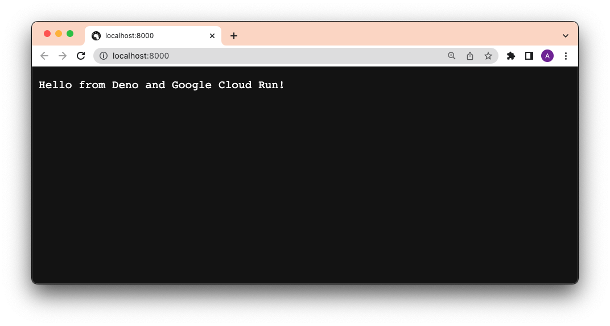
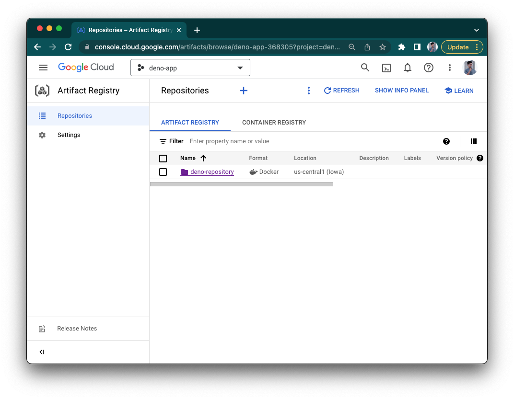
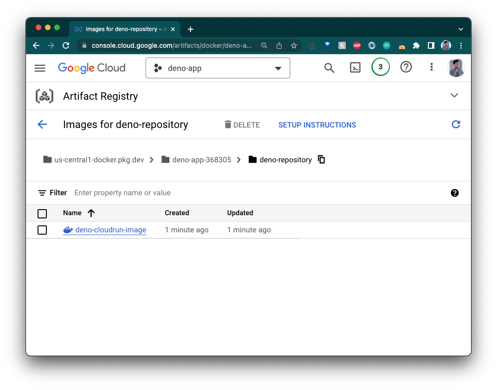
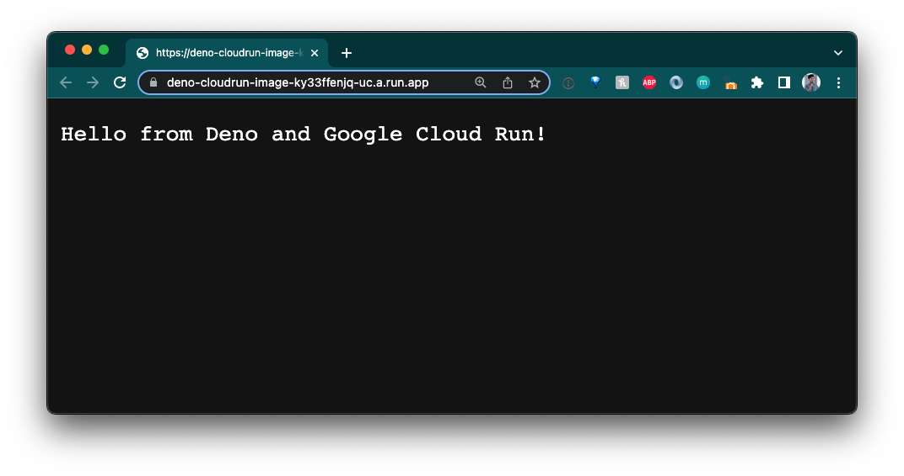

[Google Cloud Run](https://cloud.google.com/run) 是一个托管计算平台，允许您在 Google 可扩展的基础设施上运行容器。

本如何做指南将向您展示如何使用 Docker 将您的 Deno 应用程序部署到 Google Cloud Run。

首先，我们将向您展示如何手动部署，然后我们将展示如何使用 GitHub Actions 自动化部署。

先决条件：

- [Google Cloud Platform 账户](https://cloud.google.com/gcp)
- 已安装 [`docker` CLI](https://docs.docker.com/engine/reference/commandline/cli/)
- 已安装 [`gcloud`](https://cloud.google.com/sdk/gcloud)

## 手动部署

### 创建 `Dockerfile` 和 `docker-compose.yml`

为了集中关注部署，我们的应用程序将简单地为一个返回字符串的 `main.ts` 文件作为 HTTP 响应：

```ts title="main.ts"
import { Application } from "jsr:@oak/oak";

const app = new Application();

app.use((ctx) => {
  ctx.response.body = "Hello from Deno and Google Cloud Run!";
});

await app.listen({ port: 8000 });
```

然后，我们将创建两个文件——`Dockerfile` 和 `docker-compose.yml`——用于构建 Docker 镜像。

在我们的 `Dockerfile` 中，添加：

```Dockerfile
FROM denoland/deno

EXPOSE 8000

WORKDIR /app

ADD . /app

RUN deno install --entrypoint main.ts

CMD ["run", "--allow-net", "main.ts"]
```

然后，在我们的 `docker-compose.yml` 中：

```yml
version: "3"

services:
  web:
    build: .
    container_name: deno-container
    image: deno-image
    ports:
      - "8000:8000"
```

我们通过运行 `docker compose -f docker-compose.yml build` 接着 `docker compose up`，并访问 `localhost:8000` 来进行本地测试。



它成功了！

### 设置 Artifact Registry

Artifact Registry 是 GCP 的 Docker 镜像私有注册中心。

在我们可以使用它之前，请访问 GCP 的 [Artifact Registry](https://console.cloud.google.com/artifacts) 并点击 "创建存储库"。您将被要求输入一个名称（`deno-repository`）和区域（`us-central1`）。然后点击 "创建"。



### 构建、标记并推送到 Artifact Registry

一旦我们创建了一个存储库，我们就可以开始向其推送镜像。

首先，让我们将注册表地址添加到 `gcloud`：

```shell
gcloud auth configure-docker us-central1-docker.pkg.dev
```

然后，让我们构建您的 Docker 镜像。（请注意，镜像名称在我们的 `docker-compose.yml` 文件中定义。）

```shell
docker compose -f docker-compose.yml build
```

然后，用新的 Google Artifact Registry 地址、存储库和名称标记它。镜像名称应遵循以下结构：
`{{ location }}-docker.pkg.dev/{{ google_cloudrun_project_name }}/{{ repository }}/{{ image }}`。

```shell
docker tag deno-image us-central1-docker.pkg.dev/deno-app-368305/deno-repository/deno-cloudrun-image
```

如果不指定标签，它将默认使用 `:latest`。

接下来，推送镜像：

```shell
docker push us-central1-docker.pkg.dev/deno-app-368305/deno-repository/deno-cloudrun-image
```

_[有关如何推送和拉取镜像到 Google Artifact Registry 的更多信息](https://cloud.google.com/artifact-registry/docs/docker/pushing-and-pulling)。_

您的镜像现在应该出现在您的 Google Artifact Registry 中！



### 创建 Google Cloud Run 服务

我们需要一个实例来构建这些镜像，因此让我们访问 [Google Cloud Run](https://console.cloud.google.com/run) 并点击 "创建服务"。

让我们将其命名为 "hello-from-deno"。

选择 "从现有容器镜像部署一个修订版本"。使用下拉菜单选择来自 `deno-repository` Artifact Registry 的镜像。

选择 "允许未经身份验证的请求"，然后点击 "创建服务"。确保端口为 `8000`。

完成后，您的应用程序现在应该是在线的：



太棒了！

### 使用 `gcloud` 部署

现在它已经创建，我们将能够从 `gcloud` CLI 部署到此服务。命令的结构如下：
`gcloud run deploy {{ service_name }} --image={{ image }} --region={{ region }} --allow-unauthenticated`。
请注意，`image` 名称遵循上面的结构。

在本示例中，命令为：

```shell
gcloud run deploy hello-from-deno --image=us-central1-docker.pkg.dev/deno-app-368305/deno-repository/deno-cloudrun-image --region=us-central1 --allow-unauthenticated
```


成功！

## 使用 GitHub Actions 自动化部署

为了使自动化工作，我们首先需要确保这两个已经创建：

- Google Artifact Registry
- Google Cloud Run 服务实例

（如果您还没有做到这一点，请参见之前的部分。）

现在我们完成了，可以通过 GitHub 工作流自动化部署。以下是 yaml 文件：

```yml
name: Build and Deploy to Cloud Run

on:
  push:
    branches:
      - main

env:
  PROJECT_ID: { { PROJECT_ID } }
  GAR_LOCATION: { { GAR_LOCATION } }
  REPOSITORY: { { GAR_REPOSITORY } }
  SERVICE: { { SERVICE } }
  REGION: { { REGION } }

jobs:
  deploy:
    name: Deploy
    permissions:
      contents: "read"
      id-token: "write"

    runs-on: ubuntu-latest
    steps:
      - name: Checkout
        uses: actions/checkout@v3

      - name: Google Auth
        id: auth
        uses: "google-github-actions/auth@v0"
        with:
          credentials_json: "${{ secrets.GCP_CREDENTIALS }}"

      - name: Login to GAR
        uses: docker/login-action@v2.1.0
        with:
          registry: ${{ env.GAR_LOCATION }}-docker.pkg.dev
          username: _json_key
          password: ${{ secrets.GCP_CREDENTIALS }}

      - name: Build and Push Container
        run: |-
          docker build -t "${{ env.GAR_LOCATION }}-docker.pkg.dev/${{ env.PROJECT_ID }}/${{ env.REPOSITORY }}/${{ env.SERVICE }}:${{ github.sha }}" ./
          docker push "${{ env.GAR_LOCATION }}-docker.pkg.dev/${{ env.PROJECT_ID }}/${{ env.REPOSITORY }}/${{ env.SERVICE }}:${{ github.sha }}"

      - name: Deploy to Cloud Run
        id: deploy
        uses: google-github-actions/deploy-cloudrun@v0
        with:
          service: ${{ env.SERVICE }}
          region: ${{ env.REGION }}
          image: ${{ env.GAR_LOCATION }}-docker.pkg.dev/${{ env.PROJECT_ID }}/${{ env.REPOSITORY }}/${{ env.SERVICE }}:${{ github.sha }}

      - name: Show Output
        run: echo ${{ steps.deploy.outputs.url }}
```

我们需要设置的环境变量是（括号中的示例是本存储库的）：

- `PROJECT_ID`: 您的项目 ID（`deno-app-368305`）
- `GAR_LOCATION`: 您的 Google Artifact Registry 的位置（`us-central1`）
- `GAR_REPOSITORY`: 您为 Google Artifact Registry 指定的名称（`deno-repository`）
- `SERVICE`: Google Cloud Run 服务的名称（`hello-from-deno`）
- `REGION`: 您的 Google Cloud Run 服务的区域（`us-central1`）

我们需要设置的秘密变量是：

- `GCP_CREDENTIALS`: 这是 [服务账户](https://cloud.google.com/iam/docs/service-accounts) 的 json 密钥。创建服务账户时，请确保 [包括必要的角色和权限](https://cloud.google.com/iam/docs/granting-changing-revoking-access#granting_access_to_a_user_for_a_service_account) 以便用于 Artifact Registry 和 Google Cloud Run。

[查看有关从 GitHub Actions 部署到 Cloud Run 的更多详细信息和示例。](https://github.com/google-github-actions/deploy-cloudrun)

供参考：
https://github.com/google-github-actions/example-workflows/blob/main/workflows/deploy-cloudrun/cloudrun-docker.yml
