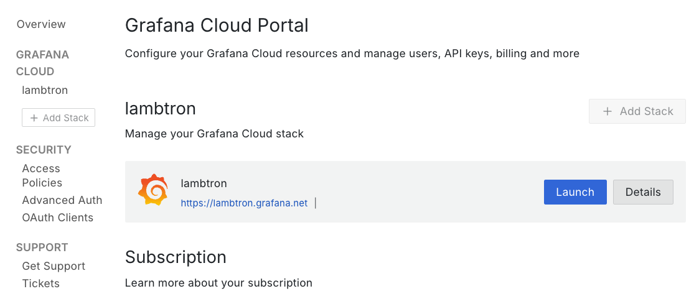
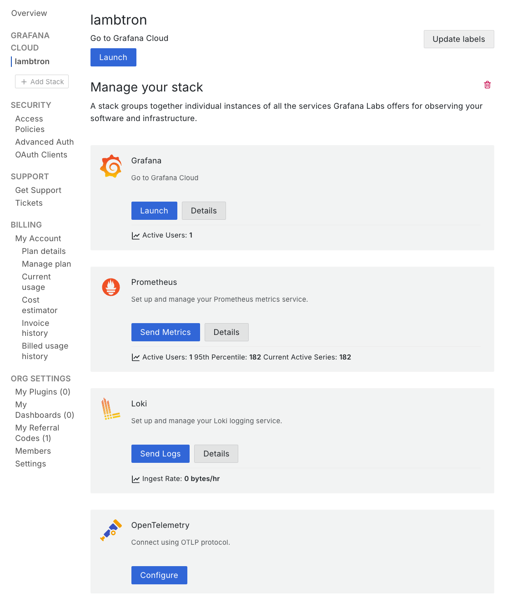
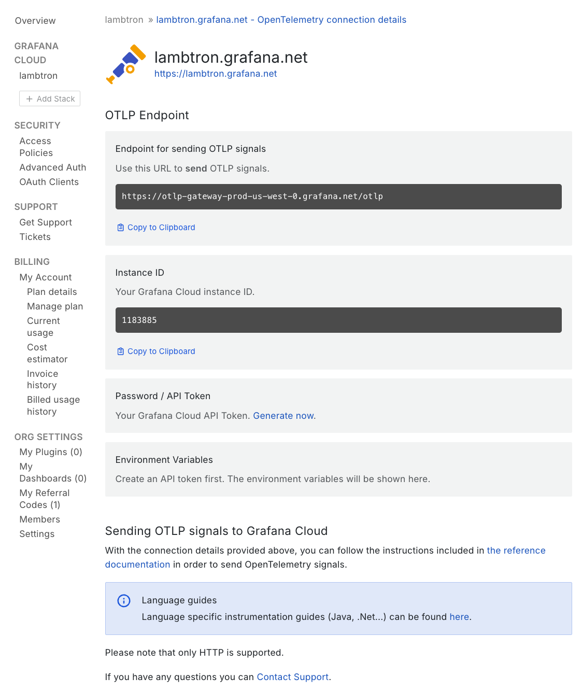
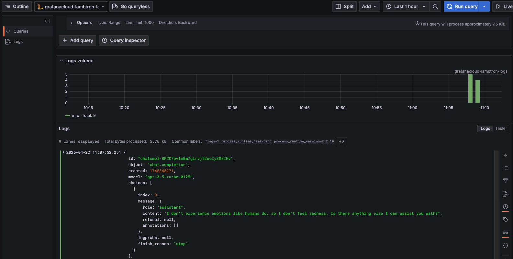
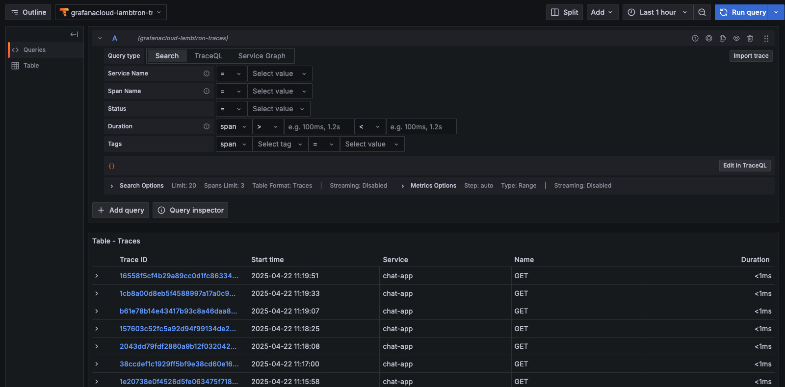

[OpenTelemetry](https://opentelemetry.io/)（通常简称为 OTel）是一个
开源的可观测性框架，它提供了一种标准化方式来收集
并导出遥测数据，例如追踪（traces）、指标（metrics）和日志（logs）。Deno 内置了对 OpenTelemetry 的支持，使你能够在
不添加外部依赖的情况下轻松为应用进行埋点。该集成可与
[Grafana](https://grafana.com/) 等可观测性平台无缝开箱即用。

Grafana 是一个开源的可观测性平台，它让 DevOps 团队能够在
实时环境中可视化、查询并告警来自多种数据源的指标、日志和追踪。它被广泛用于构建仪表盘，以监控
基础设施、应用以及系统健康状况。

Grafana 还提供一个托管版本，名为
[Grafana Cloud](https://grafana.com/products/cloud/)。本教程将帮助你
配置项目，将 OTel 数据导出到 Grafana Cloud。

在本教程中，我们将构建一个简单的应用，并将其遥测数据
导出到 Grafana Cloud。我们将涵盖：

- [搭建你的聊天应用](#set-up-your-chat-app)
- [搭建一个 Docker 采集器](#set-up-a-docker-collector)
- [生成遥测数据](#generating-telemetry-data)
- [查看遥测数据](#viewing-telemetry-data)

你可以在
[GitHub](https://github.com/denoland/examples/tree/main/with-grafana) 上找到本教程的完整源代码。

## 搭建你的聊天应用

在本教程中，我们将使用一个简单的聊天应用来演示如何
导出遥测数据。你可以在
[GitHub](https://github.com/denoland/examples/tree/main/with-grafana) 上找到该应用的
代码。

你可以直接复制该仓库，或者创建一个
[main.ts](https://github.com/denoland/examples/blob/main/with-grafana/main.ts) 文件，并创建一个
[.env](https://github.com/denoland/examples/blob/main/with-grafana/.env.example) 文件。

要运行该应用，你需要一个 OpenAI API 密钥。你可以通过在
[OpenAI](https://platform.openai.com/signup) 注册一个账号并创建新的
密钥来获取。你可以在你的 OpenAI 账号的
[API keys（API 密钥）部分](https://platform.openai.com/account/api-keys)找到你的 API 密钥。获得 API 密钥后，在你的 `.env` 文件中设置一个 `OPENAI_API-KEY` 环境变量：

```env title=".env"
OPENAI_API_KEY=your_openai_api_key
```

## 搭建一个 Docker 采集器

接下来，我们将设置一个 Docker 容器来运行 OpenTelemetry 采集器。该
采集器负责接收来自你应用的遥测数据，并将其导出到 Grafana Cloud。

在你的 `main.ts` 文件所在目录中，创建一个 `Dockerfile` 和一个 `otel-collector.yml` 文件。`Dockerfile` 将用于构建 Docker 镜像：

```dockerfile title="Dockerfile"
FROM otel/opentelemetry-collector-contrib:latest

COPY otel-collector.yml /otel-config.yml

CMD ["--config", "/otel-config.yml"]
```

[`FROM otel/opentelemetry-collector-contrib:latest`](https://hub.docker.com/r/otel/opentelemetry-collector-contrib/) -
这一行指定容器的基础镜像。它使用官方的
OpenTelemetry Collector Contributor 镜像，其中包含所有 receivers、exporters、processors、connectors 以及其他可选组件，并会拉取
最新版本。

`COPY otel-collector.yml /otel-config.yml` - 这条指令会把名为 `otel-collector.yml` 的配置文件从本地构建上下文复制到容器中。该文件会在容器内被重命名为 `/otel-config.yml`。

`CMD ["--config", "/otel-config.yml"]` - 这会设置容器启动时运行的默认命令。它告诉 OpenTelemetry Collector 使用我们在上一步复制的配置文件。

接下来，让我们配置一个 Grafana Cloud 账号并获取一些信息。

如果你还没有，
[创建一个免费的 Grafana Cloud 账号](https://grafana.com/auth/sign-up/create-user)。
创建完成后，你会收到一个 Grafana Cloud stack。点击 “Details”。



接着找到 “OpenTelemetry” 并点击 “Configure”。



该页面会提供你配置 OpenTelemetry 采集器所需的全部细节。请记下你的 **OTLP Endpoint**、**Instance ID** 和 **Password / API Token**（你需要生成一个）。



接下来，向你的 `otel-collector.yml` 文件中添加以下内容，以定义如何收集遥测数据并将其导出到 Grafana Cloud：

```yml title="otel-collector.yml"
receivers:
  otlp:
    protocols:
      grpc:
        endpoint: 0.0.0.0:4317
      http:
        endpoint: 0.0.0.0:4318

exporters:
  otlphttp/grafana_cloud:
    endpoint: $_YOUR_GRAFANA_OTLP_ENDPOINT
    auth:
      authenticator: basicauth/grafana_cloud

extensions:
  basicauth/grafana_cloud:
    client_auth:
      username: $_YOUR_INSTANCE_ID
      password: $_YOUR_API_TOKEN

processors:
  batch:

service:
  extensions: [basicauth/grafana_cloud]
  pipelines:
    traces:
      receivers: [otlp]
      processors: [batch]
      exporters: [otlphttp/grafana_cloud]
    metrics:
      receivers: [otlp]
      processors: [batch]
      exporters: [otlphttp/grafana_cloud]
    logs:
      receivers: [otlp]
      processors: [batch]
      exporters: [otlphttp/grafana_cloud]
```

`receivers` 部分用于配置采集器如何接收数据。它会设置一个 OTLP（OpenTelemetry Protocol）receiver，监听两种协议：`gRPC` 和 `HTTP`。`0.0.0.0` 地址表示它会接受来自任何来源的数据。

`exporters` 部分用于定义应该将采集到的数据发送到哪里。请确保包含你的 Grafana Cloud 实例提供的**OTLP endpoint**。

`extensions` 部分用于定义 OTel 将数据导出到 Grafana Cloud 时的身份验证方式。请务必包含你的 Grafana Cloud **Instance ID**，以及你生成的 **Password / API Token**。

`processors` 部分用于定义在导出之前如何处理数据。它使用批处理（batch processing），超时时间为 5 秒，最大批大小为 5000 条。

`service` 部分通过定义三个 pipeline 将所有内容连接起来。每个 pipeline 负责不同类型的遥测数据。logs pipeline 会收集应用日志。traces pipeline 用于分布式追踪数据。metric pipeline 用于性能指标。

使用以下命令构建并运行该 docker 实例，以开始收集你的遥测数据：

```sh
docker build -t otel-collector . && docker run -p 4317:4317 -p 4318:4318 otel-collector
```

## 生成遥测数据

既然我们已经把应用和 docker 容器都搭好了，现在就可以开始生成遥测数据了。使用下面这些环境变量运行你的应用，以便把数据发送到采集器：

```sh
OTEL_EXPORTER_OTLP_ENDPOINT=http://localhost:4318 \
OTEL_SERVICE_NAME=chat-app \
OTEL_DENO=true \
deno run --allow-net --allow-env --env-file --allow-read main.ts
```

该命令：

- 将 OpenTelemetry exporter 指向你本地的采集器（`localhost:4318`）
- 在 Grafana Cloud 中将你的服务命名为 “chat-app”
- 启用 Deno 的 OpenTelemetry 集成
- 使用必要的权限运行你的应用

为了生成一些遥测数据，请在浏览器中对你运行的应用发起几次请求：[`http://localhost:8000`](http://localhost:8000)。

每次请求将：

1. 在请求通过你的应用流转时生成追踪（traces）
2. 从你应用的控制台输出中发送日志
3. 创建关于请求性能的指标（metrics）
4. 通过采集器将所有这些数据转发到 Grafana Cloud

## 查看遥测数据

在向你的应用发起一些请求之后，你会在 Grafana Cloud 仪表盘中看到三种类型的数据：

1. **Traces** - 你的系统中的端到端请求流转
2. **Logs** - 控制台输出和结构化日志数据
3. **Metrics** - 性能与资源利用率数据



你可以深入查看各个 span，以调试性能问题：



🦕 现在你已经让遥测导出工作了，你可以：

1. 添加自定义 spans 和属性，以更好地理解你的应用
2. 基于延迟或错误条件设置告警
3. 使用诸如以下平台将你的应用和采集器部署到生产环境：
   - [Fly.io](https://docs.deno.com/examples/deploying_deno_with_docker/)
   - [Digital Ocean](https://docs.deno.com/examples/digital_ocean_tutorial/)
   - [AWS Lightsail](https://docs.deno.com/examples/aws_lightsail_tutorial/)

如需更多关于 OpenTelemetry 配置的信息，请查看
[Grafana Cloud 文档](https://grafana.com/docs/grafana-cloud/monitor-applications/application-observability/collector/)。
