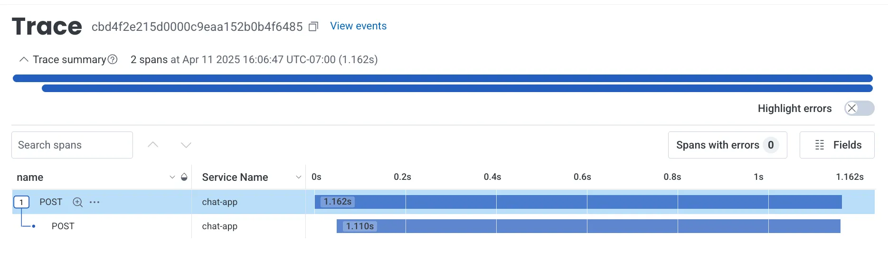
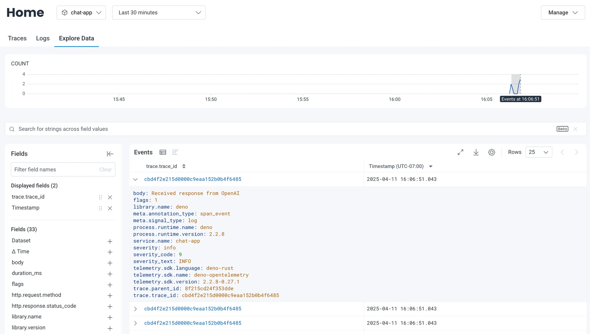

[OpenTelemetry](https://opentelemetry.io/)（通常缩写为 OTel）是一个
开源可观测性框架，它提供了一种标准化方式来收集
并导出遥测数据，例如追踪（traces）、指标（metrics）和日志（logs）。Deno 内置了对 OpenTelemetry 的支持，使得在
不添加外部依赖的情况下为你的应用进行插桩变得容易。这种集成开箱即用，适用于
诸如 [Honeycomb](https://honeycomb.io) 之类的可观测性平台。

Honeycomb 是一个面向调试和理解
复杂、现代分布式系统而设计的可观测性平台。

在本教程中，我们将构建一个简单的应用，并将其遥测数据
导出到 Honeycomb。我们将涵盖：

- [设置你的聊天应用](#set-up-your-chat-app)
- [设置 Docker 收集器](#set-up-a-docker-collector)
- [生成遥测数据](#generating-telemetry-data)
- [查看遥测数据](#viewing-telemetry-data)

你可以在
[GitHub](https://github.com/denoland/examples/tree/main/with-honeycomb) 上找到本教程的完整源代码。

## 设置你的聊天应用

在本教程中，我们将使用一个简单的聊天应用来演示如何
导出遥测数据。你可以找到
[该应用的代码](https://github.com/denoland/examples/tree/main/with-honeycomb)。

你可以直接复制该仓库，或创建一个
[main.ts](https://github.com/denoland/examples/blob/main/with-honeycomb/main.ts)
文件以及一个
[.env](https://github.com/denoland/examples/blob/main/with-honeycomb/.env.example)
文件。

要运行该应用，你需要一个 OpenAI API 密钥。你可以通过在
[OpenAI](https://platform.openai.com/signup) 注册账户并创建一个新的秘密密钥来获得它。你可以在你的 OpenAI 账户的
[API keys 部分](https://platform.openai.com/account/api-keys)找到你的 API 密钥。获得 API 密钥后，在你的 `.env` 文件中设置一个 `OPENAI_API-KEY` 环境变量：

```env title=".env"
OPENAI_API_KEY=your_openai_api_key
```

## 设置一个 Docker 收集器

接下来，我们将设置一个 Docker 容器来运行 OpenTelemetry 收集器。该
收集器负责从你的应用接收遥测数据并将其
导出到 Honeycomb。

如果你还没有，请先创建一个免费的 Honeycomb 账户，并设置一个
[ingest API key](https://docs.honeycomb.io/configure/environments/manage-api-keys/)。

在你的 `main.ts` 文件所在目录中，创建一个 `Dockerfile` 和一个 `otel-collector.yml` 文件。`Dockerfile` 将用于构建一个 Docker 镜像：

```dockerfile title="Dockerfile"
FROM otel/opentelemetry-collector:latest

COPY otel-collector.yml /otel-config.yml

CMD ["--config", "/otel-config.yml"]
```

`FROM otel/opentelemetry-collector:latest` - 这一行指定容器的基础镜像。
它使用官方的 OpenTelemetry Collector 镜像，并拉取最新版本。

`COPY otel-collector.yml /otel-config.yml` - 该指令会将本地构建上下文中名为 `otel-collector.yml` 的配置文件
复制到容器中。该文件在容器内会被重命名为 `/otel-config.yml`。

`CMD ["--config", "/otel-config.yml"]` - 这会设置当容器启动时运行的默认命令。它告诉 OpenTelemetry Collector 使用我们在上一
步骤中复制进容器的配置文件。

接下来，在你的 `otel-collector.yml` 文件中加入以下内容，用于定义如何
收集遥测数据以及如何将其导出到 Honeycomb：

```yml title="otel-collector.yml"
receivers:
  otlp:
    protocols:
      grpc:
        endpoint: 0.0.0.0:4317
      http:
        endpoint: 0.0.0.0:4318

exporters:
  otlp:
    endpoint: "api.honeycomb.io:443"
    headers:
      x-honeycomb-team: $_HONEYCOMB_API_KEY

processors:
  batch:
    timeout: 5s
    send_batch_size: 5000

service:
  pipelines:
    logs:
      receivers: [otlp]
      processors: [batch]
      exporters: [otlp]
    traces:
      receivers: [otlp]
      processors: [batch]
      exporters: [otlp]
    metrics:
      receivers: [otlp]
      processors: [batch]
      exporters: [otlp]
```

`receivers` 部分配置收集器如何接收数据。它会设置一个 OTLP（OpenTelemetry Protocol）接收器，
监听两种协议：`gRPC` 和 `HTTP`。`0.0.0.0` 地址表示它会接收来自任意来源的数据。

`exporters` 部分定义应该将收集到的数据发送到哪里。它会将数据发送到 Honeycomb 的 API 端点 `api.honeycomb.io:443`。
该配置需要一个 API key 进行身份验证；请将 `$_HONEYCOMB_API_KEY` 替换为你实际的 Honeycomb API 密钥。

`processors` 部分定义在导出之前如何处理数据。
它使用批处理（batch）方式，超时时间为 5 秒，最大批量大小为 5000 个条目。

`service` 部分通过定义三个管道（pipelines）将所有内容串联起来。每个管道负责
不同类型的遥测数据。日志管道（logs）用于收集应用日志。追踪管道（traces）用于分布式追踪数据。指标管道（metrics）用于性能指标。

使用以下命令构建并运行 Docker 实例，以开始收集你的遥测数据：

```sh
docker build -t otel-collector . && docker run -p 4317:4317 -p 4318:4318 otel-collector
```

## 生成遥测数据

既然应用和 Docker 容器都已经准备好了，我们现在可以开始生成遥测数据了。
运行你的应用并使用这些环境变量来向收集器发送数据：

```sh
OTEL_EXPORTER_OTLP_ENDPOINT=http://localhost:4318 \
OTEL_SERVICE_NAME=chat-app \
OTEL_DENO=true \
deno run --allow-net --allow-env --env-file --allow-read main.ts
```

此命令：

- 将 OpenTelemetry 导出器指向你本地的收集器（`localhost:4318`）
- 在 Honeycomb 中将你的服务命名为 “chat-app”
- 启用 Deno 的 OpenTelemetry 集成
- 以必要的权限运行你的应用

为了生成一些遥测数据，请在运行中的应用上发起几次请求，在浏览器中访问
[`http://localhost:8000`](http://localhost:8000)。

每次请求都会：

1. 在请求经过你的应用时生成追踪（traces）
2. 从应用的控制台输出发送日志
3. 创建有关请求性能的指标（metrics）
4. 将以上所有数据通过收集器转发到 Honeycomb

## 查看遥测数据

在对你的应用发起一些请求之后，你会在 Honeycomb.io 仪表板中看到三种类型的数据：

1. **Traces（追踪）** - 你的系统中端到端的请求流
2. **Logs（日志）** - 控制台输出以及结构化日志数据
3. **Metrics（指标）** - 性能和资源利用率数据



你可以深入查看各个单独的 span，以调试性能问题：



🦕 现在你的遥测导出已经正常工作，你可以：

1. 添加自定义 spans 和 attributes，以更好地理解你的应用
2. 基于延迟或错误条件设置告警
3. 使用诸如以下平台将你的应用和收集器部署到生产环境：
   - [Fly.io](https://docs.deno.com/examples/deploying_deno_with_docker/)
   - [Digital Ocean](https://docs.deno.com/examples/digital_ocean_tutorial/)
   - [AWS Lightsail](https://docs.deno.com/examples/aws_lightsail_tutorial/)

如需了解 OpenTelemetry 配置的更多细节，请查看
[Honeycomb 文档](https://docs.honeycomb.io/send-data/opentelemetry/collector/)。
