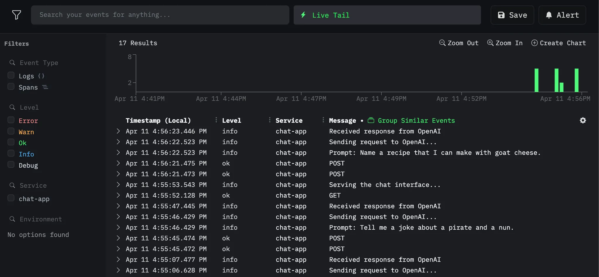
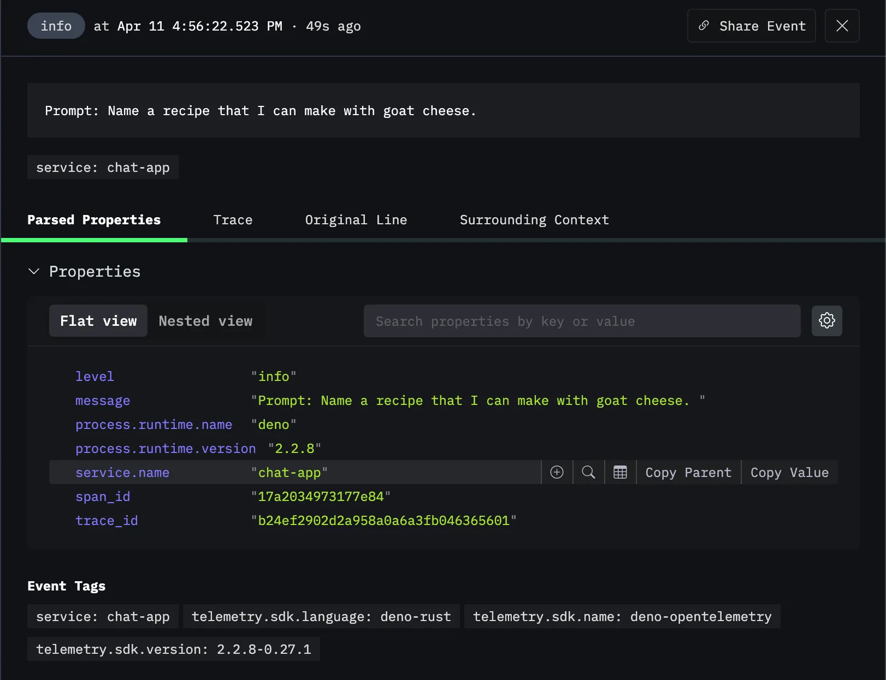
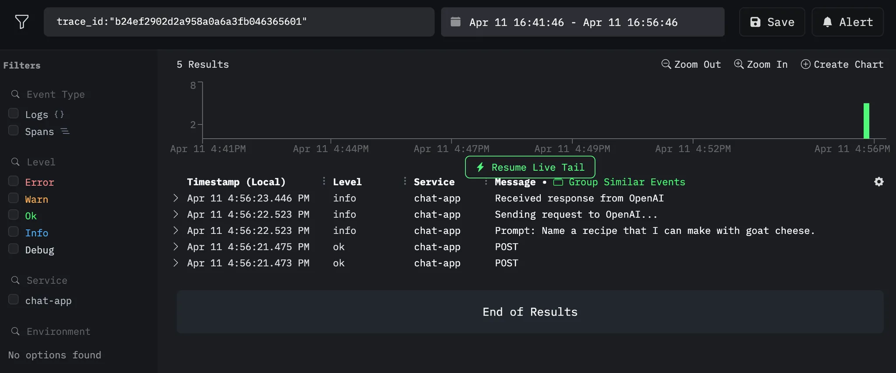
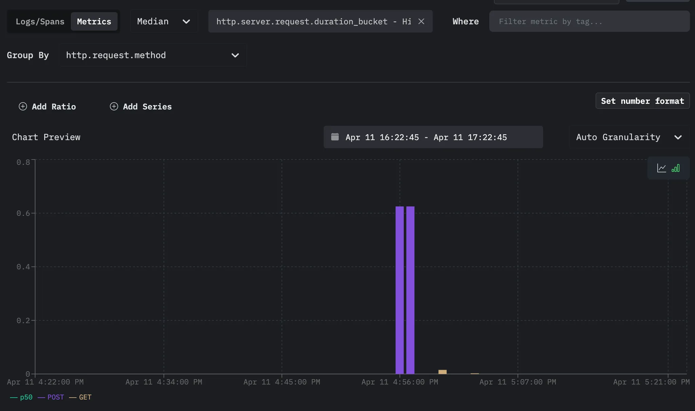

[HyperDX](https://hyperdx.io) 是一个开源的可观测性平台，它将日志、追踪、指标、异常以及会话回放统一到一个界面中。它通过提供系统行为和性能的完整视图，帮助开发者更快地调试应用程序。

[OpenTelemetry](https://opentelemetry.io/)（通常简称 OTel）提供了一种标准化的方式来采集并导出遥测数据。Deno 内置了 OpenTelemetry 支持，使你能够在无需额外依赖的情况下为应用程序进行埋点。这个集成可以与类似 HyperDX 的平台无缝协作，用于采集和可视化遥测数据。

在本教程中，我们将构建一个简单的应用，并将其遥测数据导出到 HyperDX：

- [设置你的聊天应用](#set-up-your-chat-app)
- [设置一个 Docker 采集器](#set-up-a-docker-collector)
- [生成遥测数据](#generating-telemetry-data)
- [查看遥测数据](#viewing-telemetry-data)

你可以在
[GitHub](https://github.com/denoland/examples/tree/main/with-hyperdx) 上找到本教程的完整源代码。

## 设置应用

在本教程中，我们将使用一个简单的聊天应用来演示如何导出遥测数据。你可以在
[GitHub](https://github.com/denoland/examples/tree/main/with-hyperdx) 上找到应用程序代码。

你可以直接复制该仓库，或创建一个
[main.ts](https://github.com/denoland/examples/blob/main/with-hyperdx/main.ts)
文件，以及一个
[.env](https://github.com/denoland/examples/blob/main/with-hyperdx/.env.example)
文件。

要运行该应用，你需要一个 OpenAI API 密钥。你可以通过在
[OpenAI](https://platform.openai.com/signup) 注册账号并创建新的密钥来获得。你可以在
OpenAI 账号的
[API keys 部分](https://platform.openai.com/account/api-keys)
找到你的 API 密钥。拿到 API 密钥后，在你的 `.env` 文件中设置一个 `OPENAI_API-KEY` 环境变量：

```env title=".env"
OPENAI_API_KEY=your_openai_api_key
```

## 设置采集器

首先，创建一个免费的 HyperDX 账号以获取你的 API 密钥。然后，我们将设置两个文件来配置 OpenTelemetry 采集器：

1. 创建一个 `Dockerfile`：

```dockerfile title="Dockerfile"
FROM otel/opentelemetry-collector:latest

COPY otel-collector.yml /otel-config.yml

CMD ["--config", "/otel-config.yml"]
```

这个 Dockerfile：

- 使用官方 OpenTelemetry Collector 作为基础镜像
- 将你的配置复制到容器中
- 在启动时使用你的配置来设置采集器

2. 创建一个名为 `otel-collector.yml` 的文件：

```yml title="otel-collector.yml"
receivers:
  otlp:
    protocols:
      grpc:
        endpoint: 0.0.0.0:4317
      http:
        endpoint: 0.0.0.0:4318

exporters:
  otlphttp/hdx:
    endpoint: "https://in-otel.hyperdx.io"
    headers:
      authorization: $_HYPERDX_API_KEY
    compression: gzip

processors:
  batch:

service:
  pipelines:
    traces:
      receivers: [otlp]
      processors: [batch]
      exporters: [otlphttp/hdx]
    metrics:
      receivers: [otlp]
      processors: [batch]
      exporters: [otlphttp/hdx]
    logs:
      receivers: [otlp]
      processors: [batch]
      exporters: [otlphttp/hdx]
```

这个配置文件会将 OpenTelemetry 采集器设置为从你的应用接收遥测数据，并将其导出到 HyperDX。它包含：

- receivers（接收器）部分：通过 gRPC（4317）和 HTTP（4318）接收数据
- Exporters（导出器）部分：使用压缩和认证将数据发送到 HyperDX
- processors（处理器）部分：将遥测数据进行批处理，以便高效传输
- pipelines（流水线）部分：为日志、追踪和指标定义了独立的数据流

使用下面的命令构建并运行 docker 实例，以开始收集你的遥测数据：

```sh
docker build -t otel-collector . && docker run -p 4317:4317 -p 4318:4318 otel-collector
```

## 生成遥测数据

既然应用和 docker 容器都已经配置好了，我们就可以开始生成遥测数据了。运行你的应用时，使用这些环境变量把数据发送到采集器：

```sh
OTEL_EXPORTER_OTLP_ENDPOINT=http://localhost:4318 \
OTEL_SERVICE_NAME=chat-app \
OTEL_DENO=true \
deno run --allow-net --allow-env --env-file --allow-read main.ts
```

这个命令：

- 将 OpenTelemetry 导出器指向你本地的采集器（`localhost:4318`）
- 在 HyperDX 中将你的服务命名为“chat-app”
- 启用 Deno 的 OpenTelemetry 集成
- 使用必要的权限运行你的应用

为了生成一些遥测数据，请在浏览器中向你正在运行的应用发起一些请求：  
[`http://localhost:8000`](http://localhost:8000)。

每个请求将：

1. 在应用中流转时生成追踪（traces）
2. 从你应用的控制台输出中发送日志（logs）
3. 创建关于请求性能的指标（metrics）
4. 将所有这些数据通过采集器转发到 HyperDX

## 查看遥测数据

在你的 HyperDX 仪表盘中，你会看到遥测数据的不同视图：

### 日志视图



点击任意一条日志查看详情：


### 请求追踪

在单个请求内查看所有日志：


### 指标仪表盘

监控系统性能：


🦕 现在你的遥测导出已经可以工作了，你可以：

1. 添加自定义 span 和属性，以更好地理解你的应用
2. 基于延迟或错误条件设置告警
3. 使用类似以下平台把你的应用和采集器部署到生产环境：
   - [Fly.io](https://docs.deno.com/examples/deploying_deno_with_docker/)
   - [Digital Ocean](https://docs.deno.com/examples/digital_ocean_tutorial/)
   - [AWS Lightsail](https://docs.deno.com/examples/aws_lightsail_tutorial/)

🦕 如需了解 HyperDX 中使用 OpenTelemetry 的更多配置细节，请参阅他们的
[文档](https://www.hyperdx.io/docs/install/opentelemetry)。
