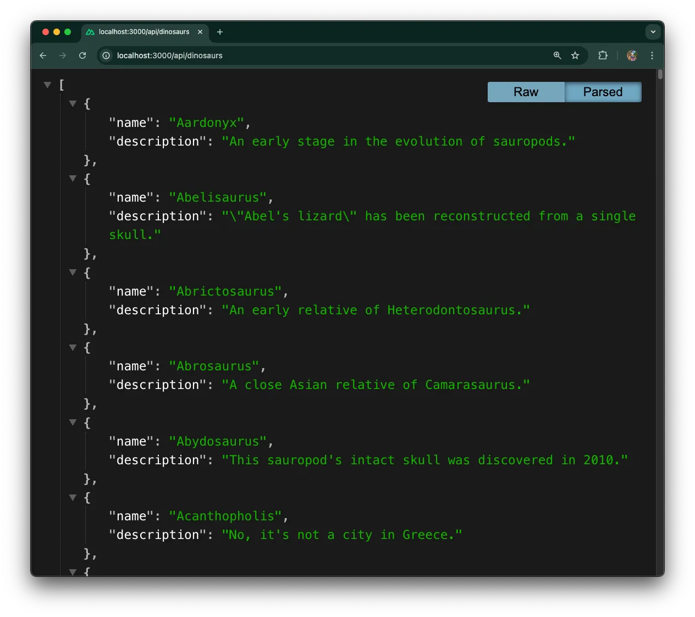
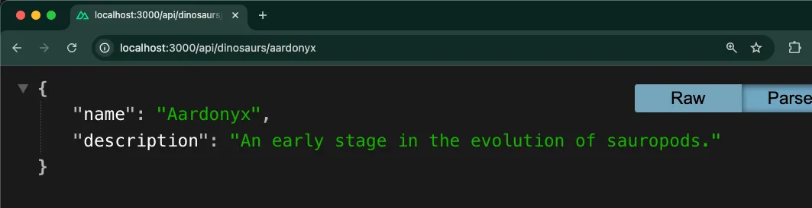

[Nuxt](https://nuxt.com/) 是一个基于 [Vue](https://vuejs.org/) 的直观框架，
提供了文件路由、多种渲染选项和开箱即用的自动代码拆分。凭借其模块化架构，Nuxt 通过提供结构化的开发方式简化了 Vue 应用的构建流程。

在本教程中，我们将使用 Deno 构建一个简单的 Nuxt 应用，显示恐龙列表，并允许你点击名字查看更多恐龙信息。

你可以在
[GitHub 上查看完整示例](https://github.com/denoland/tutorial-with-nuxt)。

也可以体验
[Deno Deploy 上的在线示例](https://tutorial-with-nuxt.deno.deno.net/)。

:::info 部署你的应用

想跳过教程，立即部署完整的 Nuxt 恐龙应用？点击下面按钮，瞬间将应用部署到 Deno Deploy。
你将获得一个可用的实时应用，可在学习时自由定制和修改！

[](https://app.deno.com/new?clone=https://github.com/denoland/tutorial-with-nuxt)

:::

## 使用 Deno 脚手架 Nuxt 应用

通过 Deno 创建新的 Nuxt 项目：

```bash
deno -A npm:nuxi@latest init
```

选择创建项目的目录，并选择 `deno` 作为依赖管理方式。你也可以选择初始化 git 仓库，也可以之后再做。

然后进入新项目目录，运行 `deno task` 查看 Nuxt 可用任务：

```bash
cd nuxt-app
deno task
```

这会显示可用任务，如 `dev`、`build` 和 `preview`。`dev` 用于启动开发服务器。

## 启动开发服务器

启动开发服务器：

```bash
deno task dev
```

这会启动 Nuxt 开发服务器，在浏览器访问
[http://localhost:3000](http://localhost:3000) 查看默认 Nuxt 欢迎页面。

## 构建应用架构

基础 Nuxt 应用搭建完成后，开始建立应用架构。我们创建几个目录以组织代码，并为后续功能做准备。项目内创建如下目录：

```bash
NUXT-APP/
├── pages/                 # Vue 页面
│   └── dinosaurs/         # 恐龙页面
├── public/                # 静态文件
├── server/                # 服务器端代码
│   └── api/               # API 路由
```

## 添加恐龙数据

在 `api` 目录下创建 `data.json` 文件，用于存储硬编码的恐龙数据。

复制粘贴
[此 JSON 文件](https://raw.githubusercontent.com/denoland/tutorial-with-nuxt/refs/heads/main/src/data/data.json)
到 `data.json` 文件中。（实际应用中，通常从数据库或外部 API 获取数据。）

## 设置 API 路由

应用将包含两个 API 路由，分别提供：

- 供索引页面使用的完整恐龙列表
- 单个恐龙页面的详细恐龙信息

路由均为 `*.get.ts` 文件，Nuxt 会自动根据文件生成响应 `GET` 请求的 API 端点。
[文件命名决定 HTTP 方法及路由路径](https://nuxt.com/docs/guide/directory-structure/server#matching-http-method)。

初始的 `dinosaurs.get.ts` 十分简单，使用 [`defineCachedEventHandler`](https://nitro.build/guide/cache) 创建缓存端点提升性能。该函数直接返回完整恐龙数据数组，无任何过滤：

```tsx title="server/api/dinosaurs.get.ts"
import data from "./data.json" with { type: "json" };

export default defineCachedEventHandler(() => {
  return data;
});
```

单个恐龙的 `GET` 路由逻辑较多。它从事件上下文中取出名称参数，以不区分大小写方式匹配请求恐龙，缺少或错误时返回相应错误。我们创建 `dinosaurs` 文件夹，并新建 `[name].get.ts`：

```tsx title="server/api/dinosaurs/[name].get.ts"
import data from "../data.json";

export default defineCachedEventHandler((event) => {
  const name = getRouterParam(event, "name");

  if (!name) {
    throw createError({
      statusCode: 400,
      message: "未提供恐龙名称",
    });
  }

  const dinosaur = data.find(
    (dino) => dino.name.toLowerCase() === name.toLowerCase(),
  );

  if (!dinosaur) {
    throw createError({
      statusCode: 404,
      message: "未找到该恐龙",
    });
  }

  return dinosaur;
});
```

启动服务器 `deno task dev`，在浏览器访问
[http://localhost:3000/api/dinosaurs](http://localhost:3000/api/dinosaurs)，你应能看到包含所有恐龙的原始 JSON 响应！



访问某个恐龙的特定 URL，如：
[http://localhost:3000/api/dinosaurs/aardonyx](http://localhost:3000/api/dinosaurs/aardonyx)，查看单个恐龙数据。



接下来，设置 Vue 前端以显示索引页面和单个恐龙页面。

## 设置 Vue 前端

我们需要两个页面：

- 一个索引页，列出全部恐龙
- 一个单独页，展示指定恐龙详情

首先，创建索引页面。Nuxt 使用
[文件系统路由](https://nuxt.com/docs/getting-started/routing)，我们在根目录创建 `pages` 文件夹，并新建 `index.vue` 作为索引页。

利用 `useFetch` 组合函数请求先前创建的 API 端点：

```tsx title="pages/index.vue"
<script setup lang="ts">
const { data: dinosaurs } = await useFetch("/api/dinosaurs");
</script>

<template>
  <main id="content">
    <h1 class="text-2xl font-bold mb-4">Welcome to the Dinosaur app</h1>
    <p class="mb-4">Click on a dinosaur below to learn more.</p>
    <ul class="space-y-2">
      <li v-for="dinosaur in dinosaurs" :key="dinosaur.name">
        <NuxtLink
          :to="'/' + dinosaur.name.toLowerCase()"
          class="text-blue-600 hover:text-blue-800 hover:underline"
        >
          {{ dinosaur.name }}
        </NuxtLink>
      </li>
    </ul>
  </main>
</template>
```

然后，为显示单个恐龙信息，创建动态页面 `[name].vue`。该页面使用 Nuxt 的
[动态路由参数](https://nuxt.com/docs/getting-started/routing#route-parameters)，文件名中的 `[name]` 在 JavaScript 中通过 `route.params.name` 访问。我们用 `useRoute` 访问参数，并用 `useFetch` 根据名称获取指定恐龙数据：

```tsx title="pages/[name].vue"
<script setup lang="ts">
const route = useRoute();
const { data: dinosaur } = await useFetch(
  `/api/dinosaurs/${route.params.name}`
);
</script>

<template>
  <main v-if="dinosaur">
    <h1 class="text-2xl font-bold mb-4">{{ dinosaur.name }}</h1>
    <p class="mb-4">{{ dinosaur.description }}</p>
    <NuxtLink to="/" class="text-blue-600 hover:text-blue-800 hover:underline">
      返回所有恐龙
    </NuxtLink>
  </main>
</template>
```

接下来，将这些 Vue 组件串联起来，使访问根目录时能正确渲染。更新根目录的 `app.vue`，提供应用根组件。使用
[`NuxtLayout`](https://nuxt.com/docs/api/components/nuxt-layout) 保持一致结构，`NuxtPage` 用于动态页面渲染：

```tsx title="app.vue"
<template>
  <NuxtLayout>
    <div>
      <nav class="p-4 bg-gray-100">
        <NuxtLink to="/" class="text-blue-600 hover:text-blue-800">
          恐龙百科全书
        </NuxtLink>
      </nav>

      <div class="container mx-auto p-4">
        <NuxtPage />
      </div>
    </div>
  </NuxtLayout>
</template>;
```

运行 `deno task dev`，在 [http://localhost:3000](http://localhost:3000) 查看效果：

效果很棒！

```bash
deno install -D npm:tailwindcss npm:@tailwindcss/vite
```

随后，更新 `nuxt.config.ts`。导入 Tailwind 依赖并配置 Nuxt 应用以支持 Deno，启用开发工具，设置 Tailwind CSS：

```tsx title="nuxt.config.ts"
import tailwindcss from "@tailwindcss/vite";

export default defineNuxtConfig({
  compatibilityDate: "2025-05-15",
  devtools: { enabled: true },
  nitro: {
    preset: "deno",
  },
  app: {
    head: {
      title: "恐龙百科全书",
    },
  },
  css: ["~/assets/css/main.css"],
  vite: {
    plugins: [
      tailwindcss(),
    ],
  },
});
```

然后，创建新的 CSS 文件 `assets/css/main.css`，添加导入语句引入 tailwind 及其实用类：

```tsx title="assets/css/main.css"
@import "tailwindcss";

@tailwind base;
@tailwind components;
@tailwind utilities;
```

## 运行应用

最后，通过以下命令运行应用：

```bash
deno task dev
```

应用将在 localhost:3000 启动：

<figure>

<video class="w-full" alt="使用 Deno 构建 Nuxt 应用。" autoplay muted loop playsinline src="./images/how-to/nuxt/nuxt-4.mp4"></video>

</figure>

完成了！

🦕 Nuxt 应用的下一步可以是使用 [Nuxt Auth](https://auth.nuxtjs.org/) 模块添加认证，集成 [Pinia](https://pinia.vuejs.org/) 状态管理，添加服务器端数据持久化（例如 [Prisma](https://docs.deno.com/examples/prisma_tutorial/) 或 [MongoDB](https://docs.deno.com/examples/mongoose_tutorial/)），以及搭建 Vitest 自动化测试，这些都将使应用更适合生产环境和大型项目。