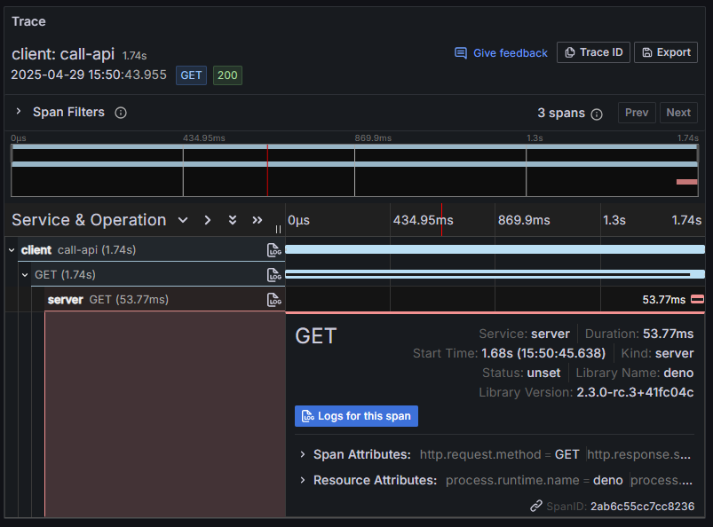

现代应用通常构建为多个服务相互通信的分布式系统。在调试问题或优化性能时，能够追踪请求在不同服务间的流动至关重要。这正是分布式追踪的作用所在。

自 Deno 2.3 起，运行时自动在服务边界间保留追踪上下文，使得分布式系统中的端到端追踪变得更加简单和强大。这意味着当一个服务向另一个服务发起请求时，追踪上下文会自动传播，让你能够将整个请求流程视为一个完整的追踪。

## 搭建分布式系统

我们的示例系统由两部分组成：

1. 一个提供 API 端点的服务器
2. 一个向服务器发起请求的客户端

### 服务器

我们搭建一个简单的 HTTP 服务器，用于响应 GET 请求并返回 JSON 消息：

```ts title="server.ts"
import { trace } from "npm:@opentelemetry/api@1";

const tracer = trace.getTracer("api-server", "1.0.0");

// 使用 Deno.serve 创建一个简单的 API 服务器
Deno.serve({ port: 8000 }, (req) => {
  return tracer.startActiveSpan("process-api-request", async (span) => {
    // 向 span 添加属性以提供更多上下文
    span.setAttribute("http.route", "/");
    span.updateName("GET /");

    // 添加一个 span 事件以便在追踪中查看
    span.addEvent("processing_request", {
      request_id: crypto.randomUUID(),
      timestamp: Date.now(),
    });

    // 模拟处理时间
    await new Promise((resolve) => setTimeout(resolve, 50));

    console.log("Server: Processing request in trace context");

    // 操作完成后结束 span
    span.end();

    return new Response(JSON.stringify({ message: "Hello from server!" }), {
      headers: { "Content-Type": "application/json" },
    });
  });
});
```

### 客户端

现在，让我们创建一个客户端向服务器发起请求：

```ts title="client.ts"
import { SpanStatusCode, trace } from "npm:@opentelemetry/api@1";

const tracer = trace.getTracer("api-client", "1.0.0");

// 为客户端操作创建一个父 span
await tracer.startActiveSpan("call-api", async (parentSpan) => {
  try {
    console.log("Client: Starting API call");

    // 该 span 内的 fetch 调用将自动：
    // 1. 为 fetch 操作创建子 span
    // 2. 将追踪上下文注入到外发请求头中
    const response = await fetch("http://localhost:8000/");
    const data = await response.json();

    console.log(`Client: Received response: ${JSON.stringify(data)}`);

    parentSpan.addEvent("received_response", {
      status: response.status,
      timestamp: Date.now(),
    });
  } catch (error) {
    console.error("Error calling API:", error);
    if (error instanceof Error) {
      parentSpan.recordException(error);
    }
    parentSpan.setStatus({
      code: SpanStatusCode.ERROR,
      message: error instanceof Error ? error.message : String(error),
    });
  } finally {
    parentSpan.end();
  }
});
```

## 使用 OpenTelemetry 进行追踪

客户端和服务器代码中已包含基础的 OpenTelemetry 仪表化：

1. 创建 tracer —— 两个文件均使用 `trace.getTracer()` 创建跟踪器，包含名称和版本信息。

2. 创建 span —— 我们使用 `startActiveSpan()` 创建表示操作的 span。

3. 添加上下文 —— 通过向 span 添加属性和事件提供更多上下文信息。

4. 结束 span —— 在操作完成时确保结束 span。

## 自动上下文传播

关键步骤发生在客户端向服务器发起请求时。客户端代码中的 fetch 调用：

```ts
const response = await fetch("http://localhost:8000/");
```

由于此 fetch 调用位于活动 span 内，Deno 会自动为 fetch 操作创建子 span，并将追踪上下文注入到外发请求头中。

服务器接收请求后，会从请求头中提取追踪上下文，并将服务器的 span 设为客户端 span 的子 span。

## 运行示例

运行此示例，首先启动服务器，为你的 otel 服务命名：

```sh
OTEL_DENO=true OTEL_SERVICE_NAME=server deno run --allow-net server.ts
```

然后，在另一个终端运行客户端，为客户端服务指定不同的名称，以便更清晰地观察传播：

```sh
OTEL_DENO=true OTEL_SERVICE_NAME=client deno run --allow-net client.ts
```

你应当看到：

1. 客户端打印日志 "Client: Starting API call"
2. 服务器打印日志 "Server: Processing request in trace context"
3. 客户端打印接收到的响应内容

## 查看追踪

要查看追踪，需要配置 OpenTelemetry 收集器和可视化工具，例如 [Grafana Tempo](/runtime/fundamentals/open_telemetry/#quick-start)。

可视化追踪时，你会看到：

1. 客户端的父 span
2. 连接到 HTTP 请求的子 span
3. 连接到服务器端的 span
4. 全部组成一个完整的追踪！

例如，在 Grafana 中的追踪可视化可能长这样：



🦕 现在你已经了解了 Deno 中的分布式追踪，接下来可以将这应用扩展到包含更多服务和异步操作的复杂系统中。

借助 Deno 的自动上下文传播，实现分布式追踪比以往任何时候都更简单！