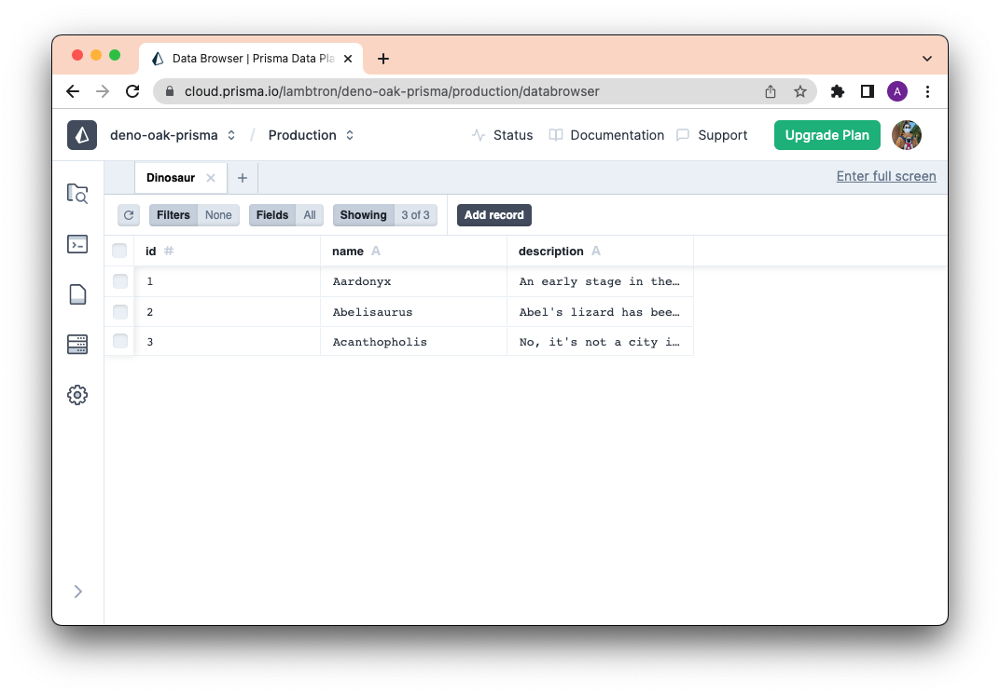
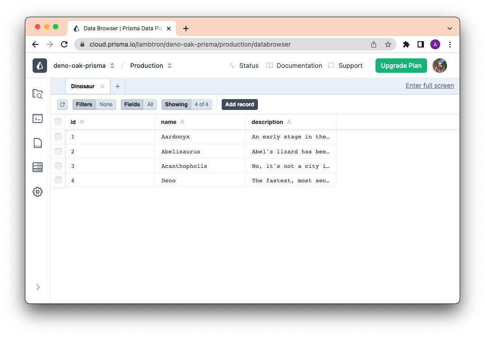

[Prisma](https://prisma.io) 一直以来都是我们在 Deno 中最受欢迎的模块之一。鉴于 Prisma 的开发者体验非常出色，并且与众多持久数据存储技术兼容，需求是可以理解的。

我们很高兴向您展示如何在 Deno 中使用 Prisma。

在本教程中，我们将使用 Oak 和 Prisma 在 Deno 中设置一个简单的 RESTful API。

让我们开始吧。

[查看源代码](https://github.com/denoland/examples/tree/main/with-prisma) 或者 [查看视频教程](https://youtu.be/P8VzA_XSF8w)。

## 设置应用程序

首先创建文件夹 `rest-api-with-prisma-oak` 并导航到该文件夹：

```shell
mkdir rest-api-with-prisma-oak
cd rest-api-with-prisma-oak
```

然后，使用 Deno 运行 `prisma init`：

```shell
deno run --allow-read --allow-env --allow-write npm:prisma@latest init
```

这将生成 [`prisma/schema.prisma`](https://www.prisma.io/docs/concepts/components/prisma-schema)。接下来我们用以下内容更新它：

```ts
generator client {
  provider = "prisma-client-js"
  previewFeatures = ["deno"]
  output = "../generated/client"
}

datasource db {
  provider = "postgresql"
  url      = env("DATABASE_URL")
}

model Dinosaur {
  id          Int     @id @default(autoincrement())
  name        String  @unique
  description String
}
```

Prisma 还会生成一个 `.env` 文件，其中包含 `DATABASE_URL` 环境变量。让我们将 `DATABASE_URL` 分配为 PostgreSQL 连接字符串。在这个示例中，我们将使用免费的 [Supabase PostgreSQL 数据库](https://supabase.com/database)。

接下来，创建数据库模式：

```shell
deno run -A npm:prisma@latest db push
```

完成后，我们需要生成 Prisma Client：

```shell
deno run -A --unstable-detect-cjs npm:prisma@latest generate --no-engine
```

## 在 Prisma 数据平台上设置 Accelerate

要开始使用 Prisma 数据平台，请执行以下步骤：

1. 注册一个免费的 [Prisma 数据平台账户](https://console.prisma.io)。
2. 创建一个项目。
3. 导航到您创建的项目。
4. 通过提供您的数据库连接字符串来启用 Accelerate。
5. 生成 Accelerate 连接字符串并将其复制到剪贴板。

将以 `prisma://` 开头的 Accelerate 连接字符串分配给 `.env` 文件中的 `DATABASE_URL`，以替换现有的连接字符串。

接下来，创建一个种子脚本来初始化数据库。

## 给你的数据库加种子

创建 `./prisma/seed.ts`：

```shell
touch prisma/seed.ts
```

在 `./prisma/seed.ts` 中：

```ts
import { Prisma, PrismaClient } from "../generated/client/deno/edge.ts";

const prisma = new PrismaClient({
  datasourceUrl: envVars.DATABASE_URL,
});

const dinosaurData: Prisma.DinosaurCreateInput[] = [
  {
    name: "Aardonyx",
    description: "在蜥脚类动物演化的早期阶段。",
  },
  {
    name: "Abelisaurus",
    description: "阿贝尔的蜥蜴是根据一个单独的头骨重建的。",
  },
  {
    name: "Acanthopholis",
    description: "不，这不是希腊的一个城市。",
  },
];

/**
 * 给数据库加种子。
 */

for (const u of dinosaurData) {
  const dinosaur = await prisma.dinosaur.create({
    data: u,
  });
  console.log(`创建了一个 ID 为 ${dinosaur.id} 的恐龙`);
}
console.log(`种子填充完成。`);

await prisma.$disconnect();
```

现在我们可以运行 `seed.ts`：

```shell
deno run -A --env prisma/seed.ts
```

> [!TIP]
>
> `--env` 标志用于告知 Deno 从 `.env` 文件加载环境变量。

完成后，您应该能够通过运行以下命令在 Prisma Studio 中看到您的数据：

```bash
deno run -A npm:prisma studio
```

您应该会看到与以下屏幕截图相似的内容：



## 创建您的 API 路由

我们将使用 [`oak`](https://deno.land/x/oak) 来创建 API 路由。现在让我们保持简单。

首先创建一个 `main.ts` 文件：

```shell
touch main.ts
```

然后在您的 `main.ts` 文件中：

```ts
import { PrismaClient } from "./generated/client/deno/edge.ts";
import { Application, Router } from "https://deno.land/x/oak@v11.1.0/mod.ts";

/**
 * 初始化。
 */

const prisma = new PrismaClient({
  datasources: {
    db: {
      url: envVars.DATABASE_URL,
    },
  },
});
const app = new Application();
const router = new Router();

/**
 * 设置路由。
 */

router
  .get("/", (context) => {
    context.response.body = "欢迎来到恐龙 API!";
  })
  .get("/dinosaur", async (context) => {
    // 获取所有恐龙。
    const dinosaurs = await prisma.dinosaur.findMany();
    context.response.body = dinosaurs;
  })
  .get("/dinosaur/:id", async (context) => {
    // 根据 ID 获取一只恐龙。
    const { id } = context.params;
    const dinosaur = await prisma.dinosaur.findUnique({
      where: {
        id: Number(id),
      },
    });
    context.response.body = dinosaur;
  })
  .post("/dinosaur", async (context) => {
    // 创建一只新恐龙。
    const { name, description } = await context.request.body("json").value;
    const result = await prisma.dinosaur.create({
      data: {
        name,
        description,
      },
    });
    context.response.body = result;
  })
  .delete("/dinosaur/:id", async (context) => {
    // 根据 ID 删除一只恐龙。
    const { id } = context.params;
    const dinosaur = await prisma.dinosaur.delete({
      where: {
        id: Number(id),
      },
    });
    context.response.body = dinosaur;
  });

/**
 * 设置中间件。
 */

app.use(router.routes());
app.use(router.allowedMethods());

/**
 * 启动服务器。
 */

await app.listen({ port: 8000 });
```

现在，我们来运行它：

```shell
deno run -A --env main.ts
```

现在我们访问 `localhost:8000/dinosaur`：


接下来，让我们用这个 `curl` 命令 `POST` 新用户：

```shell
curl -X POST http://localhost:8000/dinosaur -H "Content-Type: application/json" -d '{"name": "Deno", "description":"有史以来走在地球上最快、最安全、最易用的恐龙。" }'
```

您现在应该能在 Prisma Studio 中看到一行新数据：



很好！

## 接下来是什么？

使用 Deno 和 Prisma 构建您的下一个应用程序将更加高效和有趣，因为这两种技术都提供直观的开发者体验，包括数据建模、类型安全和强大的 IDE 支持。

如果您有兴趣将 Prisma 连接到 Deno Deploy，请 [查看这个很棒的指南](https://www.prisma.io/docs/guides/deployment/deployment-guides/deploying-to-deno-deploy)。