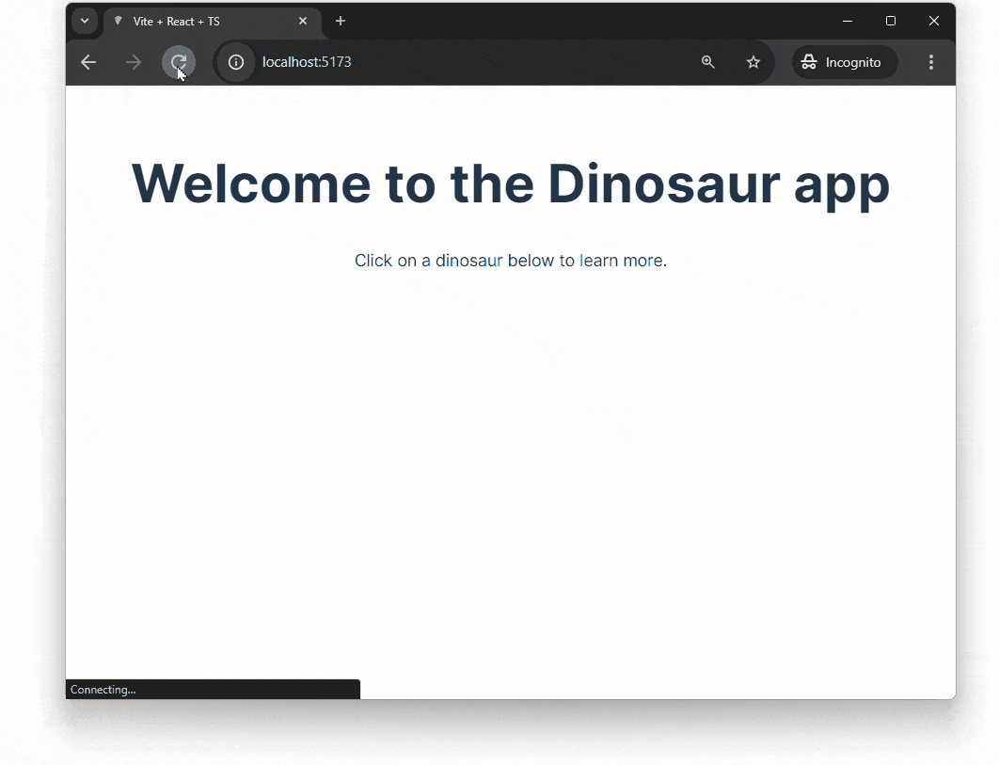

[React](https://reactjs.org) 是最广泛使用的 JavaScript 前端库。

在本教程中，我们将使用 Deno 构建一个简单的 React 应用。该应用将显示一组恐龙。当您点击其中一只时，将跳转到一个包含更多详细信息的恐龙页面。您可以查看
[完成的应用仓库在 GitHub 上](https://github.com/denoland/tutorial-with-react)



本教程将使用 [Vite](https://vitejs.dev/) 在本地提供应用。Vite 是一个现代 Web 项目的构建工具和开发服务器。它很好地与 React 和 Deno 配合使用，利用 ES 模块并允许您直接导入 React 组件。

## 启动应用

我们为您准备了一个
[起始模板](https://github.com/denoland/react-vite-ts-template)。这将为您设置一个基本的启动应用，其中包括 React、Vite 和一个 deno.json 文件，您可以在其中配置您的项目。访问 GitHub 仓库 [https://github.com/denoland/react-vite-ts-template](https://github.com/denoland/react-vite-ts-template)，然后点击“使用此模板”按钮以创建一个新的仓库。

在您从模板创建新仓库后，将其克隆到本地计算机并导航到项目目录。

## 在本地克隆仓库

```sh
git clone https://github.com/your-username/your-repo-name.git
cd your-repo-name
```

## 安装依赖

通过运行以下命令安装项目依赖：

```sh
deno install
```

## 运行开发服务器

现在您可以通过运行以下命令来提供新的 React 应用：

```sh
deno run dev
```

这将启动 Vite 服务器，点击输出链接到 localhost，以在浏览器中查看您的应用。

## 关于模板

您克隆的模板仓库带有一个基本的 React 应用。该应用使用 Vite 作为开发服务器，并提供一个使用 [oak](https://jsr.io/@oak/oak) 构建的静态文件服务器，当部署时将提供构建的应用。React 应用位于 `client` 文件夹，后端服务器位于 `server` 文件夹。

`deno.json` 文件用于配置项目并指定运行应用所需的权限，它包含 `tasks` 字段，定义可以使用 `deno run` 运行的任务。它有一个 `dev` 任务，用于运行 Vite 服务器，有一个 `build` 任务，用于使用 Vite 构建应用，还有一个 `serve` 任务，用于运行后端服务器以提供构建的应用。

## 添加后端 API

我们将在模板提供的服务器中构建一个 API。这将是我们获取恐龙数据的地方。

在新项目的 `server` 目录中，创建一个 `api` 文件夹。在该文件夹中，创建一个 `data.json` 文件，包含硬编码的恐龙数据。

复制并粘贴
[这个 JSON 文件](https://github.com/denoland/tutorial-with-react/blob/main/api/data.json)
到 `api/data.json` 文件中。（如果您是在构建一个真实的应用，您可能会从数据库或外部 API 中获取这些数据。）

我们将构建一些返回恐龙信息的 API 路由到模板附带的服务器中，我们需要 [`cors` 中间件](https://jsr.io/@tajpouria/cors) 来启用 [CORS](https://developer.mozilla.org/en-US/docs/Web/HTTP/CORS)。

使用 `deno install` 命令向项目添加 cors 依赖：

```shell
deno install jsr:@tajpouria/cors
```

接下来，更新 `server/main.ts` 导入所需模块并创建一个新的 `Router` 实例以定义一些路由：

```ts title="main.ts"
import { Application } from "jsr:@oak/oak/application";
import { Router } from "jsr:@oak/oak/router";
import { oakCors } from "@tajpouria/cors";
import routeStaticFilesFrom from "./util/routeStaticFilesFrom.ts";
import data from "./api/data.json" with { type: "json" };

export const app = new Application();
const router = new Router();
```

之后，在同一文件中，我们将定义两个路由。一个在 `/api/dinosaurs` 用于返回所有恐龙，另一个在 `/api/dinosaurs/:dinosaur` 用于根据 URL 中的名称返回特定恐龙：

```ts title="main.ts"
router.get("/api/dinosaurs", (context) => {
  context.response.body = data;
});

router.get("/api/dinosaurs/:dinosaur", (context) => {
  if (!context?.params?.dinosaur) {
    context.response.body = "未提供恐龙名称。";
  }

  const dinosaur = data.find((item) =>
    item.name.toLowerCase() === context.params.dinosaur.toLowerCase()
  );

  context.response.body = dinosaur ?? "未找到恐龙。";
});
```

在同一文件的底部，将我们刚刚定义的路由附加到应用中。我们还必须包括模板中的静态文件服务器，最后我们将启动服务器并监听 8000 端口：

```ts title="main.ts"
app.use(oakCors());
app.use(router.routes());
app.use(router.allowedMethods());
app.use(routeStaticFilesFrom([
  `${Deno.cwd()}/client/dist`,
  `${Deno.cwd()}/client/public`,
]));

if (import.meta.main) {
  console.log("服务器正在 http://localhost:8000 上监听");
  await app.listen({ port: 8000 });
}
```

您可以使用
`deno run --allow-env --allow-net server/main.ts` 运行 API 服务器。我们将创建一个任务在后台运行此命令，并更新开发任务以同时运行 React 应用和 API 服务器。

在您的 `package.json` 文件中，更新 `scripts` 字段以包含以下内容：

```diff title="deno.json"
{
  "tasks": {
+   "dev": "deno run -A --node-modules-dir=auto npm:vite & deno run server:start",
    "build": "deno run -A --node-modules-dir=auto npm:vite build",
    "server:start": "deno run -A --node-modules-dir --watch ./server/main.ts",
    "serve": "deno run build && deno run server:start"
}
```

如果您现在运行 `deno run dev` 并访问 `localhost:8000/api/dinosaurs`，在您的浏览器中，您应该会看到所有恐龙的 JSON 响应。

## 更新入口点

React 应用的入口点在 `client/src/main.tsx` 文件中。我们的将非常简单：

```tsx title="main.tsx"
import { StrictMode } from "react";
import { createRoot } from "react-dom/client";
import "./index.css";
import App from "./App.tsx";

createRoot(document.getElementById("root")!).render(
  <StrictMode>
    <App />
  </StrictMode>,
);
```

## 添加路由

该应用将有两个路由：`/` 和 `/:dinosaur`。

我们将使用 [`react-router-dom`](https://reactrouter.com/en/main) 来构建一些路由逻辑，因此我们需要将 `react-router-dom` 依赖添加到项目中。在项目根目录下运行：

```shell
deno install npm:react-router-dom
```

更新 `/src/App.tsx` 文件以导入并使用
[`BrowserRouter`](https://reactrouter.com/en/main/router-components/browser-router)
组件，并定义这两个路由：

```tsx title="App.tsx"
import { BrowserRouter, Route, Routes } from "react-router-dom";
import Index from "./pages/index.tsx";
import Dinosaur from "./pages/Dinosaur.tsx";
import "./App.css";

function App() {
  return (
    <BrowserRouter>
      <Routes>
        <Route path="/" element={<Index />} />
        <Route path="/:selectedDinosaur" element={<Dinosaur />} />
      </Routes>
    </BrowserRouter>
  );
}

export default App;
```

## 代理以转发 API 请求

Vite 将在端口 `3000` 上提供应用，而我们的 API 在端口 `8000` 上运行。因此，我们需要设置一个代理以使 `api/` 路径可以通过路由访问。在 `vite.config.ts` 添加一个代理设置：

```diff title="vite.config.ts"
export default defineConfig({
  root: "./client",
  server: {
    port: 3000,
+   proxy: {
+     "/api": {
+       target: "http://localhost:8000",
+       changeOrigin: true,
+     },
+   },
```

## 创建页面

我们将创建两个页面：`Index` 和 `Dinosaur`。`Index` 页面将列出所有恐龙，而 `Dinosaur` 页面将显示特定恐龙的详细信息。

在 `src` 目录中创建一个 `pages` 文件夹，并在其中创建两个文件：`index.tsx` 和 `Dinosaur.tsx`。

### 类型

这两个页面将使用 `Dino` 类型来描述它们期望从 API 中获取的数据形状，因此我们在 `src` 目录中创建一个 `types.ts` 文件：

```ts title="types.ts"
export type Dino = { name: string; description: string };
```

### index.tsx

此页面将从 API 获取恐龙列表并将其呈现为链接：

```tsx title="index.tsx"
import { useEffect, useState } from "react";
import { Link } from "react-router-dom";
import { Dino } from "../types.ts";

export default function Index() {
  const [dinosaurs, setDinosaurs] = useState<Dino[]>([]);

  useEffect(() => {
    (async () => {
      const response = await fetch(`/api/dinosaurs/`);
      const allDinosaurs = await response.json() as Dino[];
      setDinosaurs(allDinosaurs);
    })();
  }, []);

  return (
    <main>
      <h1>欢迎来到恐龙应用</h1>
      <p>点击下方的恐龙以了解更多信息。</p>
      {dinosaurs.map((dinosaur: Dino) => {
        return (
          <Link
            to={`/${dinosaur.name.toLowerCase()}`}
            key={dinosaur.name}
            className="dinosaur"
          >
            {dinosaur.name}
          </Link>
        );
      })}
    </main>
  );
}
```

### Dinosaur.tsx

此页面将从 API 获取特定恐龙的详细信息并在段落中呈现：

```tsx title="Dinosaur.tsx"
import { useEffect, useState } from "react";
import { Link, useParams } from "react-router-dom";
import { Dino } from "../types";

export default function Dinosaur() {
  const { selectedDinosaur } = useParams();
  const [dinosaur, setDino] = useState<Dino>({ name: "", description: "" });

  useEffect(() => {
    (async () => {
      const resp = await fetch(`/api/dinosaurs/${selectedDinosaur}`);
      const dino = await resp.json() as Dino;
      setDino(dino);
    })();
  }, [selectedDinosaur]);

  return (
    <div>
      <h1>{dinosaur.name}</h1>
      <p>{dinosaur.description}</p>
      <Link to="/">🠠 返回所有恐龙</Link>
    </div>
  );
}
```

### 对恐龙列表进行样式设置

由于我们在主页上显示恐龙列表，因此让我们进行一些基本的格式化。将以下内容添加到 `src/App.css` 的底部，以有序显示我们的恐龙列表：

```css title="src/App.css"
.dinosaur {
  display: block;
}
```

## 运行应用

要运行应用，请使用您之前设置的任务

```sh
deno run dev
```

在浏览器中导航到本地 Vite 服务器 (`localhost:5173`)，您应该会看到列出的恐龙，您可以单击以了解每个恐龙的详细信息。


## 构建和部署

您克隆的模板自带一个 `serve` 任务，该任务构建应用并使用后端服务器提供它。运行以下命令以构建和提供应用：

```sh
deno run serve
```

如果您在浏览器中访问 `localhost:8000`，您应该会看到该应用正在运行！

您可以将此应用部署到您喜欢的云提供商。我们推荐使用 [Deno Deploy](https://deno.com/deploy) 以简单和轻松的部署体验。

要部署到 Deno Deploy，请访问
[Deno Deploy 仪表板](https://dash.deno.com) 并创建一个新项目。然后，您可以通过连接您的 GitHub 仓库并选择要部署的分支来部署该应用。

为项目命名，并确保 `build step` 设置为 `deno run build`，`Entrypoint` 为 `server/main.ts`。

点击 `Deploy Project` 按钮，您的应用将上线！

🦕 现在您可以使用 Vite 和 Deno 搭建和开发一个 React 应用！您准备好构建快速的 Web 应用程序了。我们希望您喜欢探索这些前沿工具，我们期待看到您创造的作品！