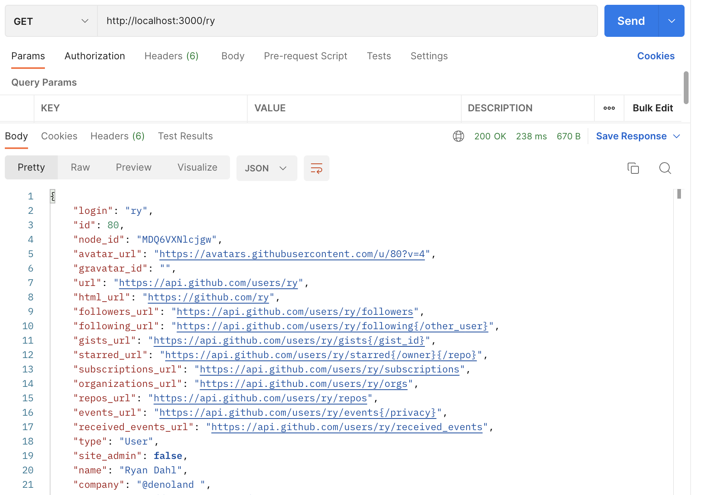
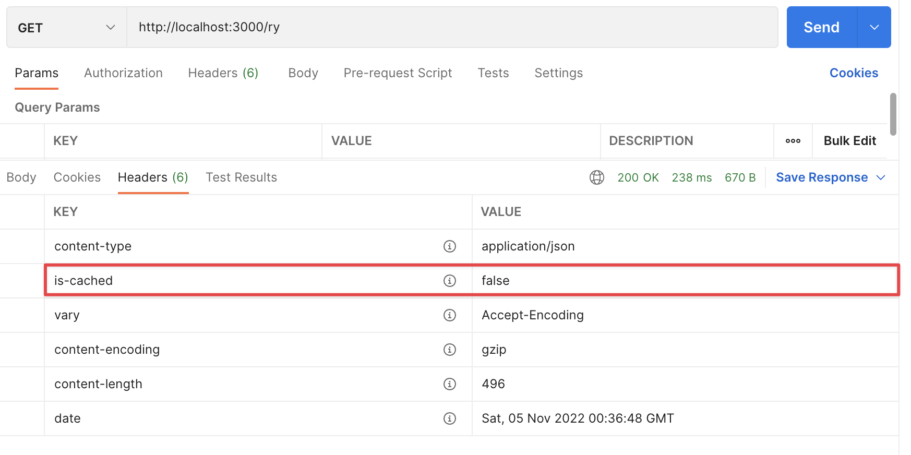
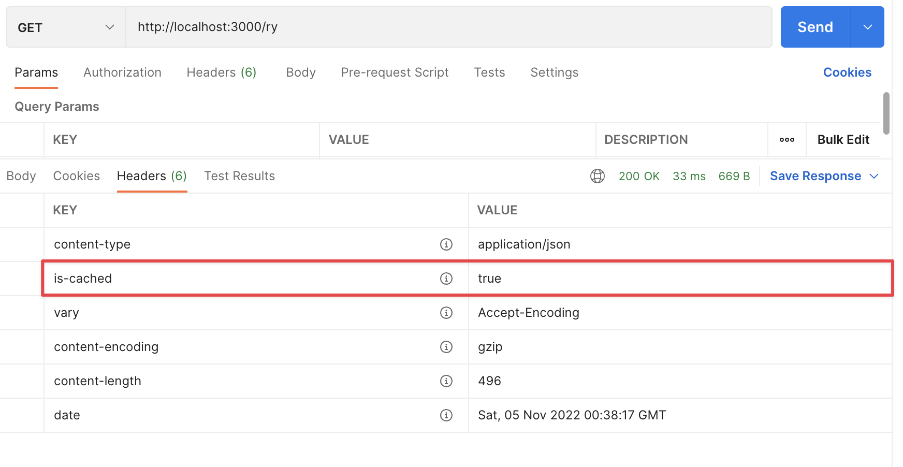

[Redis](https://redis.io/) 是一个内存数据存储，你可以用它来缓存、作为消息代理或用于流数据处理。

[在这里查看源代码。](https://github.com/denoland/examples/tree/main/with-redis)

在这里，我们将设置 Redis 来缓存 API 调用的数据，从而加快对该数据后续请求的响应速度。我们将会：

- 设置一个 Redis 客户端，将每个 API 调用的数据保存在内存中
- 设置一个 Deno 服务器，以便我们可以方便地请求特定数据
- 在服务器处理程序中调用 Github API 来在第一次请求时获取数据
- 在每一次后续请求中从 Redis 提供数据

我们可以在一个文件 `main.ts` 中完成这一切。

## 连接到 Redis 客户端

我们需要两个模块。第一个是 Deno 服务器。我们将使用这个模块来获取用户的信息以查询我们的 API。第二个是 Redis。我们可以使用 `npm:` 修饰符获取 Redis 的节点包：

```tsx
import { createClient } from "npm:redis@^4.5";
```

我们使用 `createClient` 创建一个 Redis 客户端并连接到我们的本地 Redis 服务器：

```tsx
// 连接到本地的 Redis 实例
const client = createClient({
  url: "redis://localhost:6379",
});

await client.connect();
```

你还可以在这个 [配置](https://github.com/redis/node-redis/blob/master/docs/client-configuration.md) 对象中单独设置主机、用户、密码和端口。

## 设置服务器

我们的服务器将作为 Github API 的一个封装。客户端可以通过 URL 路径名调用我们的服务器，格式为 `http://localhost:3000/{username}`。

解析路径名并调用 Github API 将在我们服务器的处理函数内进行。我们去掉了前导斜杠，这样就得到了一个可以传递给 Github API 作为用户名的变量。然后我们将响应返回给用户。

```tsx
Deno.serve({ port: 3000 }, async (req) => {
  const { pathname } = new URL(req.url);
  // 去掉前导斜杠
  const username = pathname.substring(1);
  const resp = await fetch(`https://api.github.com/users/${username}`);
  const user = await resp.json();
  return new Response(JSON.stringify(user), {
    headers: {
      "content-type": "application/json",
    },
  });
});
```

我们用下面的命令来运行它：

```tsx
deno run --allow-net main.ts
```

如果我们在 Postman 中访问 [http://localhost:3000/ry](http://localhost:3000/ry)，我们将获得 Github 的响应：



让我们使用 Redis 来缓存这个响应。

## 检查缓存

一旦我们从 Github API 得到响应，我们可以使用 `client.set` 将其缓存到 Redis 中，将我们的用户名作为键，用户对象作为值：

```tsx
await client.set(username, JSON.stringify(user));
```

下次请求相同的用户名时，我们可以使用 `client.get` 来获取缓存的用户：

```tsx
const cached_user = await client.get(username);
```

如果密钥不存在，这将返回 null。因此我们可以在某些流程控制中使用它。当我们得到用户名时，我们将首先检查是否已经在缓存中拥有该用户。如果有，我们将提供缓存的结果。如果没有，我们将调用 Github API 获取用户，缓存它，然后提供 API 结果。在这两种情况下，我们将添加一个自定义头来显示我们正在提供的版本：

```tsx
const server = new Server({
  handler: async (req) => {
    const { pathname } = new URL(req.url);
    // 去掉前导斜杠
    const username = pathname.substring(1);
    const cached_user = await client.get(username);
    if (cached_user) {
      return new Response(cached_user, {
        headers: {
          "content-type": "application/json",
          "is-cached": "true",
        },
      });
    } else {
      const resp = await fetch(`https://api.github.com/users/${username}`);
      const user = await resp.json();
      await client.set(username, JSON.stringify(user));
      return new Response(JSON.stringify(user), {
        headers: {
          "content-type": "application/json",
          "is-cached": "false",
        },
      });
    }
  },

  port: 3000,
});

server.listenAndServe();
```

第一次运行这段代码我们将获得与上述相同的响应，并且我们将看到 `is-cached` 头被设置为 `false`：



但当再次使用相同的用户名调用时，我们得到了缓存的结果。内容是相同的：


但头部显示我们有缓存：



我们还可以看到响应快了大约 200 毫秒！

你可以在 [这里](https://redis.io/docs/) 查看 Redis 文档，以及在 [这里](https://github.com/redis/node-redis) 查看 Redis 节点包。