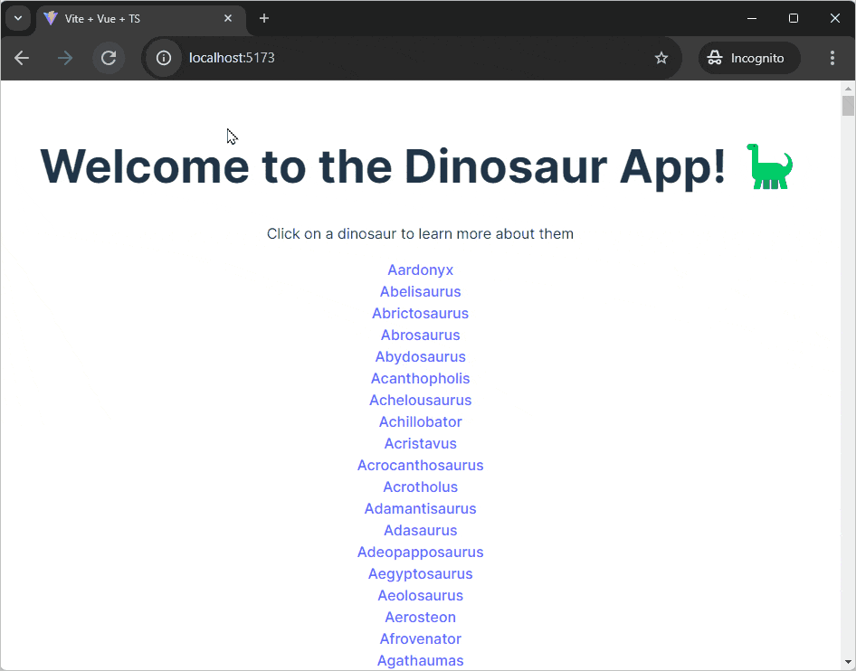

[Vue.js](https://vuejs.org/) 是一个渐进式前端 JavaScript 框架。它提供了创建动态和交互式用户界面的工具和特性。

在本教程中，我们将使用 Vite 和 Deno 构建一个简单的 Vue.js 应用。该应用将显示恐龙列表。当你点击其中一个时，它将带你到一个包含更多详细信息的恐龙页面。你可以在 [GitHub 上查看完成的应用](https://github.com/denoland/tutorial-with-vue)。



## 使用 Vite 和 Deno 创建 Vue.js 应用

我们将使用 [Vite](https://vitejs.dev/) 来搭建一个基本的 Vue.js 应用。在你的终端中，运行以下命令以使用 Vite 创建一个新的 .js 应用：

```shell
deno run -A npm:create-vite
```

当提示时，给你的应用命名，并从提供的框架中选择 `Vue`，将 `TypeScript` 作为变体。

创建后，`cd` 进入你的新项目并运行以下命令来安装依赖：

```shell
deno install
```

然后，运行以下命令来提供你的新 Vue.js 应用：

```shell
deno task dev
```

Deno 将运行 `package.json` 文件中的 `dev` 任务，这将启动 Vite 服务器。点击输出链接到 localhost 以在浏览器中查看你的应用。

## 添加后端

下一步是添加一个后端 API。我们将创建一个非常简单的 API，返回有关恐龙的信息。

在你新创建的 Vite 项目的根目录中，创建一个 `api` 文件夹。在该文件夹中，创建一个 `main.ts` 文件，用于运行服务器，以及一个 `data.json` 文件，放置我们硬编码的数据。

复制并粘贴
[这个 json 文件](https://raw.githubusercontent.com/denoland/tutorial-with-vue/refs/heads/main/api/data.json)
到 `api/data.json`。

我们将构建一个简单的 API 服务器，具有返回恐龙信息的路由。我们将使用 [`oak` 中间件框架](https://jsr.io/@oak/oak) 和 [`cors` 中间件](https://jsr.io/@tajpouria/cors) 来启用 [CORS](https://developer.mozilla.org/en-US/docs/Web/HTTP/CORS)。

使用 `deno add` 命令将所需的依赖添加到你的项目中：

```shell
deno add jsr:@oak/oak jsr:@tajpouria/cors
```

接下来，更新 `api/main.ts` 以导入所需模块并创建一个新的 `Router` 实例以定义一些路由：

```ts title="main.ts"
import { Application, Router } from "@oak/oak";
import { oakCors } from "@tajpouria/cors";
import data from "./data.json" with { type: "json" };

const router = new Router();
```

之后，在同一个文件中，我们将定义三个路由。第一个路由在 `/` 路径下返回字符串 `Welcome to the dinosaur API`，然后我们会设置 `/dinosaurs` 来返回所有的恐龙，最后使用 `/dinosaurs/:dinosaur` 返回基于 URL 中名称的特定恐龙：

```ts title="main.ts"
router
  .get("/", (context) => {
    context.response.body = "Welcome to dinosaur API!";
  })
  .get("/dinosaurs", (context) => {
    context.response.body = data;
  })
  .get("/dinosaurs/:dinosaur", (context) => {
    if (!context?.params?.dinosaur) {
      context.response.body = "No dinosaur name provided.";
    }

    const dinosaur = data.find((item) =>
      item.name.toLowerCase() === context.params.dinosaur.toLowerCase()
    );

    context.response.body = dinosaur ? dinosaur : "No dinosaur found.";
  });
```

最后，在同一文件的底部，创建一个新的 `Application` 实例，并使用 `app.use(router.routes())` 将我们刚刚定义的路由附加到应用程序，并启动服务器监听 8000 端口：

```ts title="main.ts"
const app = new Application();
app.use(oakCors());
app.use(router.routes());
app.use(router.allowedMethods());

await app.listen({ port: 8000 });
```

你可以使用 `deno run --allow-env --allow-net api/main.ts` 运行 API 服务器。我们将创建一个任务来运行此命令，并更新开发任务以同时运行 Vue.js 应用和 API 服务器。

在你的 `package.json` 文件中，更新 `scripts` 字段以包含以下内容：

```jsonc
{
  "scripts": {
    "dev": "deno task dev:api & deno task dev:vite",
    "dev:api": "deno run --allow-env --allow-net api/main.ts",
    "dev:vite": "deno run -A npm:vite",
    // ...
}
```

现在，如果你运行 `deno task dev` 并访问 `localhost:8000`，在浏览器中你应该看到文本 `Welcome to dinosaur API!`，如果你访问 `localhost:8000/dinosaurs`，你应该看到所有恐龙的 JSON 响应。

## 构建前端

### 入口点和路由

在 `src` 目录中，你会找到一个 `main.ts` 文件。这是 Vue.js 应用的入口点。我们的应用将有多个路由，因此我们需要一个路由器来处理客户端的路由。我们将使用官方的 [Vue Router](https://router.vuejs.org/)。

更新 `src/main.ts` 以导入并使用路由器：

```ts
import { createApp } from "vue";
import router from "./router/index.ts";

import "./style.css";
import App from "./App.vue";

createApp(App)
  .use(router)
  .mount("#app");
```

通过 `deno add` 将 Vue Router 模块添加到项目中：

```shell
deno add npm:vue-router
```

接下来，在 `src` 目录中创建一个 `router` 目录。在其中创建一个 `index.ts` 文件，内容如下：

```ts title="router/index.ts"
import { createRouter, createWebHistory } from "vue-router";
import HomePage from "../components/HomePage.vue";
import Dinosaur from "../components/Dinosaur.vue";

export default createRouter({
  history: createWebHistory("/"),
  routes: [
    {
      path: "/",
      name: "Home",
      component: HomePage,
    },
    {
      path: "/:dinosaur",
      name: "Dinosaur",
      component: Dinosaur,
      props: true,
    },
  ],
});
```

这将设置一个具有两个路由的路由器：`/` 和 `/:dinosaur`。`HomePage` 组件将在 `/` 渲染，`Dinosaur` 组件将在 `/:dinosaur` 渲染。

最后，你可以删除 `src/App.vue` 文件中的所有代码，并更新它只包含 `<RouterView>` 组件：

```html title="App.vue"
<template>
  <RouterView />
</template>
```

### 组件

Vue.js 将前端 UI 分成组件。每个组件都是可复用的代码片段。我们将创建三个组件：一个用于主页，一个用于恐龙列表，另一个用于单个恐龙。

每个组件文件分为三个部分：`<script>`、`<template>` 和 `<style>`。`<script>` 标签包含该组件的 JavaScript 逻辑，`<template>` 标签包含 HTML，`<style>` 标签包含 CSS。

在 `/src/components` 目录中，创建三个新文件：`HomePage.vue`、`Dinosaurs.vue` 和 `Dinosaur.vue`。

#### Dinosaurs 组件

`Dinosaurs` 组件将从我们之前设置的 API 获取恐龙列表，并将它们作为链接渲染，使用
[来自 Vue Router 的 `RouterLink` 组件](https://router.vuejs.org/guide/)。
（因为我们正在创建一个 TypeScript 项目，不要忘记在 script 标签上指定 `lang="ts"` 属性。）将以下代码添加到 `Dinosaurs.vue` 文件中：

```html title="Dinosaurs.vue"
<script lang="ts">
  import { defineComponent } from "vue";

  export default defineComponent({
    async setup() {
      const res = await fetch("http://localhost:8000/dinosaurs");
      const dinosaurs = await res.json() as Dinosaur[];
      return { dinosaurs };
    },
  });
</script>

<template>
  <div v-for="dinosaur in dinosaurs" :key="dinosaur.name">
    <RouterLink
      :to="{ name: 'Dinosaur', params: { dinosaur: `${dinosaur.name.toLowerCase()}` } }"
    >
      {{ dinosaur.name }}
    </RouterLink>
  </div>
</template>
```

这段代码使用 Vue.js 的 
[v-for](https://vuejs.org/api/built-in-directives.html#v-for) 指令遍历 `dinosaurs` 数组，并将每个恐龙渲染为一个 `RouterLink` 组件。`RouterLink` 组件的 `:to` 属性指定了单击链接时要导航的路由，`:key` 属性用于唯一识别每个恐龙。

#### Homepage 组件

主页将包含一个标题，然后渲染 `Dinosaurs` 组件。将以下代码添加到 `HomePage.vue` 文件中：

```html title="HomePage.vue"
<script setup lang="ts">
  import Dinosaurs from "./Dinosaurs.vue";
</script>
<template>
  <h1>欢迎来到恐龙应用！🦕</h1>
  <p>点击一个恐龙以了解更多信息</p>
  <Suspense>
    <template #default>
      <Dinosaurs />
    </template>
    <template #fallback>
      <div>加载中...</div>
    </template>
  </Suspense>
</template>
```

由于 `Dinosaurs` 组件异步获取数据，因此使用 
[`Suspense` 组件](https://vuejs.org/guide/built-ins/suspense.html) 处理加载状态。

#### Dinosaur 组件

`Dinosaur` 组件将显示特定恐龙的名称和描述，以及返回完整列表的链接。

首先，我们将设置一些我们将要获取的数据的类型。在 `src` 目录中创建一个 `types.ts` 文件，并添加以下代码：

```ts title="types.ts"
type Dinosaur = {
  name: string;
  description: string;
};

type ComponentData = {
  dinosaurDetails: null | Dinosaur;
};
```

然后更新 `Dinosaur.vue` 文件：

```html title="Dinosaur.vue"
<script lang="ts">
  import { defineComponent } from "vue";

  export default defineComponent({
    props: { dinosaur: String },
    data(): ComponentData {
      return {
        dinosaurDetails: null,
      };
    },
    async mounted() {
      const res = await fetch(
        `http://localhost:8000/dinosaurs/${this.dinosaur}`,
      );
      this.dinosaurDetails = await res.json();
    },
  });
</script>

<template>
  <h1>{{ dinosaurDetails?.name }}</h1>
  <p>{{ dinosaurDetails?.description }}</p>
  <RouterLink to="/">🠠 返回所有恐龙</RouterLink>
</template>
```

这段代码使用 `props` 选项定义了一个名为 `dinosaur` 的 prop，将传递给组件。`mounted` 生命周期钩子用于根据 `dinosaur` prop 提取特定恐龙的详细信息，并将其存储在 `dinosaurDetails` 数据属性中。然后在模板中渲染这些数据。

## 运行应用

现在我们已经设置了前端和后端，我们可以运行应用了。在终端中运行以下命令：

```shell
deno task dev
```

访问输出的 localhost 链接以在浏览器中查看应用。点击一个恐龙以查看更多详细信息！


🦕 现在你可以在 Deno 中使用 Vite 运行 Vue 应用，你准备好构建真实的应用程序了！如果你想扩展这个演示，可以考虑构建一个后端服务器以在构建后提供静态应用，然后你将能够
[将你的恐龙应用部署到云端](https://docs.deno.com/deploy/manual/)。
