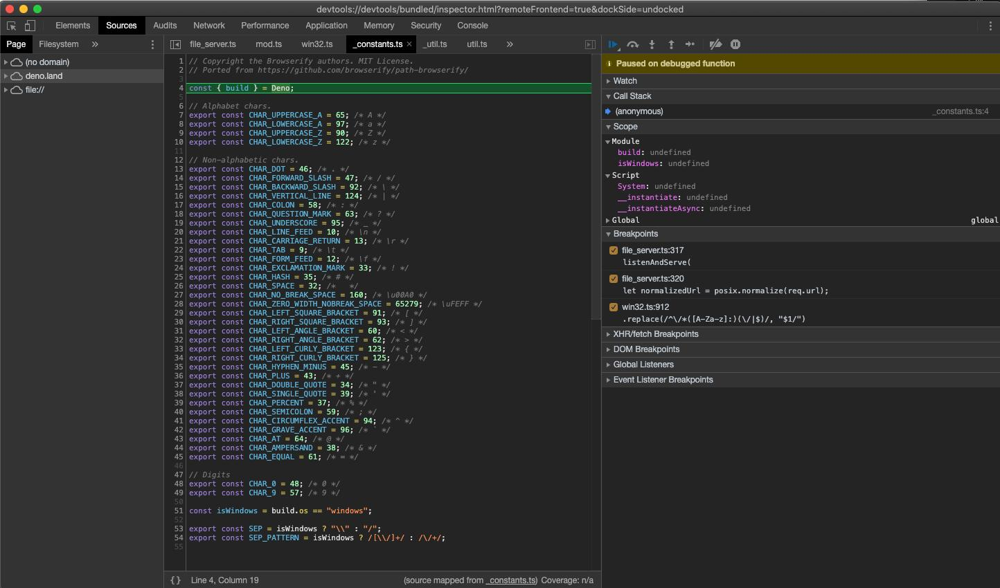
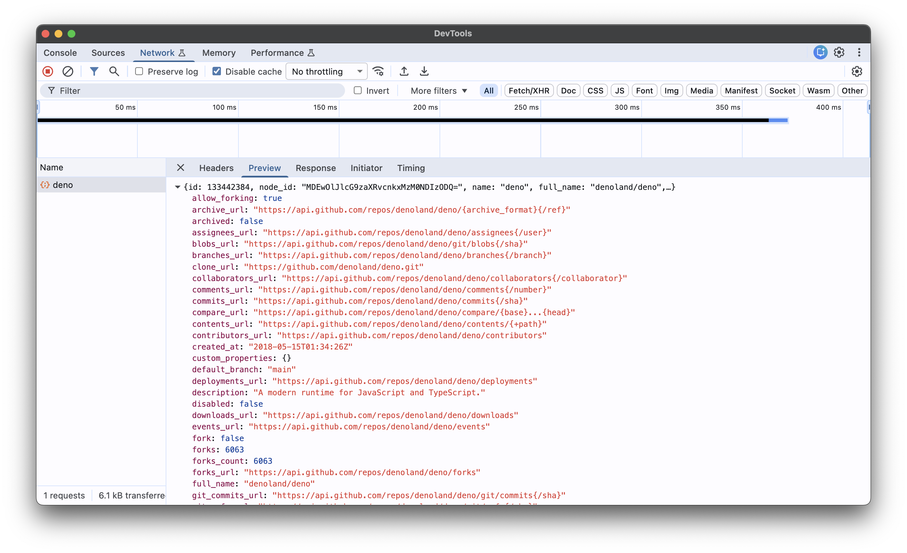
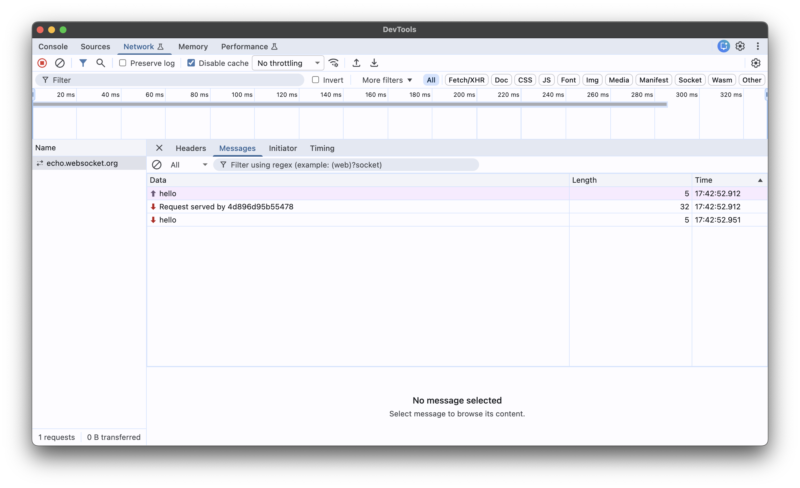

Deno 支持 [V8 Inspector Protocol](https://v8.dev/docs/inspector)，这是 Chrome、Edge 和 Node.js 使用的协议。这使得可以使用 Chrome DevTools 或其他支持该协议的客户端（例如 VSCode）调试 Deno 程序。

要激活调试功能，请使用以下标志之一运行 Deno：

- `--inspect`
- `--inspect-wait`
- `--inspect-brk`

## --inspect

使用 `--inspect` 标志将启动一个带有 inspector 服务器的程序，这样就可以从支持 V8 Inspector 协议的工具（例如 Chrome DevTools）连接客户端。

在 Chromium 兼容的浏览器中访问 `chrome://inspect` 以将 Deno 连接到 inspector 服务器。这允许您检查代码、添加断点并逐步执行代码。

```sh
deno run --inspect your_script.ts
```

您可以选择为 inspector 服务器指定主机和端口。完整地址和纯端口号都可以接受：

```sh
# 默认：监听 127.0.0.1:9229
deno run --inspect your_script.ts

# 自定义端口
deno run --inspect=9230 your_script.ts

# 自定义主机和端口
deno run --inspect=0.0.0.0:9229 your_script.ts
```

### --inspect-publish-uid

默认情况下，Deno 在开始监听时会将 inspector WebSocket URL 打印到 stderr。您可以使用 `--inspect-publish-uid` 来控制这一行为：

- `stderr`（默认）— 在启动时将 URL 打印到 stderr
- `http` — 通过 inspector 端口上的 `/json/list` HTTP 端点公开该 URL，而不是打印它；这对以编程方式轮询可用目标的工具很有用

```sh
deno run --inspect --inspect-publish-uid=http your_script.ts
```

:::note

如果您使用 `--inspect` 标志，代码将立即开始执行。如果您的程序较短，您可能没有足够的时间在程序完成执行之前连接调试器。

在这种情况下，请尝试使用 `--inspect-wait` 或 `--inspect-brk` 标志，或者在代码的结尾添加一个超时。

:::

## --inspect-wait

`--inspect-wait` 标志将在执行代码之前等待调试器连接。

```sh
deno run --inspect-wait your_script.ts
```

## --inspect-brk

`--inspect-brk` 标志将在执行代码之前等待调试器连接，然后在您连接后立即在您的程序中设置一个断点，允许您在继续执行之前添加额外的断点或评估表达式。

**这是最常用的 inspect 标志**。JetBrains 和 VSCode IDE 默认使用此标志。

```sh
deno run --inspect-brk your_script.ts
```

## 使用 Chrome DevTools 的示例

让我们尝试使用 Chrome DevTools 调试一个程序。为此，我们将使用
[`@std/http/file-server`](/runtime/reference/std/http/)，一个静态文件服务器。

使用 `--inspect-brk` 标志在第一行中暂停执行：

```sh
$ deno run --inspect-brk -RN jsr:@std/http/file-server
Debugger listening on ws://127.0.0.1:9229/ws/1e82c406-85a9-44ab-86b6-7341583480b1
...
```

在像 Google Chrome 或 Microsoft Edge 这样的 Chromium 兼容浏览器中，打开 `chrome://inspect` 并点击目标旁边的 `Inspect`：


打开 DevTools 后可能需要几秒钟才能加载所有模块。



您可能会注意到 DevTools 在 `_constants.ts` 的第一行暂停执行，而不是在 `file_server.ts`。这是由于 JavaScript 中 ES 模块的评估方式造成的预期行为（`_constants.ts` 是 `file_server.ts` 的最左侧、最底部依赖项，因此它首先被评估）。

此时，所有源代码在 DevTools 中均可用，所以让我们打开 `file_server.ts` 并在此添加断点；转到 "Sources" 面板并展开树形结构：


_仔细查看您会发现每个文件都有重复条目；一个是常规写法，一个是斜体。前者是编译的源文件（因此在 `.ts` 文件的情况下，它将发出 JavaScript 源），而后者是该文件的源映射。_

接下来，在 `listenAndServe` 方法中添加一个断点：


一旦添加了断点，DevTools 将自动打开源映射文件，这让我们可以逐步查看包含类型的实际源代码。

现在我们已经设置了断点，可以继续执行脚本，以便检查传入的请求。点击 "Resume script execution" 按钮来完成。您可能需要点击两次！

一旦我们的脚本在运行，尝试发送请求并在 DevTools 中检查它：

```sh
curl http://0.0.0.0:4507/
```


此时我们可以检查请求的内容，并逐步调试代码。

## 检查网络流量

从 Deno 2.8 开始，Chrome DevTools 可以像检查浏览器标签页中的流量一样检查您的程序发出的网络流量。使用 `--inspect-wait`（或 `--inspect` / `--inspect-brk`）运行程序，在 Chromium 衍生浏览器中打开 `chrome://inspect`，点击 Deno 目标上的 **Inspect**，然后切换到 **Network** 选项卡。

以下内置 API 已接入 Network 选项卡：

- `fetch()` — 请求会以 `Type: fetch` 显示
- `node:http` 和 `node:https` 客户端请求（`http.request`、`http.get`、`https.request`、`https.get`）— **Type** 列会反映响应内容类型（例如 `json`、`document`），因此任何通过 `node:http` 发出 HTTP 请求的 npm 库也会与 `fetch()` 流量一起显示
- `WebSocket` — 客户端连接会与 HTTP 请求一起显示，并带有握手状态和升级响应中的头信息、消息帧，以及套接字关闭时的关闭事件
- [`Deno.upgradeWebSocket()`](/api/deno/~/Deno.upgradeWebSocket) — 服务端 WebSocket 升级也会被记录，因此您可以从 Deno 到 Deno 的握手中检查连接双方

对于每个请求，您都可以查看 URL、方法、状态码、请求和响应头、请求和响应正文，以及耗时信息。

让我们用一个使用 `fetch()` 的小程序来试试：

```ts title="net.ts"
const res = await fetch("https://api.github.com/repos/denoland/deno");
console.log(res.status, (await res.json()).stargazers_count);
```

使用 `--inspect-wait` 运行它，这样程序会暂停直到 DevTools 连接：

```sh
$ deno run --inspect-wait --allow-net net.ts
Debugger listening on ws://127.0.0.1:9229/...
Visit chrome://inspect to connect to the debugger.
Deno is waiting for debugger to connect.
```

打开 `chrome://inspect`，在 Deno 目标上点击 **Inspect**，然后切换到 **Network** 选项卡。`fetch()` 请求会作为常规网络条目显示，并且请求和响应面板会填充内容：


点击某个请求可以查看其头信息、负载、响应正文和耗时分布：



`node:http` 和 `node:https` 也同样适用，因此通过 Node 内置客户端（而不是 `fetch()`）发出 HTTP 请求的 npm 库也会显示在 Network 选项卡中。例如：

```ts title="node-http.ts"
import https from "node:https";

const options = {
  hostname: "api.github.com",
  path: "/repos/denoland/deno",
  headers: { "User-Agent": "deno-docs-example" },
};

https.get(options, (res) => {
  let body = "";
  res.on("data", (chunk) => body += chunk);
  res.on(
    "end",
    () => console.log(res.statusCode, JSON.parse(body).stargazers_count),
  );
});
```

```sh
$ deno run --inspect-wait --allow-net node-http.ts
```

该请求会像 `fetch()` 请求一样在 Network 选项卡中显示相同的头信息、正文和耗时信息——**Type** 列会反映响应内容类型（此示例中为 `json`）：


`WebSocket` 连接也会出现在同一个 Network 选项卡中，并随着连接进展显示消息和关闭事件：



使用 [`Deno.upgradeWebSocket()`](/api/deno/~/Deno.upgradeWebSocket) 创建的服务端 WebSocket 也会被记录，因此您可以检查连接的双方——发出的客户端 `WebSocket` 和接受它的服务端升级。例如，一个小型回显服务器：

```ts title="ws-server.ts"
Deno.serve({ port: 8000 }, (req) => {
  if (req.headers.get("upgrade") !== "websocket") {
    return new Response("send a WebSocket request", { status: 426 });
  }
  const { socket, response } = Deno.upgradeWebSocket(req);
  socket.onmessage = (e) => socket.send(`echo: ${e.data}`);
  return response;
});
```

```sh
$ deno run --inspect-wait --allow-net ws-server.ts
```

连接 DevTools 并继续执行后，从另一个终端连接到服务器（例如使用 `deno eval`）：

```sh
deno eval 'const ws = new WebSocket("ws://localhost:8000");
  ws.onopen = () => ws.send("hello");
  ws.onmessage = (e) => { console.log(e.data); ws.close(); };'
```

升级和消息帧会显示在服务器 DevTools 会话的 Network 选项卡中：


这些相同的事件也通过 `node:inspector` 暴露给程序化客户端，因此已经针对 Node 使用 Chrome DevTools Protocol 的工具可以连接到 Deno，并在不做任何更改的情况下观察相同的网络流量。

:::note

当没有调试器连接时，网络监控实际上没有任何开销——这些事件仅在会话通过 `Network.enable` 显式启用后才会发出。

:::

## VSCode

可以使用 VSCode 调试 Deno。最好的方法是借助官方的 `vscode_deno` 扩展。有关此扩展的文档可以在 [这里](/runtime/reference/vscode#using-the-debugger) 找到。

## JetBrains IDEs

_**注意**：确保您已安装并在首选项/设置 | 插件中启用 [此 Deno 插件](https://plugins.jetbrains.com/plugin/14382-deno)。有关更多信息，请参见 [此博客文章](https://blog.jetbrains.com/webstorm/2020/06/deno-support-in-jetbrains-ides/)。_

您可以通过右键单击要调试的文件并选择 `Debug 'Deno: <file name>'` 选项来使用 JetBrains IDE 调试 Deno。


这将创建一个没有权限标志的运行/调试配置。如果您想配置它们，请打开您的运行/调试配置并将所需标志添加到 `Command` 字段。

## --log-level=debug

如果您在连接 inspector 时遇到问题，可以使用 `--log-level=debug` 标志以获取有关发生情况的更多信息。这将显示例如模块解析、网络请求和其他权限检查等信息。

```sh
deno run --inspect-brk --log-level=debug your_script.ts
```

## --strace-ops

Deno ops 是一个 [RPC](https://en.wikipedia.org/wiki/Remote_procedure_call) 机制，用于在 JavaScript 和 Rust 之间提供功能，例如文件 I/O、网络和定时器。`--strace-ops` 标志将在程序运行时打印所有正在执行的 Deno ops 及其时序。

```sh
deno run --strace-ops your_script.ts
```

每个 op 都应包含一个 `Dispatch` 和一个 `Complete` 事件。这两个事件之间的时间即为执行该 op 所花费的时间。此标志对于性能分析、调试挂起的程序或了解 Deno 的底层工作原理非常有用。

## CPU profiling

Deno 内置了 CPU 分析器：在程序运行时收集 profile，然后将其作为 Markdown 报告、交互式 flamegraph 或在 Chrome DevTools 中读取。有关标志、报告格式和分析提示，请参见 [CPU profiling](/runtime/fundamentals/cpu_profiling/)。

## OpenTelemetry 集成

对于生产环境应用或复杂系统，OpenTelemetry 提供了更全面的可观察性和调试方案。Deno 内置支持 OpenTelemetry，允许您：

- 跟踪应用中的请求
- 监测应用性能指标
- 收集结构化日志
- 将遥测数据导出到监控系统

```sh
OTEL_DENO=true deno run your_script.ts
```

这将自动收集和导出运行时可观察性数据，包括：

- HTTP 请求跟踪
- 运行时指标
- 控制台日志和错误

有关 Deno 的 OpenTelemetry 集成的完整详情，包括自定义指标、跟踪和配置选项，请参见
[OpenTelemetry 文档](/runtime/fundamentals/open_telemetry)。

## 调试 Web Workers

从 Deno 2.7 开始，可以通过 Chrome DevTools 和 VS Code 调试 Web Workers。运行程序时使用任何 `--inspect` 标志，每个创建的 worker 都会与主线程一起作为单独的目标显示在 `chrome://inspect` 中。

```ts title="main.ts"
const worker = new Worker(import.meta.resolve("./worker.ts"), {
  type: "module",
});
worker.postMessage("start");
```

```ts title="worker.ts"
self.onmessage = (e) => {
  console.log("Worker received:", e.data);
  // 在 DevTools 中于此处设置断点
};
```

```sh
deno run --inspect-brk --allow-read main.ts
```

打开 `chrome://inspect`，您会看到 `main.ts` 和 `worker.ts` 都作为可单独检查的目标列出。点击 worker 目标上的 **Inspect**，即可为该 worker 打开一个专用的 DevTools 面板，您可以在其中设置断点、逐步执行代码，并独立于主线程检查变量。

在安装了 Deno 扩展的 VS Code 中，worker 会作为调试器 **Call Stack** 面板中的单独线程显示。

## TLS 会话调试

设置 `SSLKEYLOGFILE` 环境变量以将 TLS 会话密钥记录到文件中。
这使您可以使用 [Wireshark](https://www.wireshark.org/) 等工具解密并检查加密网络流量：

```sh
SSLKEYLOGFILE=./keys.log deno run -N main.ts
```

然后在 Wireshark 中加载 `keys.log`（Edit > Preferences > Protocols > TLS >
(Pre)-Master-Secret log filename）以解密捕获的 TLS 流量。
