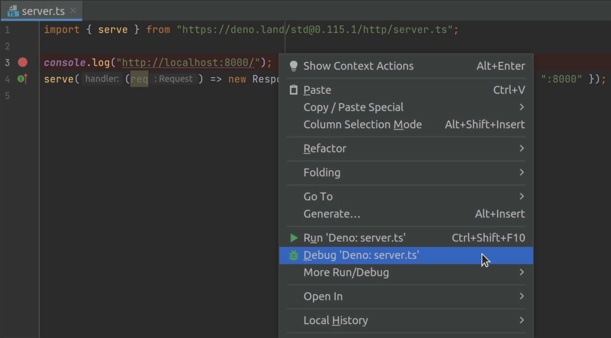

Deno 支持 [V8 Inspector Protocol](https://v8.dev/docs/inspector)，这是 Chrome、Edge 和 Node.js 使用的协议。这使得可以使用 Chrome DevTools 或其他支持该协议的客户端（例如 VSCode）调试 Deno 程序。

要激活调试功能，请使用以下标志之一运行 Deno：

- `--inspect`
- `--inspect-wait`
- `--inspect-brk`

## --inspect

使用 `--inspect` 标志将启动一个带有 inspector 服务器的程序，这样就可以从支持 V8 Inspector 协议的工具（例如 Chrome DevTools）连接客户端。

在 Chromium 兼容的浏览器中访问 `chrome://inspect` 以将 Deno 连接到 inspector 服务器。这允许您检查代码、添加断点并逐步执行代码。

```sh
deno run --inspect your_script.ts
```

:::note

如果您使用 `--inspect` 标志，代码将立即开始执行。如果您的程序较短，您可能没有足够的时间在程序完成执行之前连接调试器。

在这种情况下，请尝试使用 `--inspect-wait` 或 `--inspect-brk` 标志，或者在代码的结尾添加一个超时。

:::

## --inspect-wait

`--inspect-wait` 标志将在执行代码之前等待调试器连接。

```sh
deno run --inspect-wait your_script.ts
```

## --inspect-brk

`--inspect-brk` 标志将在执行代码之前等待调试器连接，然后在您连接后立即在您的程序中设置一个断点，允许您在继续执行之前添加额外的断点或评估表达式。

**这是最常用的 inspect 标志**。JetBrains 和 VSCode IDE 默认使用此标志。

```sh
deno run --inspect-brk your_script.ts
```

## 使用 Chrome DevTools 的示例

我们来尝试使用 Chrome DevTools 调试一个程序。为此，我们将使用 [@std/http/file-server](https://jsr.io/@std/http#file-server)，这是一个静态文件服务器。

使用 `--inspect-brk` 标志在第一行中暂停执行：

```sh
$ deno run --inspect-brk -RN jsr:@std/http/file-server
Debugger listening on ws://127.0.0.1:9229/ws/1e82c406-85a9-44ab-86b6-7341583480b1
...
```

在像 Google Chrome 或 Microsoft Edge 这样的 Chromium 兼容浏览器中，打开 `chrome://inspect` 并点击目标旁边的 `Inspect`：


打开 DevTools 后可能需要几秒钟才能加载所有模块。


您可能会注意到 DevTools 在 `_constants.ts` 的第一行暂停执行，而不是在 `file_server.ts`。这是由于 JavaScript 中 ES 模块的评估方式造成的预期行为（`_constants.ts` 是 `file_server.ts` 的最左侧、最底部依赖项，因此它首先被评估）。

此时，所有源代码在 DevTools 中均可用，所以让我们打开 `file_server.ts` 并在此添加断点；转到 "Sources" 面板并展开树形结构：


_仔细查看您会发现每个文件都有重复条目；一个是常规写法，一个是斜体。前者是编译的源文件（因此在 `.ts` 文件的情况下，它将发出 JavaScript 源），而后者是该文件的源映射。_

接下来，在 `listenAndServe` 方法中添加一个断点：


一旦添加了断点，DevTools 将自动打开源映射文件，这让我们可以逐步查看包含类型的实际源代码。

现在我们已经设置了断点，可以继续执行脚本，以便检查传入的请求。点击 "Resume script execution" 按钮来完成。您可能需要点击两次！

一旦我们的脚本在运行，尝试发送请求并在 DevTools 中检查它：

```sh
curl http://0.0.0.0:4507/
```


此时我们可以检查请求的内容，并逐步调试代码。

## VSCode

可以使用 VSCode 调试 Deno。最好的方法是借助官方的 `vscode_deno` 扩展。有关此扩展的文档可以在 [这里](/runtime/reference/vscode#using-the-debugger) 找到。

## JetBrains IDEs

_**注意**：确保您已安装并在首选项/设置 | 插件中启用 [此 Deno 插件](https://plugins.jetbrains.com/plugin/14382-deno)。有关更多信息，请参见 [此博客文章](https://blog.jetbrains.com/webstorm/2020/06/deno-support-in-jetbrains-ides/)。_

您可以通过右键单击要调试的文件并选择 `Debug 'Deno: <file name>'` 选项来使用 JetBrains IDE 调试 Deno。



这将创建一个没有权限标志的运行/调试配置。如果您想配置它们，请打开您的运行/调试配置并将所需标志添加到 `Command` 字段。

## --log-level=debug

如果您在连接 inspector 时遇到问题，可以使用 `--log-level=debug` 标志以获取有关发生情况的更多信息。这将显示例如模块解析、网络请求和其他权限检查等信息。

```sh
deno run --inspect-brk --log-level=debug your_script.ts
```

## --strace-ops

Deno ops 是一个 [RPC](https://en.wikipedia.org/wiki/Remote_procedure_call) 机制，用于在 JavaScript 和 Rust 之间提供功能，例如文件 I/O、网络和定时器。`--strace-ops` 标志将在程序运行时打印所有正在执行的 Deno ops 及其时序。

```sh
deno run --strace-ops your_script.ts
```

每个 op 应该具有一个 `Dispatch` 和一个 `Complete` 事件。这两个事件之间的时间是执行 op 所需的时间。此标志对于性能分析、调试挂起的程序或理解 Deno 背后的工作原理可能非常有用。

## OpenTelemetry 集成

对于生产应用程序或复杂系统，OpenTelemetry 提供了更全面的可观察性和调试方法。Deno 内置支持 OpenTelemetry，允许您：

- 跟踪请求通过您的应用程序
- 监控应用程序性能指标
- 收集结构化日志
- 将遥测数据导出到监控系统

要启用 OpenTelemetry，请使用 `--unstable-otel` 标志运行您的应用程序：

```sh
OTEL_DENO=true deno run --unstable-otel your_script.ts
```

这将自动收集和导出运行时可观察性数据，包括：

- HTTP 请求跟踪
- 运行时指标
- 控制台日志和错误

有关 Deno 的 OpenTelemetry 集成的完整详细信息，包括自定义指标、跟踪和配置选项，请参见 [OpenTelemetry 文档](/runtime/fundamentals/open_telemetry)。
