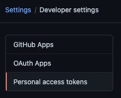
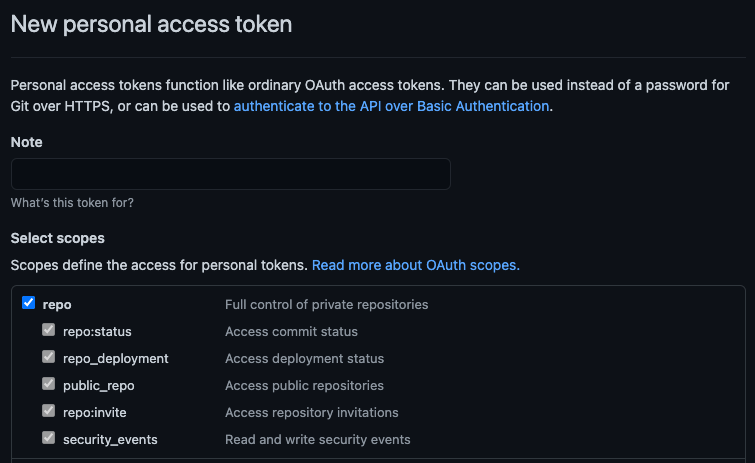
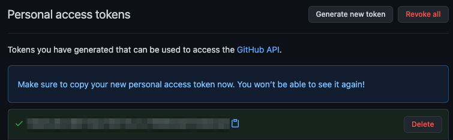

Deno 使用
[ECMAScript 模块](https://developer.mozilla.org/zh-CN/docs/Web/JavaScript/Guide/Modules)
作为其默认模块系统，以符合现代 JavaScript 标准并提升更高效和一致的开发体验。这是 JavaScript 模块的官方标准，允许更好的树摇优化，改进的工具集成，以及在不同环境中的原生支持。

通过采用 ECMAScript 模块，Deno 确保与不断发展的 JavaScript 生态系统的兼容性。对开发者而言，这意味着一个流畅且可预测的模块系统，避免了与遗留模块格式（如 CommonJS）相关的复杂性。

## 导入模块

在这个例子中，`add` 函数是从本地的 `calc.ts` 模块导入的。

```ts title="calc.ts"
export function add(a: number, b: number): number {
  return a + b;
}
```

```ts title="main.ts"
// 导入与此文件相邻的 `calc.ts` 模块
import { add } from "./calc.ts";

console.log(add(1, 2)); // 3
```

你可以在包含 `main.ts` 和 `calc.ts` 的目录中运行这个例子，通过调用 `deno run main.ts`。

使用 ECMAScript 模块时，本地导入规范必须始终包含完整的文件扩展名，不能省略。

```ts title="example.ts"
// 错误：缺少文件扩展名
import { add } from "./calc";

// 正确：包含文件扩展名
import { add } from "./calc.ts";
```

## 导入属性

Deno 支持 `with { type: "json" }` 导入属性语法以导入 JSON 文件：

```ts
import data from "./data.json" with { type: "json" };

console.log(data.property); // 访问 JSON 数据作为对象
```

从 Deno 2.4 开始，也可以导入 `text` 和 `bytes` 模块。

:::info

对导入 `text` 和 `bytes` 模块的支持尚属实验性功能，需通过以下方式启用：

在命令行中使用 `--unstable-raw-imports` 标志或在 `deno.json` 配置文件中设置 `unstable.raw-import` 选项

:::

```ts
import text from "./log.txt" with { type: "text" };

console.log(typeof text === "string");
// true
console.log(text);
// Hello from a text file
```

```ts
import bytes from "./image.png" with { type: "bytes" };

console.log(bytes instanceof Uint8Array);
// true
console.log(bytes);
Uint8Array(12) [
//    72, 101, 108, 108, 111,
//    44,  32,  68, 101, 110,
//   111,  33
// ]
```

## WebAssembly 模块

Deno 支持直接导入 Wasm 模块：

```ts
import { add } from "./add.wasm";

console.log(add(1, 2));
```

要了解更多信息，请访问 [WebAssembly 部分](/runtime/reference/wasm/#wasm-modules)

## 数据 URL 导入

Deno 支持导入数据 URL，这使您能够导入不在单独文件中的内容。这对于测试、原型设计或当您需要以编程方式生成模块时非常有用。

您可以使用 `data:` URL 方案动态创建模块：

```ts
// 从数据 URL 导入一个简单的 JavaScript 模块
import * as module from "data:application/javascript;base64,ZXhwb3J0IGNvbnN0IG1lc3NhZ2UgPSAiSGVsbG8gZnJvbSBkYXRhIFVSTCI7";
console.log(module.message); // 输出: Hello from data URL

// 你也可以使用非 base64 格式
const plainModule = await import(
  "data:application/javascript,export function greet() { return 'Hi there!'; }"
);
console.log(plainModule.greet()); // 输出: Hi there!

// 带有文本内容的简单示例
const textModule = await import(
  "data:text/plain,export default 'This is plain text'"
);
console.log(textModule.default); // 输出: This is plain text
```

数据 URL 格式遵循以下模式：

```sh
data:[<media type>][;base64],<data>
```

对于 JavaScript 模块，请使用 `application/javascript` 作为媒体类型。

TypeScript 也支持 `application/typescript`。此功能特别适用于在隔离环境中测试模块以及在测试期间创建模拟模块。

## 导入第三方模块和库

在 Deno 中使用第三方模块时，使用与本地代码相同的 `import` 语法。第三方模块通常从远程注册表导入，并以 `jsr:` 、 `npm:` 或 `https://` 开头。

```ts title="main.ts"
import { camelCase } from "jsr:@luca/cases@1.0.0";
import { say } from "npm:cowsay@1.6.0";
import { pascalCase } from "https://deno.land/x/case/mod.ts";
```

Deno 推荐使用 [JSR](https://jsr.io)，这是一个现代的 JavaScript 注册中心，用于第三方模块。在那里，你将会找到许多文档完善的 ES 模块供你的项目使用，包括
[Deno 标准库](/runtime/fundamentals/standard_library/)。

你可以
[在这里阅读更多关于 Deno 对 npm 包支持的内容](/runtime/fundamentals/node/#using-npm-modules)。

## 管理第三方模块和库

在多个文件中导入模块时，输入完整版本说明符的模块名称可能会变得繁琐。您可以通过在 `deno.json` 文件中使用 `imports` 字段来集中管理远程模块。我们称这个 `imports` 字段为 **导入映射**，它基于 [导入映射标准]。

[导入映射标准]: https://html.spec.whatwg.org/multipage/webappapis.html#import-maps

```json title="deno.json"
{
  "imports": {
    "@luca/cases": "jsr:@luca/cases@^1.0.0",
    "cowsay": "npm:cowsay@^1.6.0",
    "cases": "https://deno.land/x/case/mod.ts"
  }
}
```

使用重新映射的说明符，代码看起来更加简洁：

```ts title="main.ts"
import { camelCase } from "@luca/cases";
import { say } from "cowsay";
import { pascalCase } from "cases";
```

重新映射的名称可以是任何有效的说明符。这是 Deno 中非常强大的功能，可以重映射任何内容。了解更多信息，请参阅
[配置依赖部分](/runtime/fundamentals/configuration/#dependencies)。

## 区分 `deno.json` 中的 `imports` 或 `importMap` 和 `--import-map` 选项

根据 [导入映射标准]，每个模块需要两个条目：一个是模块说明符本身，另一个是带尾随 `/` 的说明符。这是因为该标准仅允许每个模块说明符有一个条目，而尾随的 `/` 表示该说明符指向一个目录。例如，在使用 `--import-map import_map.json` 选项时，`import_map.json` 文件必须为每个模块包含两个条目（注意这里使用 `jsr:/@std/async` 而非 `jsr:@std/async`）：

```json title="import_map.json"
{
  "imports": {
    "@std/async": "jsr:@std/async@^1.0.0",
    "@std/async/": "jsr:/@std/async@^1.0.0/"
  }
}
```

`deno.json` 中 `importMap` 字段引用的 `import_map.json` 文件行为与使用 `--import-map` 选项完全相同，对每个包含的模块条目要求相同。

相比之下，`deno.json` 扩展了导入映射标准。当你在 `deno.json` 中使用 `imports` 字段或通过 `importMap` 字段引用 `import_map.json` 文件时，只需要指定模块说明符而不带尾随 `/`：

```json title="deno.json"
{
  "imports": {
    "@std/async": "jsr:@std/async@^1.0.0"
  }
}
```

## 使用 `deno add` 添加依赖

使用 `deno add` 子命令可以轻松完成安装过程。它将自动将你请求的包的最新版本添加到 `deno.json` 的 `imports` 部分。

```sh
# 将模块的最新版本添加到 deno.json
$ deno add jsr:@luca/cases
Add @luca/cases - jsr:@luca/cases@1.0.0
```

```json title="deno.json"
{
  "imports": {
    "@luca/cases": "jsr:@luca/cases@^1.0.0"
  }
}
```

你也可以指定确切的版本：

```sh
# 传入确切版本
$ deno add jsr:@luca/cases@1.0.0
Add @luca/cases - jsr:@luca/cases@1.0.0
```

在 [`deno add` 参考文档](/runtime/reference/cli/add/) 中阅读更多内容。

你也可以使用 `deno remove` 移除依赖项：

```sh
$ deno remove @luca/cases
Remove @luca/cases
```

```json title="deno.json"
{
  "imports": {}
}
```

在 [`deno remove` 参考文档](/runtime/reference/cli/remove/) 中阅读更多内容。

## 包版本

你可以为正在导入的包指定一个版本范围。这通过 `@` 符号后跟版本范围说明符来完成，并遵循 [语义化版本控制 (semver)](https://semver.org/) 版本方案。

例如：

```bash
@scopename/mypackage           # 最新版本
@scopename/mypackage@16.1.0    # 精确版本
@scopename/mypackage@16        # 最新的 16.x 版本 >= 16.0.0
@scopename/mypackage@^16.1.0   # 最新的 16.x 版本 >= 16.1.0
@scopename/mypackage@~16.1.0   # 最新的 16.1.x 版本 >= 16.1.0
```

以下是所有你可以指定版本或范围的方式的概述：

| 符号      | 描述                                                                                                                                                             | 示例      |
| --------- | ---------------------------------------------------------------------------------------------------------------------------------------------------------------- | --------- |
| `1.2.3`   | 精确版本。仅使用此特定版本。                                                                                                                                   | `1.2.3`   |
| `^1.2.3`  | 兼容版本 1.2.3。允许更新而不改变最左侧的非零数字。<br>例如，`1.2.4` 和 `1.3.0` 是允许的，但 `2.0.0` 不是。                                                    | `^1.2.3`  |
| `~1.2.3`  | 大约等价于版本 1.2.3。允许对补丁版本进行更新。<br>例如，`1.2.4` 是允许的，但 `1.3.0` 不是。                                                                    | `~1.2.3`  |
| `>=1.2.3` | 大于或等于版本 1.2.3。任何版本 `1.2.3` 或更高的版本都是允许的。                                                                                                 | `>=1.2.3` |
| `<=1.2.3` | 小于或等于版本 1.2.3。任何版本 `1.2.3` 或更低的版本都是允许的。                                                                                                 | `<=1.2.3` |
| `>1.2.3`  | 大于版本 1.2.3。仅允许版本高于 `1.2.3` 的版本。                                                                                                                | `>1.2.3`  |
| `<1.2.3`  | 小于版本 1.2.3。仅允许低于 `1.2.3` 的版本。                                                                                                                    | `<1.2.3`  |
| `1.2.x`   | 在次版本 1.2 中的任何补丁版本。例如，`1.2.0`、`1.2.1` 等。                                                                                                     | `1.2.x`   |
| `1.x`     | 在主版本 1 中的任何次版本和补丁版本。例如，`1.0.0`、`1.1.0`、`1.2.0` 等。                                                                                      | `1.x`     |
| `*`       | 任何版本都是允许的。                                                                                                                                           | `*`       |

## HTTPS 导入

Deno 还支持引用 HTTP/HTTPS URL 的导入语句，可以直接：

```js
import { Application } from "https://deno.land/x/oak/mod.ts";
```

或作为你的 `deno.json` 导入映射的一部分：

```json
{
  "imports": {
    "oak": "https://deno.land/x/oak/mod.ts"
  }
}
```

支持 HTTPS 导入使我们能够支持以下 JavaScript CDN，因为它们提供对 JavaScript 模块的 URL 访问：

- [deno.land/x](https://deno.land/x)
- [esm.sh](https://esm.sh)
- [unpkg.com](https://unpkg.com)

HTTPS 导入对于小型且通常是单文件的 Deno 项目特别有用，这些项目不需要其他配置。使用 HTTPS 导入，你可以完全避免拥有 `deno.json` 文件。然而，在较大的应用程序中不建议使用这种导入风格，因为你可能会遇到版本冲突（不同文件使用不同的版本说明符）。HTTP 导入不支持 `deno add`/`deno install` 命令。

:::info

使用 HTTPS 导入时请谨慎，并且仅**从受信任的来源**。如果服务器被攻破，它可能会向你的应用程序提供恶意代码。如果你在不同的文件中导入不同版本，可能还会导致版本问题。HTTPS 导入仍然被支持，**但我们建议使用包注册中心以获得更好的体验。**

:::

## 覆写依赖

Deno 提供了覆盖依赖的机制，允许开发者在开发或测试期间使用自定义或本地版本的库。

注意：如果你需要缓存或本地修改依赖以用于多次构建，可以考虑[供应远程模块](#vendoring-远程模块)。

### 覆写本地包

对于熟悉 Node.js 中 `npm link` 的开发者，Deno 通过 `deno.json` 中的 `links` 字段提供了类似的功能。它允许你在开发阶段覆盖依赖，使用本地版本，而无需发布。

示例：

```json title="deno.json"
{
  "links": [
    "../some-package-or-workspace"
  ]
}
```

关键点：

- `links` 字段接受包含包或工作区的目录路径。如果你引用的是一个工作区中的单个包，则整个工作区都会被包括进来。
- 支持 JSR 和 npm 包。
- 此功能仅在工作区根目录生效。在其他位置使用 `links` 会触发警告。

限制：

- 不支持基于 Git 的依赖覆盖。
- `links` 字段需要在工作区根目录中正确配置。

### 覆写 NPM 包

Deno 支持类似地链接 npm 包的本地版本，类似于 JSR 包的链接。这样可以做到在开发时使用本地 npm 包版本，而无需发布。

要使用本地 npm 包，需要在 `deno.json` 中配置 `links` 字段：

```json
{
  "links": [
    "../path/to/local_npm_package"
  ]
}
```

此功能依赖于 `node_modules` 目录，并根据你的 `nodeModulesDir` 设置表现不同：

- 当 `"nodeModulesDir": "auto"`：目录会在每次运行时重建，启动时间稍有增加，但确保总是使用最新版本。
- 当 `"nodeModulesDir": "manual"`（使用 `package.json` 时的默认值）：更新包后，你必须运行 `deno install`，将更改同步到工作空间的 `node_modules` 目录。

限制：

- 指定本地 npm 包或更改其依赖会清除锁文件中的 npm 包，可能导致 npm 解析行为不同。
- npm 包名称必须存在于注册表中，即使你使用的是本地副本。

### 覆写 HTTPS 导入

Deno 也允许通过 `deno.json` 中的 `scopes` 字段覆盖 HTTPS 导入。这一功能在用本地修补版本替换远程依赖以调试或临时修复时特别有用。

示例：

```json title="deno.json"
{
  "imports": {
    "example/": "https://deno.land/x/example/"
  },
  "scopes": {
    "https://deno.land/x/example/": {
      "https://deno.land/x/my-library@1.0.0/mod.ts": "./patched/mod.ts"
    }
  }
}
```

关键点：

- 导入映射中的 `scopes` 字段允许你将特定导入重定向到其他路径。
- 这通常用于用本地文件覆盖远程依赖，用于测试或开发目的。
- Scopes 仅适用于项目的根目录。嵌套在依赖项中的 scopes 会被忽略。

## 供应远程模块

如果你的项目有外部依赖项，你可能希望将它们本地存储，以避免每次构建项目时都从互联网下载它们。在 CI 服务器或 Docker 容器中构建项目或修补或其他修改远程依赖项时，这尤其有用。

Deno 通过在 `deno.json` 文件中设置提供此功能：

```json
{
  "vendor": true
}
```

将上述代码段添加到你的 `deno.json` 文件中，Deno 将在项目运行时将所有依赖项缓存到 `vendor` 目录中，或者你可以选择运行 `deno install --entrypoint` 命令以立即缓存依赖项：

```bash
deno install --entrypoint main.ts
```

然后你可以像往常一样使用 `deno run` 运行应用程序：

```bash
deno run main.ts
```

在进行供应后，你可以使用 `--cached-only` 标志在没有互联网访问的情况下运行 `main.ts`，这会强制 Deno 仅使用本地可用的模块。

有关更加高级的覆盖，例如在开发期间替代依赖项，请参见 [覆写依赖](#覆写-依赖)。

## 发布模块

任何定义导出的 Deno 程序都可以作为模块发布。这允许其他开发人员在自己的项目中导入和使用你的代码。模块可以发布到：

- [JSR](https://jsr.io) - 推荐，原生支持 TypeScript，并为你自动生成文档
- [npm](https://www.npmjs.com/) - 使用 [dnt](https://github.com/denoland/dnt) 创建 npm 包
- [deno.land/x](https://deno.com/add_module) - 用于 HTTPS 导入，尽可能使用 JSR，而不是

## 重新加载模块

默认情况下，Deno 使用全局缓存目录（`DENO_DIR`）来存储下载的依赖项。这个缓存共享于所有项目。

你可以使用 `--reload` 标志强制 Deno 重新获取并重新编译模块到缓存中。

```bash
# 重新加载所有内容
deno run --reload my_module.ts

# 重新加载特定模块
deno run --reload=jsr:@std/fs my_module.ts
```

## 仅开发依赖

有时依赖项仅在开发期间需要，例如测试文件或构建工具的依赖。在 Deno 中，运行时不要求你区分开发和生产依赖，因为
[运行时只会加载和安装实际执行代码中使用的依赖](#为什么-deno-没有-devimports字段)。

然而，标记开发依赖对于阅读你包的用户来说是有帮助的。在使用 `deno.json` 时，约定是在任何“仅限开发”的依赖后添加 `// dev` 注释：

```json title="deno.json"
{
  "imports": {
    "@std/fs": "jsr:@std/fs@1",
    "@std/testing": "jsr:@std/testing@1" // dev
  }
}
```

当使用 `package.json` 文件时，开发依赖可以添加在单独的 `devDependencies` 字段中：

```json title="package.json"
{
  "dependencies": {
    "pg": "npm:pg@^8.0.0"
  },
  "devDependencies": {
    "prettier": "^3"
  }
}
```

### 为什么 Deno 没有 `devImports` 字段？

理解为什么 Deno 不在包清单中将开发依赖分离出来，重要的是理解开发依赖试图解决的问题。

在部署应用时，你经常只想安装实际执行代码中用到的依赖。这有助于加快启动时间并减小部署体积。

历史上，这通过在 `package.json` 中将开发依赖分离到 `devDependencies` 字段实现。当部署应用时，会跳过 `devDependencies`，只安装正式依赖。

然而，这种方法在实践中存在问题。很容易忘记将依赖从 `dependencies` 移到 `devDependencies`，当依赖从运行时变为仅开发时。此外，一些语义上的“开发时”依赖（如 `@types/*`），经常被放在 `dependencies` 中，导致它们被安装到生产环境，虽然没有用处。

因此，Deno 使用不同的方式来安装仅适用于生产的依赖：在执行 `deno install` 时，可以传入 `--entrypoint` 标志，让 Deno 只安装指定入口文件（及其递归导入）实际使用的依赖。因为这是自动完成的且基于实际执行的代码，所以不需要单独指定开发依赖字段。

## 仅使用缓存模块

为了强制 Deno 仅使用之前缓存的模块，请使用 `--cached-only` 标志：

```shell
deno run --cached-only mod.ts
```

如果 `mod.ts` 的依赖树中存在尚未缓存的依赖，此命令将失败。

## 完整性检查和锁文件

假设你的模块依赖于位于
<https://some.url/a.ts> 的远程模块。当你第一次编译模块时，`a.ts`
会被抓取、编译和缓存。此缓存版本将被使用，直到在另一个机器上运行该模块（如生产环境），或手动重新加载缓存（使用如
`deno install --reload` 的命令）。

但如果远程内容发生变化怎么办？这可能导致生产模块运行时和本地开发时的依赖代码不一致。为了解决这个问题，Deno 使用完整性检查和锁文件。

Deno 使用 `deno.lock` 文件来检测外部模块完整性。启用锁文件可以通过以下方式之一进行：

1. 在当前目录或其祖先目录创建 `deno.json` 文件，将自动创建附加式锁文件 `deno.lock`。

   注意你可以通过在 `deno.json` 中设置以下选项来禁用锁文件：

   ```json title="deno.json"
   {
     "lock": false
   }
   ```

2. 使用 `--lock` 标志启用并指定锁文件路径。

### 冻结锁文件

默认情况下，Deno 使用附加锁文件，即新依赖项会被添加到锁文件中，而不会报错。

但是在某些场景（例如 CI 流水线或生产环境），你可能希望对未在锁文件中存在的新依赖报错，而不是默默添加。此时可以使用 `--frozen` 标志，或者在 `deno.json` 中设置：

```json title="deno.json"
{
  "lock": {
    "frozen": true
  }
}
```

当启用冻结锁文件执行命令时，任何会修改锁文件的操作都会令命令失败，并显示变更的错误。

如果你想更新锁文件，可以临时在命令行指定 `--frozen=false`，解除冻结限制。

### 更改锁文件路径

你可以通过指定 `--lock=deps.lock` 或在 Deno 配置文件中这样设置锁文件路径：

```json title="deno.json"
{
  "lock": {
    "path": "deps.lock"
  }
}
```

## 私有仓库

:::note

如果你在寻找私有 npm 注册中心和 `.npmrc` 支持，请访问
[npm 支持](/runtime/fundamentals/node/#private-registries) 页面。

:::

有时你希望加载来自 _私有_ 仓库的远程模块，例如 GitHub 私有仓库。

Deno 支持在请求远程模块时发送 bearer token。Bearer tokens 是主流的 OAuth 2.0 访问令牌类型，且被托管服务广泛支持（如 GitHub、GitLab、Bitbucket、Cloudsmith 等）。

### DENO_AUTH_TOKENS

Deno CLI 会查找环境变量 `DENO_AUTH_TOKENS`，用于决定使用哪些身份验证令牌请求远程模块。其值为若干令牌（以分号 `;` 分隔），每个令牌格式可以是：

- `{token}@{hostname[:port]}` 格式的 bearer token，或者
- `{username}:{password}@{hostname[:port]}` 格式的基本认证数据

例如，对 `deno.land` 的单个令牌示例：

```sh
DENO_AUTH_TOKENS=a1b2c3d4e5f6@deno.land
```

或者：

```sh
DENO_AUTH_TOKENS=username:password@deno.land
```

多个令牌示例：

```sh
DENO_AUTH_TOKENS=a1b2c3d4e5f6@deno.land;f1e2d3c4b5a6@example.com:8080;username:password@deno.land
```

当 Deno 请求远程模块时，如果主机名与远程模块主机名匹配，Deno 会把请求的 `Authorization` 头设置成 `Bearer {token}` 或 `Basic {base64EncodedData}`。这让远程服务器能识别请求是否由已认证用户发出，进而访问相应资源。

### GitHub

要访问 GitHub 上的私有仓库，你需要获取一个 _个人访问令牌_。你可以登录 GitHub，然后进入
_设置 -> 开发者设置 -> 个人访问令牌_：



点击 _生成新令牌_，给令牌命名并赋予 `repo` 权限。`repo` 权限允许读取文件内容（详见 [GitHub 的权限范围说明](https://docs.github.com/en/apps/oauth-apps/building-oauth-apps/scopes-for-oauth-apps#available-scopes)）：



创建后，GitHub 只会显示一次新令牌，你需要将它设置到环境变量中：



要访问 GitHub 私有仓库中的模块，你需将令牌放入环境变量 `DENO_AUTH_TOKENS`，作用域设置为 `raw.githubusercontent.com` 主机名，例如：

```sh
DENO_AUTH_TOKENS=a1b2c3d4e5f6@raw.githubusercontent.com
```

这将允许 Deno 访问该令牌拥有权限的所有模块。

当令牌错误或无权限访问时，GitHub 返回的是 `404 Not Found`，而非未授权错误。如果你收到未找到模块的错误，请检查令牌和环境变量配置。

另外，执行 `deno run -L debug` 会打印关于环境变量中解析的令牌数量的调试信息。如果格式有误，它会报错，但为了安全起见，不会显示令牌详情。