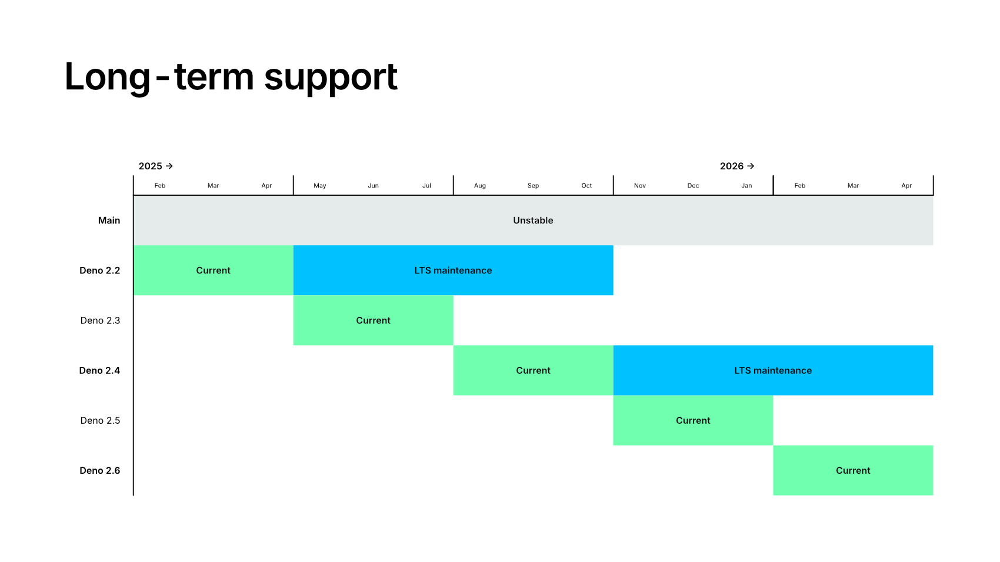

截至 Deno 1.0.0，`Deno` 命名空间的 API 是稳定的。这意味着我们将努力使在 1.0.0 下工作的代码在未来版本中继续有效。

## 发布计划、渠道和长期支持

Deno 每月发布一个新的稳定小版本（例如：v2.1.0，v2.0.0）。

包含最新小版本的 bug 修复的补丁版本会根据需要发布 - 您可以期待在发布新的小版本之前发布两到三个补丁版本。

### 发布渠道

Deno 提供 4 种发布渠道：

- `stable` - 如上所述的 semver 小版本/补丁版本。这是 **默认的** 推荐给大多数用户的分发渠道。
- `lts` - 对特定稳定版本的长期支持，推荐给不想频繁升级的企业用户。具体详情见下文。
- `rc` - 即将发布的 semver 小版本的候选版本。
- `canary` - 不稳定的版本，每天更改多次，允许尝试最新的 bug 修复和可能会最终包含在 `stable` 渠道中的新功能。

### 长期支持 (LTS)

从 Deno v2.1.0（发布于 2024 年 11 月）开始，Deno 提供 LTS（长期支持）渠道。

LTS 渠道是我们维护的 semver 小版本，只包含向后兼容的 bug 修复。

新 LTS 版本每年两次发布，并 **支持 6 个月**，为用户提供了在 LTS 发布之间升级的一个月窗口。LTS 渠道的新补丁版本至少每个季度发布 **一次**。

LTS 合格的回溯包括安全修复和缺陷修复（崩溃、错误答案）。

关键性能改进 **可能** 会根据严重性进行回溯。

API 更改和重大新功能 **将不会** 进行回溯。

## 不稳定的 API

在引入新 API 时，首先将其标记为不稳定。这意味着该 API 未来可能会更改。除非您显式传递不稳定标志（如 `--unstable-kv`），否则这些 API 不可用。
[了解更多关于 `--unstable-*` 标志的信息](/runtime/reference/cli/unstable_flags)。

还有一些 Deno 的非运行时特性被视为不稳定，并被锁定在不稳定标志后面。例如，`--unstable-sloppy-imports` 标志用于启用不指定文件扩展名的 `import` 代码。

## 标准库

Deno 标准库 (https://jsr.io/@std) 大部分是稳定的。所有版本为 1.0.0 或更高的标准库模块都被认为是稳定的。所有其他模块（0.x）被视为不稳定，未来可能会更改。

不建议在生产代码中使用不稳定的标准库模块，但这是一种尝试新特性并向 Deno 团队提供反馈的好方式。使用不稳定标准库模块并不需要使用任何不稳定标志。