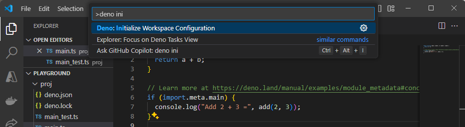
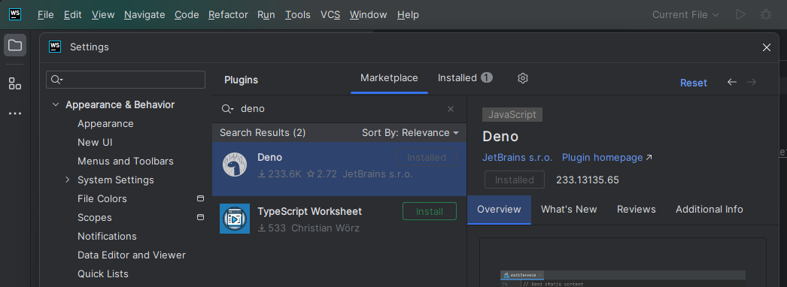

Deno 附带许多在应用程序开发中常用的工具，包括完整的
[语言服务 (LSP)](/runtime/reference/cli/lsp/)，以支持你选择的 IDE。本页面将帮助你配置环境，以便在开发时充分利用 Deno。

我们将涵盖：

- 如何在你喜欢的编辑器/IDE 中使用 Deno
- 如何生成 shell 自动补全

## 设置你的编辑器/IDE

### Visual Studio Code

如果你尚未安装，请从 [官方网站](https://code.visualstudio.com/) 下载并安装 Visual Studio Code。

在扩展视图中搜索 "Deno" 并安装
[Denoland 的扩展](https://marketplace.visualstudio.com/items?itemName=denoland.vscode-deno)。

接下来，按下 `Ctrl+Shift+P` 打开命令面板，输入
`Deno: Initialize Workspace Configuration`，选择该选项以配置 Deno
以适配你的工作区。



一个名为 `.vscode/settings.json` 的文件会在你的工作区中创建，内容如下：

```json
{
  "deno.enable": true
}
```

就这样！你已经成功设置了 VSCode 的 Deno 开发环境。现在你可以享受 Deno LSP 提供的所有功能，包括智能感知（IntelliSense）、代码格式化、代码检查等。

### JetBrains IDEs

要安装 Deno 插件，打开你的 IDE 并前往 **File** > **Settings**。
导航至 **Plugins**，搜索 `Deno`，并安装官方的 Deno 插件。



要配置插件，返回到 **File** > **Settings**，导航到
**Languages & Frameworks** > **Deno**。勾选 **Enable Deno for your project**，
并指定 Deno 可执行文件的路径（如果未自动检测）。

查看
[这篇博客文章](https://blog.jetbrains.com/webstorm/2020/06/deno-support-in-jetbrains-ides/)
以了解如何在 JetBrains IDE 中开始使用 Deno 的更多信息。

### Vim/Neovim 通过插件

Deno 在 [Vim](https://www.vim.org/) 和 [Neovim](https://neovim.io/) 上有良好支持，可以通过
[coc.nvim](https://github.com/neoclide/coc.nvim)、[vim-easycomplete](https://github.com/jayli/vim-easycomplete)、[ALE](https://github.com/dense-analysis/ale) 和 [vim-lsp](https://github.com/prabirshrestha/vim-lsp) 插件实现。coc.nvim 提供与 Deno 语言服务器集成的插件，而 ALE 开箱即用支持 Deno。

### Neovim 0.6+ 使用内置语言服务器

要使用 Deno 语言服务器，请安装
[nvim-lspconfig](https://github.com/neovim/nvim-lspconfig/) 并按照说明启用
[所提供的 Deno 配置](https://github.com/neovim/nvim-lspconfig/blob/master/doc/configs.md#denols)。

请注意，如果你同时使用 `ts_ls` 作为 LSP 客户端，可能会出现 `ts_ls` 和 `denols` 同时附加到当前缓冲区的问题。为解决此问题，请确保为 `ts_ls` 和 `denols` 设置不同的 `root_dir`。你可能还需将 `ts_ls` 的 `single_file_support` 设置为 `false`，以防其在单文件模式下运行。以下是示例配置：

```lua
vim.lsp.config('denols', {
    on_attach = on_attach,
    root_markers = {"deno.json", "deno.jsonc"},
})

vim.lsp.config('ts_ls', {
    on_attach = on_attach,
    root_markers = {"package.json"},
    single_file_support = false,
})
```

对于 Deno，上述示例假设项目根目录下存在 `deno.json` 或 `deno.jsonc` 文件。

##### Kickstart.nvim 和 Mason LSP

如果你使用 [kickstart.nvim](https://github.com/nvim-lua/kickstart.nvim)，可以将上述配置以如下方式添加至你的 `init.lua` 配置中的服务器表：

```lua
local servers = {
        -- ... 一些配置
        ts_ls = {
            root_dir = require("lspconfig").util.root_pattern({ "package.json", "tsconfig.json" }),
            single_file_support = false,
            settings = {},
        },
        denols = {
            root_dir = require("lspconfig").util.root_pattern({"deno.json", "deno.jsonc"}),
            single_file_support = false,
            settings = {},
        },
    }
```

#### coc.nvim

安装
[coc.nvim](https://github.com/neoclide/coc.nvim/wiki/Install-coc.nvim) 后，你需要通过命令 `:CocInstall coc-deno` 安装
[coc-deno](https://github.com/fannheyward/coc-deno) 插件。

插件安装完毕后，如想在某个工作区启用 Deno，可以运行命令 `:CocCommand deno.initializeWorkspace`，然后即可使用 `gd`（跳转到定义）、`gr`（查找引用）等命令。

#### ALE

ALE 原生支持 Deno 语言服务器，许多情况下无需额外配置。安装
[ALE](https://github.com/dense-analysis/ale#installation) 后，执行
[`:help ale-typescript-deno`](https://github.com/dense-analysis/ale/blob/master/doc/ale-typescript.txt)
以获取可用配置选项信息。

有关如何设置 ALE（如键绑定）的更多信息，请参考
[官方文档](https://github.com/dense-analysis/ale#usage)。

#### Vim-EasyComplete

Vim-EasyComplete 默认支持 Deno，无需额外配置。安装
[vim-easycomplete](https://github.com/jayli/vim-easycomplete#installation) 后，若尚未安装 Deno，需通过 `:InstallLspServer deno` 安装。更多信息详见
[官方文档](https://github.com/jayli/vim-easycomplete)。

#### Vim-Lsp

通过
[vim-plug](https://github.com/prabirshrestha/vim-lsp?tab=readme-ov-file#installing)
或 vim 包管理器安装 Vim-Lsp 后，在你的 `.vimrc` 添加以下配置：

```vim
if executable('deno')
  let server_config = {
    \ 'name': 'deno',
    \ 'cmd': {server_info->['deno', 'lsp']},
    \ 'allowlist': ['typescript', 'javascript', 'javascriptreact', 'typescriptreact'],
    \ }

  if exists('$DENO_ENABLE')
    let deno_enabled = $DENO_ENABLE == '1'
    let server_config['workspace_config'] = { 'deno': { 'enable': deno_enabled ? v:true : v:false } }
  endif

  au User lsp_setup call lsp#register_server(server_config)
endif
```

启用 LSP 服务器有两种方式：一种是在当前工作目录下存在 `deno.json` 或 `deno.jsonc` 文件，另一种是通过环境变量 `DENO_ENABLE=1` 强制启用。如果你想让 IntelliSense 中的工具提示高亮语法，也可在 `.vimrc` 中添加：

```vim
let g:markdown_fenced_languages = ["ts=typescript"]
```

### Emacs

#### lsp-mode

Emacs 通过 Deno 语言服务器使用
[lsp-mode](https://emacs-lsp.github.io/lsp-mode/) 支持 Deno。安装
[lsp-mode](https://emacs-lsp.github.io/lsp-mode/page/installation/) 后，默认支持 Deno，可进行
[配置](https://emacs-lsp.github.io/lsp-mode/page/lsp-deno/) 来自定义设置。

#### eglot

你也可以使用内置 Deno 语言服务器的 [`eglot`](https://github.com/joaotavora/eglot)。

以下是通过 eglot 配置 Deno 的示例：

```elisp
(add-to-list 'eglot-server-programs '((js-mode typescript-mode) . (eglot-deno "deno" "lsp")))

  (defclass eglot-deno (eglot-lsp-server) ()
    :documentation "Deno LSP 的自定义类。")

  (cl-defmethod eglot-initialization-options ((server eglot-deno))
    "传递必要的 deno 初始化选项"
    (list
      :enable t
      :unstable t
      :typescript
        (:inlayHints
          (:variableTypes
            (:enabled t))
          (:parameterTypes
            (:enabled t)))))
```

这相当于 VSCode 中 `settings.json` 的以下配置：

```jsonc
{
  "deno.enable": true,
  "deno.unstable": true,
  "typescript.inlayHints.variableTypes.enabled": true,
  "typescript.inlayHints.parameterTypes.enabled": true
}
```

### Pulsar

[Pulsar 编辑器，前身为 Atom](https://pulsar-edit.dev/) 支持通过
[atom-ide-deno](https://web.pulsar-edit.dev/packages/atom-ide-deno) 包集成 Deno 语言服务器。
`atom-ide-deno` 需要安装 Deno CLI，并依赖
[atom-ide-base](https://web.pulsar-edit.dev/packages/atom-ide-base) 包。

### Sublime Text

[Sublime Text](https://www.sublimetext.com/) 通过 [LSP 插件](https://packagecontrol.io/packages/LSP) 连接到 Deno 语言服务器。你可能还需要安装
[TypeScript 插件](https://packagecontrol.io/packages/TypeScript) 以获得完整语法高亮。

安装 LSP 插件后，在 `.sublime-project` 文件中添加以下配置：

```jsonc
{
  "settings": {
    "LSP": {
      "deno": {
        "command": ["deno", "lsp"],
        "initializationOptions": {
          // "config": "", // 设置项目中配置文件路径
          "enable": true,
          // "importMap": "", // 设置项目导入映射路径
          "lint": true,
          "unstable": false
        },
        "enabled": true,
        "languages": [
          {
            "languageId": "javascript",
            "scopes": ["source.js"],
            "syntaxes": [
              "Packages/Babel/JavaScript (Babel).sublime-syntax",
              "Packages/JavaScript/JavaScript.sublime-syntax"
            ]
          },
          {
            "languageId": "javascriptreact",
            "scopes": ["source.jsx"],
            "syntaxes": [
              "Packages/Babel/JavaScript (Babel).sublime-syntax",
              "Packages/JavaScript/JavaScript.sublime-syntax"
            ]
          },
          {
            "languageId": "typescript",
            "scopes": ["source.ts"],
            "syntaxes": [
              "Packages/TypeScript-TmLanguage/TypeScript.tmLanguage",
              "Packages/TypeScript Syntax/TypeScript.tmLanguage"
            ]
          },
          {
            "languageId": "typescriptreact",
            "scopes": ["source.tsx"],
            "syntaxes": [
              "Packages/TypeScript-TmLanguage/TypeScriptReact.tmLanguage",
              "Packages/TypeScript Syntax/TypeScriptReact.tmLanguage"
            ]
          }
        ]
      }
    }
  }
}
```

### Nova

[Nova 编辑器](https://nova.app) 可通过
[Deno 扩展](https://extensions.panic.com/extensions/co.gwil/co.gwil.deno/) 集成 Deno 语言服务器。

### GitHub Codespaces

[GitHub Codespaces](https://github.com/features/codespaces) 允许你完全在线或远程在本地机器上开发，无需额外配置或安装 Deno。目前处于早期访问阶段。

如果项目启用了 Deno，并包含 `.devcontainer` 配置作为库的一部分，则在 Codespaces 中打开项目应可“开箱即用”。若创建新项目或想为现有环境添加 Deno 支持，可通过命令面板选择 `Codespaces: Add Development Container Configuration Files...`，然后选择 `Show All Definitions...` 并搜索 `Deno` 定义。

选中后需要重建容器，容器内会添加 Deno CLI。重建后，代码空间即可支持 Deno。

### Kakoune

[Kakoune](https://kakoune.org/) 通过 [kak-lsp](https://github.com/kak-lsp/kak-lsp) 客户端支持连接 Deno 语言服务器。安装
[kak-lsp](https://github.com/kak-lsp/kak-lsp#installation) 后，可在 `kak-lsp.toml` 中添加如下配置示例：

```toml
[language.typescript]
filetypes = ["typescript", "javascript"]
roots = [".git"]
command = "deno"
args = ["lsp"]
[language.typescript.settings.deno]
enable = true
lint = true
```

### Helix

[Helix](https://helix-editor.com) 内建语言服务器支持。启用连接 Deno 语言服务器，需要在 `languages.toml` 配置文件中做如下修改：

```toml
[[language]]
name = "typescript"
roots = ["deno.json", "deno.jsonc", "package.json"]
file-types = ["ts", "tsx"]
auto-format = true
language-servers = ["deno-lsp"]

[[language]]
name = "javascript"
roots = ["deno.json", "deno.jsonc", "package.json"]
file-types = ["js", "jsx"]
auto-format = true
language-servers = ["deno-lsp"]

[language-server.deno-lsp]
command = "deno"
args = ["lsp"]
config.deno.enable = true
```

### Zed

[Zed 编辑器](https://zed.dev) 可通过
[Deno 扩展](https://zed.dev/extensions?query=deno&filter=language-servers) 集成 Deno 语言服务器。

## Shell 自动补全

Deno CLI 内置支持为自身生成 shell 补全脚本。使用 `deno completions <shell>` 命令，Deno CLI 会将补全内容输出到 stdout。目前支持的 shell 如下：

- bash
- elvish
- fish
- powershell
- zsh

### bash 示例

输出补全脚本并加载到环境中：

```shell
> deno completions bash > /usr/local/etc/bash_completion.d/deno.bash
> source /usr/local/etc/bash_completion.d/deno.bash
```

### PowerShell 示例

输出补全脚本：

```shell
> deno completions powershell >> $profile
> .$profile
```

这会在 `$HOME\Documents\WindowsPowerShell\Microsoft.PowerShell_profile.ps1` 创建 PowerShell 配置文件，并在每次启动 PowerShell 时自动运行。

### zsh 示例

你应有一个目录用来存放补全脚本：

```shell
> mkdir ~/.zsh
```

然后输出补全：

```shell
> deno completions zsh > ~/.zsh/_deno
```

确保你的 `~/.zshrc` 中加载补全：

```shell
fpath=(~/.zsh $fpath)
autoload -Uz compinit
compinit -u
```

若重新加载 shell 后补全仍未生效，尝试删除 `~/.zcompdump/` 目录清除旧补全缓存，再次运行 `compinit`。

### 使用 ohmyzsh 和 antigen 的 zsh 示例

[ohmyzsh](https://github.com/ohmyzsh/ohmyzsh) 是 zsh 配置框架，方便管理 shell 配置，
[antigen](https://github.com/zsh-users/antigen) 是 zsh 插件管理器。

创建目录并输出补全：

```shell
> mkdir ~/.oh-my-zsh/custom/plugins/deno
> deno completions zsh > ~/.oh-my-zsh/custom/plugins/deno/_deno
```

你的 `.zshrc` 可能如下：

```shell
source /path-to-antigen/antigen.zsh

# 加载 oh-my-zsh。
antigen use oh-my-zsh

antigen bundle deno
```

### fish 示例

将补全脚本输出至 fish 配置目录中的文件：

```shell
> deno completions fish > ~/.config/fish/completions/deno.fish
```

## 其他工具

如果你正在开发或支持使用 Deno 语言服务器的社区集成，请参考
[更多关于与 Deno LSP 集成的信息](/runtime/reference/lsp_integration/)，并欢迎随时加入我们的 [Discord 社区](https://discord.gg/deno) 的 `#dev-lsp` 频道交流。