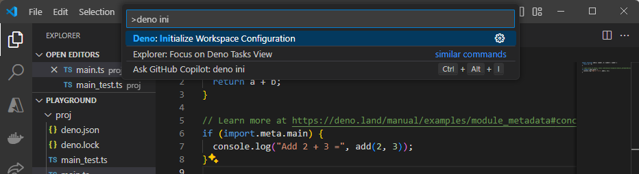

Deno 附带许多在应用程序开发中常用的工具，包括完整的
[语言服务 (LSP)](/runtime/reference/cli/lsp/)，以支持你选择的 IDE。本页面将帮助你配置环境，以便在开发时充分利用 Deno。

我们将涵盖：

- 如何在你最喜欢的编辑器/IDE 中使用 Deno
- 如何生成 shell 补全

## 设置你的编辑器/IDE

### Visual Studio Code

如果你还没有安装，请从
[官方网站](https://code.visualstudio.com/)下载并安装 Visual Studio Code。

在扩展视图中搜索 "Deno" 并安装
[Denoland 的扩展](https://marketplace.visualstudio.com/items?itemName=denoland.vscode-deno)。

接下来，按下 `Ctrl+Shift+P` 打开命令面板，输入
`Deno: Initialize Workspace Configuration`，选择该选项以配置 Deno
以适配你的工作区。



一个名为 `.vscode/settings.json` 的文件会在你的工作区中创建，内容如下：

```json
{
  "deno.enable": true
}
```

就是这样！你已经成功使用 VSCode 为 Deno 设置好了开发环境。你现在将获得 Deno 的 LSP 带来的全部优势，包括 IntelliSense、代码格式化、代码检查等更多功能。

### JetBrains IDEs

要安装 Deno 插件，打开你的 IDE 并前往 **File** > **Settings**。
导航至 **Plugins**，搜索 `Deno`，并安装官方的 Deno 插件。


要配置插件，返回到 **File** > **Settings**，导航到
**Languages & Frameworks** > **JavaScript Runtime**。将 **Preferred
Runtime** 切换为 **Deno**。在 **Deno** 下面，指定 Deno 可执行文件的路径（如果未自动检测到）。

查看
[这篇博客文章](https://blog.jetbrains.com/webstorm/2020/06/deno-support-in-jetbrains-ides/)
以了解如何在 JetBrains IDE 中开始使用 Deno 的更多信息。

### Vim/Neovim

Neovim 0.6+ 的推荐设置是使用内置语言服务器客户端
并配合 [nvim-lspconfig](https://github.com/neovim/nvim-lspconfig/)，它自带一个
[现成的 Deno 配置](https://github.com/neovim/nvim-lspconfig/blob/master/doc/configs.md#denols)。

如果你还配置了 `ts_ls`，两个服务器都可能附加到同一个缓冲区。
为避免这种情况，请给每个服务器设置不同的 `root_dir`（或 `root_markers`），并在 `ts_ls` 上设置
`single_file_support = false`：

```lua
vim.lsp.config('denols', {
    on_attach = on_attach,
    root_markers = {"deno.json", "deno.jsonc"},
})

vim.lsp.config('ts_ls', {
    on_attach = on_attach,
    root_markers = {"package.json"},
    single_file_support = false,
})
```

这假定你的 Deno 项目根目录下存在 `deno.json` 或 `deno.jsonc`。

**Kickstart.nvim 和 Mason LSP。** 如果你使用
[kickstart.nvim](https://github.com/nvim-lua/kickstart.nvim)，请将等效配置添加到 `init.lua` 中的 `servers` 表：

```lua
local servers = {
        -- ... 一些配置
        ts_ls = {
            root_dir = require("lspconfig").util.root_pattern({ "package.json", "tsconfig.json" }),
            single_file_support = false,
            settings = {},
        },
        denols = {
            root_dir = require("lspconfig").util.root_pattern({"deno.json", "deno.jsonc"}),
            single_file_support = false,
            settings = {},
        },
    }
```

**其他 Vim/Neovim 插件。** 如果你更喜欢其他插件生态，Deno
也可以与以下插件配合使用：

- **[ALE](https://github.com/dense-analysis/ale)：** 开箱即支持 Deno 语言服务器。参见
  [`:help ale-typescript-deno`](https://github.com/dense-analysis/ale/blob/master/doc/ale-typescript.txt)
  了解配置选项。
- **[coc.nvim](https://github.com/neoclide/coc.nvim)：** 使用
  `:CocInstall coc-deno` 安装 [coc-deno](https://github.com/fannheyward/coc-deno)，然后在
  你的项目中运行 `:CocCommand deno.initializeWorkspace`。
- **[vim-easycomplete](https://github.com/jayli/vim-easycomplete)：** 安装后，运行 `:InstallLspServer deno`。详见
  [项目 README](https://github.com/jayli/vim-easycomplete)。
- **[vim-lsp](https://github.com/prabirshrestha/vim-lsp)：** 在你的 `.vimrc` 中注册 Deno
  语言服务器：

  ```vim
  if executable('deno')
    let server_config = {
      \ 'name': 'deno',
      \ 'cmd': {server_info->['deno', 'lsp']},
      \ 'allowlist': ['typescript', 'javascript', 'javascriptreact', 'typescriptreact'],
      \ }

    if exists('$DENO_ENABLE')
      let deno_enabled = $DENO_ENABLE == '1'
      let server_config['workspace_config'] = { 'deno': { 'enable': deno_enabled ? v:true : v:false } }
    endif

    au User lsp_setup call lsp#register_server(server_config)
  endif
  ```

  通过在工作目录中放置 `deno.json`/`deno.jsonc`，或者设置 `DENO_ENABLE=1` 来激活服务器。若要在 intellisense 提示中高亮语法，还可以添加：

  ```vim
  let g:markdown_fenced_languages = ["ts=typescript"]
  ```

### Zed

[Zed 编辑器](https://zed.dev) 可通过
[Deno 扩展](https://zed.dev/extensions?query=deno&filter=language-servers)集成 Deno 语言服务器。

### Helix

[Helix](https://helix-editor.com) 自带语言服务器支持。
要连接到 Deno 语言服务器，需要修改
`languages.toml` 配置文件。

```toml
[[language]]
name = "typescript"
roots = ["deno.json", "deno.jsonc", "package.json"]
file-types = ["ts", "tsx"]
auto-format = true
language-servers = ["deno-lsp"]

[[language]]
name = "javascript"
roots = ["deno.json", "deno.jsonc", "package.json"]
file-types = ["js", "jsx"]
auto-format = true
language-servers = ["deno-lsp"]

[language-server.deno-lsp]
command = "deno"
args = ["lsp"]
config.deno.enable = true
```

### Emacs

**lsp-mode。** Emacs 可通过 Deno 语言服务器使用
[lsp-mode](https://emacs-lsp.github.io/lsp-mode/) 支持 Deno。
一旦
[lsp-mode 安装完成](https://emacs-lsp.github.io/lsp-mode/page/installation/)，
它应该支持 Deno，并且可以被
[配置](https://emacs-lsp.github.io/lsp-mode/page/lsp-deno/)为支持
各种设置。

**eglot。** 你也可以通过
[`eglot`](https://github.com/joaotavora/eglot) 使用内置的 Deno 语言服务器。示例配置：

```elisp
(add-to-list 'eglot-server-programs '((js-mode typescript-mode) . (eglot-deno "deno" "lsp")))

  (defclass eglot-deno (eglot-lsp-server) ()
    :documentation "Deno LSP 的自定义类。")

  (cl-defmethod eglot-initialization-options ((server eglot-deno))
    "传递必要的 deno 初始化选项"
    (list
      :enable t
      :unstable t
      :typescript
        (:inlayHints
          (:variableTypes
            (:enabled t))
          (:parameterTypes
            (:enabled t)))))
```

这相当于 VSCode 中 `settings.json` 的以下配置：

```jsonc
{
  "deno.enable": true,
  "deno.unstable": true,
  "typescript.inlayHints.variableTypes.enabled": true,
  "typescript.inlayHints.parameterTypes.enabled": true
}
```

### Sublime Text

[Sublime Text](https://www.sublimetext.com/) 支持通过
[LSP package](https://packagecontrol.io/packages/LSP) 连接到 Deno
语言服务器。安装完成后，在你的 `.sublime-project` 中添加一个最小的 Deno 客户端：

```jsonc
{
  "settings": {
    "LSP": {
      "deno": {
        "command": ["deno", "lsp"],
        "enabled": true,
        "selector": "source.ts | source.tsx | source.js | source.jsx",
        "initializationOptions": {
          "enable": true,
          "lint": true
        }
      }
    }
  }
}
```

关于支持的 `initializationOptions` 键的完整列表（例如 `config`、
`importMap` 和 `unstable`），请参阅
[LSP 集成参考中的 Settings 部分](/runtime/reference/lsp_integration/#settings)
以及
[LSP package 文档](https://lsp.sublimetext.io/language_servers/)。

### Kakoune

[Kakoune](https://kakoune.org/) 通过 [kak-lsp](https://github.com/kak-lsp/kak-lsp) 客户端支持连接 Deno 语言服务器。安装
[kak-lsp](https://github.com/kak-lsp/kak-lsp#installation) 后，可在 `kak-lsp.toml` 中添加如下配置示例：

```toml
[language.typescript]
filetypes = ["typescript", "javascript"]
roots = [".git"]
command = "deno"
args = ["lsp"]
[language.typescript.settings.deno]
enable = true
lint = true
```

### Nova

[Nova 编辑器](https://nova.app) 可通过
[Deno 扩展](https://extensions.panic.com/extensions/co.gwil/co.gwil.deno/)集成 Deno 语言服务器。

### Pulsar

[Pulsar 编辑器，前身为 Atom](https://pulsar-edit.dev/) 支持
通过 [atom-ide-deno](https://web.pulsar-edit.dev/packages/atom-ide-deno) 包集成 Deno 语言服务器。
`atom-ide-deno` 要求安装 Deno CLI，并且还需要安装
[atom-ide-base](https://web.pulsar-edit.dev/packages/atom-ide-base) 包。

## 远程开发

### GitHub Codespaces

[GitHub Codespaces](https://github.com/features/codespaces) 让你可以在
一个托管环境中开发，而无需在本地安装 Deno。

如果仓库已经包含带有 Deno 的 `.devcontainer` 配置，那么在 Codespaces 中打开它即可正常工作。要为没有该配置的 Codespace 添加 Deno：

1. 打开命令面板 (`Cmd/Ctrl+Shift+P`)。
2. 运行 `Codespaces: Add Development Container Configuration Files...`。
3. 选择 `Show All Definitions...` 并搜索 `Deno`。
4. 重建容器，使 Deno CLI 可用。

## Shell 自动补全

Deno CLI 内置支持为自身生成 shell 补全脚本。使用 `deno completions <shell>` 命令，Deno CLI 会将补全内容输出到 stdout。目前支持的 shell 如下：

- bash
- elvish
- fish
- powershell
- zsh

### bash 示例

输出补全脚本并加载到环境中：

```shell
> deno completions bash > /usr/local/etc/bash_completion.d/deno.bash
> source /usr/local/etc/bash_completion.d/deno.bash
```

### PowerShell 示例

输出补全脚本：

```shell
> deno completions powershell >> $profile
> .$profile
```

这会在 `$HOME\Documents\WindowsPowerShell\Microsoft.PowerShell_profile.ps1` 创建 PowerShell 配置文件，并在每次启动 PowerShell 时自动运行。

### zsh 示例

你应有一个目录用来存放补全脚本：

```shell
> mkdir ~/.zsh
```

然后输出补全：

```shell
> deno completions zsh > ~/.zsh/_deno
```

确保你的 `~/.zshrc` 中加载补全：

```shell
fpath=(~/.zsh $fpath)
autoload -Uz compinit
compinit -u
```

若重新加载 shell 后补全仍未生效，尝试删除 `~/.zcompdump/` 目录清除旧补全缓存，再次运行 `compinit`。

### 使用 ohmyzsh 和 antigen 的 zsh 示例

[ohmyzsh](https://github.com/ohmyzsh/ohmyzsh) 是 zsh 配置框架，方便管理 shell 配置，
[antigen](https://github.com/zsh-users/antigen) 是 zsh 插件管理器。

创建目录并输出补全：

```shell
> mkdir ~/.oh-my-zsh/custom/plugins/deno
> deno completions zsh > ~/.oh-my-zsh/custom/plugins/deno/_deno
```

你的 `.zshrc` 可能如下：

```shell
source /path-to-antigen/antigen.zsh

# 加载 oh-my-zsh。
antigen use oh-my-zsh

antigen bundle deno
```

### fish 示例

将补全脚本输出至 fish 配置目录中的文件：

```shell
> deno completions fish > ~/.config/fish/completions/deno.fish
```

## 构建你自己的 LSP 集成

如果你正在构建或维护与 Deno 语言
服务器的社区集成，请参阅 [LSP 集成参考](/runtime/reference/lsp_integration/)
并加入 [Deno Discord](https://discord.gg/deno) 上的 `#dev-lsp` 频道。
