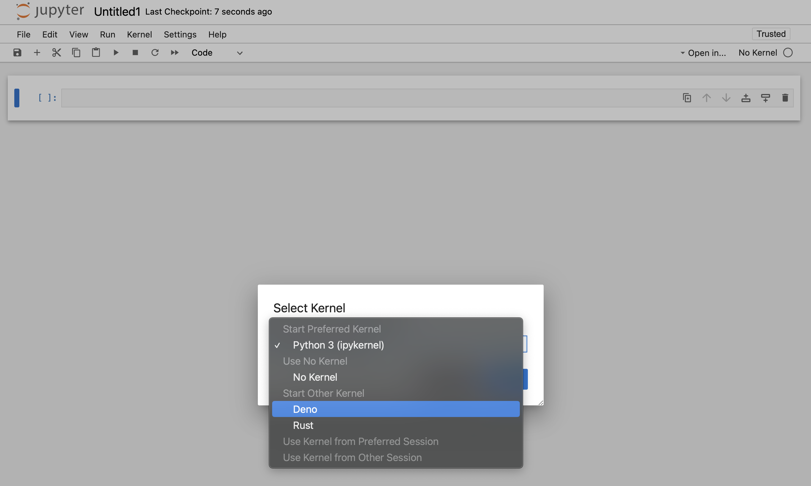
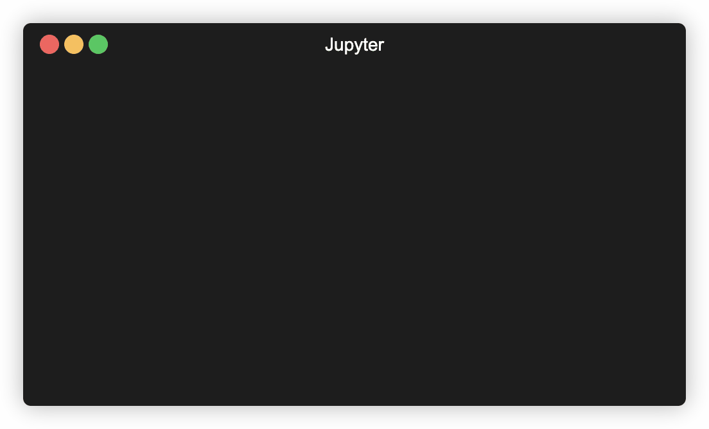

Deno 附带一个内置的 Jupyter 内核，允许你在交互式笔记本中编写 JavaScript 和 TypeScript；使用 Web 和 Deno API，并直接导入 `npm` 包。

:::caution `deno jupyter` 总是以 `--allow-all` 选项运行

目前，在 Jupyter 内核中执行的所有代码均以 `--allow-all` 标志运行。这是一个临时限制，将在未来解决。

:::

## 快速入门

运行 `deno jupyter --unstable` 并按照说明操作。

你可以运行 `deno jupyter --unstable --install` 来强制安装内核。Deno 假设 `jupyter` 命令在你的 `PATH` 中可用。

完成安装过程后，Deno 内核将在 JupyterLab 和经典笔记本的笔记本创建对话框中可用：



你可以在任何支持 Jupyter 笔记本的编辑器中使用 Deno Jupyter 内核。

### VS Code

- 安装
  [VSCode Jupyter 扩展](https://marketplace.visualstudio.com/items?itemName=ms-toolsai.jupyter)
- 通过打开命令面板（Ctrl+Shift+P）并选择“创建：新建 Jupyter 笔记本”来打开或创建一个笔记本文件。你也可以手动通过创建一个扩展名为 ".ipynb" 的文件来完成此操作。
- 在新建或现有笔记本上，点击创建新的 Jupyter 笔记本，选择“Jupyter 内核”，然后选择 Deno


### JetBrains IDEs

Jupyter 笔记本开箱即用。

## 丰富内容输出

`Deno.jupyter` 命名空间提供了用于在笔记本中显示丰富内容的辅助函数，
[使用 Jupyter 支持的 MIME 类型](https://docs.jupyter.org/en/latest/reference/mimetype.html)。

---

提供丰富输出的最简单方法是返回一个具有 `[Symbol.for("Jupyter.display")]` 方法的对象。

此方法应返回一个将 MIME 类型映射到应显示的值的字典。

```ts
{
  [Symbol.for("Jupyter.display")]() {
    return {
      // 普通文本内容
      "text/plain": "Hello world!",

      // HTML 输出
      "text/html": "<h1>Hello world!</h1>",
    }
  }
}
```

_返回普通文本和 HTML 输出的对象示例。_

:::info

你也可以使用 `Deno.jupyter.$display`，而无需输入
`Symbol.for("Jupyter.display")`

:::

这是一个常规函数，因此你可以使用任何库来格式化输出 —— 例如，使用 `@std/fmt/colors` 提供彩色输出：

```ts
import * as colors from "jsr:@std/fmt/colors";

{
  [Deno.jupyter.$display]() {
    return {
      "text/plain": colors.green("Hello world"),
    }
  }
}
```

你还可以使用 `Deno.jupyter.display` 函数直接显示 MIME 集合：

```js
await Deno.jupyter.display({
  "text/plain": "Hello, world!",
  "text/html": "<h1>Hello, world!</h1>",
  "text/markdown": "# Hello, world!",
}, { raw: true });
```


你的笔记本前端将自动根据其能力选择“最丰富”的 MIME 类型进行显示。

---

`Deno.jupyter` 提供了若干用于常见媒体类型的丰富输出的辅助方法。

`Deno.jupyter.html` 是一个标记模板，将提供的字符串作为 HTML 渲染在笔记本中。

```js
Deno.jupyter.html`<h1>Hello, world!</h1>
<h2>来自 Deno 内核</h2>
<p>Lorem ipsum <i>dolor</i> <b>sit</b> <u>amet</u></p>`;
```


`Deno.jupyter.md` 是一个标记模板，将提供的字符串作为 Markdown 文档在笔记本中渲染。

```js
Deno.jupyter
  .md`# 使用 Deno 的 TypeScript 笔记本 

**与 Jupyter 的交互式计算 _内置于 Deno_！**`;
```


`Deno.jupyter.svg` 是一个标记模板，将提供的字符串作为 SVG 图形在笔记本中渲染。

```js
Deno.jupyter.svg`<svg xmlns="http://www.w3.org/2000/svg" viewBox="0 0 100 100">
      <circle cx="50" cy="50" r="40" stroke="green" stroke-width="4" fill="yellow" />
    </svg>`;
```


`Deno.jupyter.image` 是一个函数，将渲染 JPG 或 PNG 图像。你可以传入文件路径或已读取的字节：

```js
Deno.jupyter.image("./cat.jpg");

const data = Deno.readFileSync("./dog.png");
Deno.jupyter.image(data);
```

## prompt 和 confirm APIs

你可以使用 `prompt` 和 `confirm` Web API 在笔记本中等待用户输入。

<figure>

<video class="w-full" alt="`confirm` 和 `prompt` APIs 示例" autoplay muted loop playsinline controls src="../images/jupyter-confirm-prompt.mp4"></video>

<figcaption><span style="font-family: monospace;">confirm</span> 和 <span style="font-family: monospace;">prompt</span> APIs 示例</figcaption>

</figure>

## IO pub 通道广播

`Deno.jupyter.broadcast` 允许将消息发布到 IO pub 通道，允许在单元格被评估时提供实时更新。

考虑以下示例，该示例在开始计算之前打印一条消息，计算完成时再打印另一条消息：

```js
await Deno.jupyter.broadcast("display_data", {
  data: { "text/html": "<b>处理中...</b>" },
  metadata: {},
  transient: { display_id: "progress" },
});

// 假装我们正在进行一个耗时的计算
await new Promise((resolve) => setTimeout(resolve, 1500));

await Deno.jupyter.broadcast("update_display_data", {
  data: { "text/html": "<b>完成</b>" },
  metadata: {},
  transient: { display_id: "progress" },
});
```

<figure>

<video class="w-full" alt="`Deno.jupyter.broadcast` API 示例" autoplay muted loop playsinline controls src="../images/jupyter-broadcast.mp4"></video>

<figcaption><span style="font-family: monospace;">Deno.jupyter.broadcast</span> API 示例</figcaption>

</figure>

## 示例

以下是使用 `@observablehq/plot` 生成图表的示例：

```ts
import { document, penguins } from "jsr:@ry/jupyter-helper";
import * as Plot from "npm:@observablehq/plot";

let p = await penguins();

Plot.plot({
  marks: [
    Plot.dot(p.toRecords(), {
      x: "culmen_depth_mm",
      y: "culmen_length_mm",
      fill: "species",
    }),
  ],
  document,
});
```


请参阅 https://github.com/rgbkrk/denotebooks 以获取利用数据分析和可视化库（如 Polars、Observable 和 d3）的更高级示例。

## `jupyter console` 集成

你还可以在 `jupyter console` REPL 中使用 Deno Jupyter 内核。为此，你应该通过 `jupyter console --kernel deno` 启动控制台。

