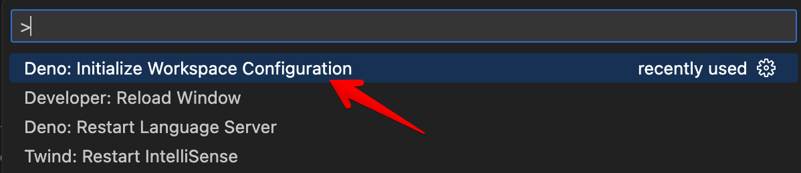
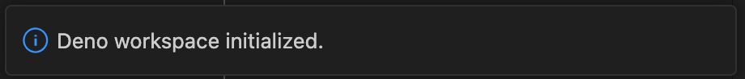

该页面介绍了如何使用 [Visual Studio Code](https://code.visualstudio.com/) 和官方的 [vscode_deno](https://marketplace.visualstudio.com/items?itemName=denoland.vscode-deno) 扩展来开发 Deno 应用程序。

## 安装

Deno VS Code 扩展直接与 Deno CLI 集成，使用 [语言服务器协议](/runtime/reference/lsp_integration/)。这有助于确保您获取的有关代码的信息与您使用 Deno CLI 运行代码时的运行方式对齐。

Deno 扩展的安装方式与 VS Code 中的其他扩展相同。在 VS Code 的扩展选项卡中搜索 `Deno` 并单击 **安装** 按钮，或者 [这个链接](vscode:extension/denoland.vscode-deno) 将打开扩展页面，您可以选择安装。

首次安装扩展后，您应该会收到一条欢迎页面，欢迎您使用该扩展。（如果您错过了它，或者想再次查看，使用 <kbd>⌘</kbd> <kbd>⇧</kbd> <kbd>P</kbd> 打开命令面板，并运行 **Deno: Welcome** 命令。）

## 在 VS Code 工作区中启用 Deno

我们意识到，您在 VS Code 中工作的并非每个项目都是 Deno 项目。默认情况下，VS Code 配备了内置的 TypeScript/JavaScript 语言服务，当编辑 TypeScript 或 JavaScript 文件时将使用。

为了支持 Deno API，以及能够像 Deno CLI 一样解析模块，您需要在工作区中启用 Deno。最直接的方法是使用 VS Code 的 **Deno: Initialize Workspace Configuration** 命令从 [命令面板](https://code.visualstudio.com/docs/getstarted/userinterface#_command-palette)。



此命令会在工作区配置中添加 `"deno.enable": true`（即您的工作区根目录 `.vscode/settings.json`）。命令完成后，您将收到通知，表示 Deno 工作区已初始化。



这些设置（以及其他设置）可以通过 VS Code 的 [设置](https://code.visualstudio.com/docs/getstarted/userinterface#_settings) 面板获取。在面板中，该设置为 **Deno: Enable**。

:::note

VS Code 有用户和工作区设置。您可能不希望在 **用户** 设置中启用 Deno，而是将其设定在 **工作区** 设置中，否则每个工作区都将默认启用 Deno。

:::

### 工作区文件夹设置

这些是在工作区文件夹上可以设置的设置。其余设置当前仅适用于工作区：

- `deno.enable` - 控制是否启用 Deno 语言服务器。当启用时，扩展将禁用内置的 VS Code JavaScript 和 TypeScript 语言服务，并将使用 Deno 语言服务器。_布尔值，默认 `false`_
- `deno.enablePaths` - 控制是否仅对工作区文件夹的特定路径启用 Deno 语言服务器。默认为空列表。
- `deno.codeLens.test` - 控制测试代码透镜是否启用。_布尔值，默认 `true`_
- `deno.codeLens.testArgs` - 在激活测试代码透镜时传递给 `deno test` 的参数列表。_字符串数组，默认 `["--allow-all"]`_

启用项目后，扩展将直接从已安装的 Deno CLI 获取信息。扩展还将静音内置的 TypeScript/JavaScript 扩展。

## 在 VS Code 工作区中部分启用 Deno

在工作区（或工作区文件夹）中，子路径可以启用 Deno，而代码路径外的部分不会启用，VS Code 的内置 JavaScript/TypeScript 语言服务器将被使用。使用 **Deno: Enable Paths** 设置（或如果手动编辑则使用 `deno.enablePaths`）

例如，如果您有如下项目：

```console
project
├── worker
└── front_end
```

您只希望启用 `worker` 路径（及其子路径）为 Deno 启用，您将需要将 `./worker` 添加到配置中的 **Deno: Enable Paths** 列表中。

## 混合 Deno 项目

通过此功能，您可以拥有混合 Deno 项目，其中某些工作区文件夹已启用 Deno，而某些文件夹未启用。这在创建可能具有前端组件的项目时很有用，因为您希望该前端代码有不同的配置。

为了支持此操作，您可以创建一个新工作区（或向现有工作区添加文件夹），并在设置中将其中一个文件夹配置为 `deno.enable` 设置为 `true`，而其他一个设置为 `false`。保存工作区配置后，您会注意到 Deno 语言服务器仅对启用的文件夹应用诊断，而其他文件夹将使用 VS Code 的内置 TypeScript 编译器来提供 TypeScript 和 JavaScript 文件的诊断。

## 代码检查

使用 `deno lint` 时提供诊断的相同引擎也可以通过扩展使用。通过在设置面板中启用 **Deno: Lint** 设置（或如果在 JSON 中手动编辑，则使用 `deno.lint`），编辑器将开始在您的代码中显示 lint "警告"。有关如何使用 Deno lint 的更多信息，请参见 [Linter](/runtime/reference/cli/linter/) 部分。

## 使用配置文件

Deno 项目并不要求使用配置文件，但在某些场景下它可能很有用。如果您希望在命令行中指定 `--config` 选项时应用相同的设置，则可以使用 **Deno: Config** 选项（或如果手动编辑则使用 `deno.config`）。

Deno 扩展还会通过查找工作区根目录中的配置文件来自动识别并应用 `deno.jsonc` 或 `deno.json`。手动指定 **Deno: Config** 选项将覆盖此自动行为。

## 格式化

Deno CLI 提供了一个 [内置格式化工具](/runtime/reference/cli/formatter/)，可以通过 `deno fmt` 访问，但也可以配置为由 VS Code 使用。`Deno` 应该出现在 **编辑器: 默认格式化程序** 设置的下拉列表中（或者如果您手动编辑设置，它将是 `"editor.defaultFormatter": "denoland.vscode-deno"`）。

## 设置 Deno CLI 的路径

扩展在主机的 `PATH` 中查找 Deno CLI 可执行文件，但有时这并不理想，可以设置 **Deno: Path**（或如果手动编辑则使用 `deno.path`）以指向 Deno 可执行文件。如果提供的路径是相对路径，它将相对于工作区根目录解析。

## 导入建议

在尝试导入模块时，扩展将提供完整导入的建议。建议中将包含本地相对文件以及任何缓存的远程文件。

扩展支持注册表自动补全，远程注册表/模块网站可以选择性地提供元数据，以允许客户端发现模块。默认情况下，扩展将检查主机/源以查看它们是否支持建议，如果支持，扩展将提示您查看是否启用。此行为可以通过在设置中取消选中 **Deno > Suggest > Imports: Auto Discover** 选项改变。（或 `deno.suggest.imports.autoDiscover` 如果手动编辑）。

可以通过编辑 **Deno > Suggest > Imports: Hosts** 设置 - `deno.suggest.imports.hosts` 在适当的 `settings.json` 中启用或禁用单独的主机/源。

## 缓存远程模块

Deno 支持远程模块，并将提取远程模块并将其存储在本地缓存中。当您在命令行上执行 `deno run`、`deno test`、`deno info` 或 `deno install` 等操作时，Deno CLI 将获取任何远程模块及其依赖项并填充缓存。

在编辑器中开发代码时，如果模块不在缓存中，您将收到一条诊断信息，例如 `Uncached or missing remote URL: "https://deno.land/example/mod.ts"`，表示任何缺少远程模块。Deno 不会自动尝试缓存模块，除非它是来自注册表导入建议的补全（见上文）。

除了在命令行上运行命令外，扩展还提供了在编辑器中缓存依赖项的方法。缺少依赖项将具有一个 _快速修复_，让 Deno 尝试缓存该依赖项。修复可以通过在导入说明符上按 <kbd>CTRL</kbd> <kbd>.</kbd> 或 <kbd>⌘</kbd> <kbd>.</kbd> 来访问，或者悬停在说明符上并选择 **Quick Fix...**。

命令面板中还有 **Deno: Cache Dependencies** 命令，该命令将尝试缓存当前在编辑器中激活的模块的任何依赖项。

## 代码透镜

语言服务器当前支持若干代码透镜（可操作的上下文信息穿插在代码中），使您可以对代码获得更深入的洞察。大多数默认为禁用，但可以轻松启用：

### Deno > 代码透镜: 实现

`deno.codeLens.implementations` - 提供一个透镜，可以列出代码中任何其他位置的项目实现。

### Deno > 代码透镜: 引用

`deno.codeLens.references` - 提供一个透镜，可以列出代码中任何其他位置对项目的引用。

### Deno > 代码透镜: 所有函数的引用

`deno.codeLens.referencesAllFunctions` - 提供一个透镜，可以列出代码中所有函数的所有引用。所有函数都被排除在上面提到的 _References_ 设置之外。

### 测试代码透镜

Deno CLI 包含一个 [内置测试 API](/runtime/reference/lsp_integration/#testing)，可在 `Deno.test` 下可用。该扩展和语言服务器默认启用一个代码透镜，提供了从编辑器运行测试的能力。

当您有一个提供测试的代码块时：

```ts
import { assert } from "jsr:@std/assert@1";

Deno.test({
  name: "a test case",
  fn() {
    let someCondition = true;
    assert(someCondition);
  },
});
```

您将在测试上方看到一个代码透镜：

```console
▶ 运行测试
```

如果您单击代码透镜，扩展将启动 Deno CLI 为您运行测试并显示输出。根据您的其他设置，扩展将尝试以相同的设置运行您的测试。如果您需要调整在执行 `deno test` 时提供的参数，您可以通过设置 `deno.codeLens.testArgs` 设置来实现。

扩展还将尝试跟踪您在同一模块中是否解构了 `Deno.test` 函数或将其分配给变量。这样，您可以像这样做并仍然让代码透镜工作：

```ts
const { test: denoTest } = Deno;

denoTest({
  name: "example test",
  fn() {},
});
```

如果您想禁用该功能，可以通过取消设置 **Deno > 代码透镜: 测试** 设置 - `deno.codeLens.test` 来实现。

您可以通过测试资源管理器视图、代码透镜装饰或命令面板运行测试。您还可以在测试资源管理器视图中使用过滤功能以排除某些测试不参加测试运行。

当测试失败时，失败消息，包括堆栈跟踪，将在 VS Code 中检查测试结果时可用。

### 测试配置

默认情况下，测试的执行方式类似于您在命令行中使用 `deno test --allow-all`。可以通过在用户或工作区设置中设置 **Deno > Testing: Args** 选项（或 `deno.testing.args` 如果您手动配置）来更改这些默认参数。在这里添加您本来会使用 `deno test` 子命令的单独参数。

基于您拥有的其他设置，这些选项将自动合并到运行测试时使用的 "命令行" 中，除非在 **Deno > Testing: Args** 设置中明确提供。

## 使用调试器

该扩展提供与内置的 VS Code 调试器的集成。您可以通过以下方式生成配置：转到 `运行和调试` 面板，点击 `创建一个 launch.json 文件`，并从可用的调试器选项中选择 `Deno` 选项。（生成的配置 `type` 将是 `node`；这没问题。）

## 任务

尽管扩展与语言服务器直接通信，但有时您可能更希望通过 CLI 运行 Deno 命令。您可以在工作区根目录中的 `deno.json` 文件中定义任务，位于 [`tasks` 字段](/runtime/fundamentals/configuration/#tasks).

## 使用开发容器

使用 [开发容器](https://code.visualstudio.com/docs/remote/containers) 与 VS Code 是获得隔离开发环境的绝佳方式，而无需担心在本地系统上安装 Deno CLI。Deno 支持开发容器，Deno 扩展将与之配合使用。

如果您有一个现有的 Deno 项目，您希望添加开发容器支持，则在命令面板中执行 **Remote-Containers: Add Development Container Configuration Files...**，选择 **Show All Definitions...**，然后搜索 `Deno` 定义。这将设置一个基线的 `.devcontainer` 配置，将在容器中安装 Deno CLI 的最新版本。

添加后，VS Code 会提示您是否希望在开发容器中打开项目。如果您选择这样做，VS Code 将构建开发容器，并使用该开发容器重新打开工作区，其中将安装 Deno CLI 和 `vscode_deno` 扩展。

## 故障排除

以下部分涵盖使用扩展时可能遇到的挑战，并尝试提供可能的原因。

### 错误/诊断

`导入路径无法以 '.ts' 扩展名结束。` 或 `找不到名称 'Deno'.`

这通常是 Deno 没有在 Deno 项目中启用的情况。如果您查看诊断源，您可能会看到 `ts(2691)`。`ts` 表示它来自 VS Code 中内置的 TypeScript/JavaScript 引擎。您将需要检查您的配置是否正确设置以及 **Deno: Enable** 设置 - `deno.enable` 是否为 true。

您还可以通过使用命令面板中的 **Deno: Language Server Status** 查看 Deno 语言服务器认为您当前的活动配置。这将显示一个来自语言服务器的文档，其中包含名为 "Workspace Configuration" 的部分。这将给您提供 VS Code 报告给语言服务器的配置。

还要检查 VS Code 配置中 `enableProjectDiagnostics`，它位于 **TypeScript › Tsserver › Experimental: Enable Project Diagnostics** 是否为 **禁用**。此设置允许 TypeScript 语言服务器在后台一次检查整个项目，Deno 不能禁用其行为，因此错误会继续显示，即使所有其他设置都已正确设置。

如果 `"enable"` 在此处设置为 `true`，并且错误消息仍然存在，您可能想重启 VS Code，因为扩展中 "静音" 内置 TypeScript 诊断文件的部分没有按预期工作。如果在重启后问题仍然存在，您可能遇到了我们未预料到的错误，接下来的步骤是搜索问题并在 https://github.com/denoland/vscode_deno 上报告错误。
