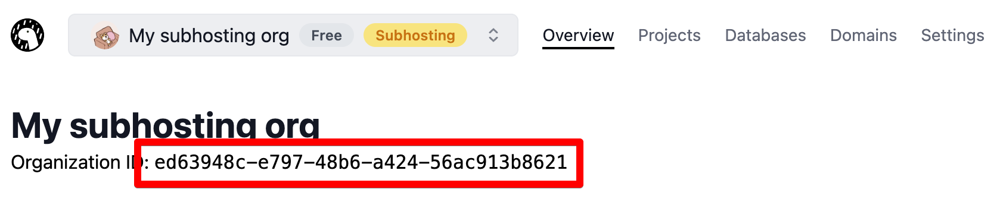

:::warning 2026 年 7 月 20 日停止服务

subhosting v1 API 将于 2026 年 7 月 20 日关闭。请迁移到
<a href="https://api.deno.com/v2/docs">v2 API</a>。详情请参阅
<a href="/subhosting/manual/api_migration_guide/">API 迁移指南</a>。

:::

开发者可以使用 Subhosting REST API 配置项目、域名、KV 数据库和其他资源。

## 端点和认证

Subhosting REST API v1 的基本 URL 如下。

```console
https://api.deno.com/v1/
```

v1 API 使用
[HTTP 令牌认证](https://swagger.io/docs/specification/authentication/bearer-authentication/)。
您可以在仪表盘 [这里](https://dash.deno.com/account#access-tokens) 创建一个访问令牌以使用 API。大多数 API 请求还需要您的组织 ID。您可以从 Deno Deploy 仪表盘中获取您的组织 ID。



使用您的组织 ID 和访问令牌，您可以通过列出与您的组织相关联的所有项目来测试您的 API 访问。以下是一个可以用于访问 API 的 Deno 脚本示例。

```typescript
// 将这些替换为您自己的！
const organizationId = "a75a9caa-b8ac-47b3-a423-3f2077c58731";
const token = "ddo_u7mo08lBNHm8GMGLhtrEVfcgBsCuSp36dumX";

const res = await fetch(
  `https://api.deno.com/v1/organizations/${organizationId}/projects`,
  {
    method: "GET",
    headers: {
      Authorization: `Bearer ${token}`,
    },
  },
);

const response = await res.json();
console.log(response);
```