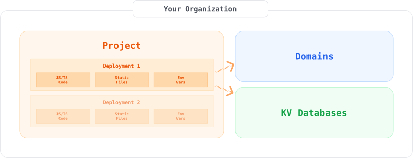

要构建 Deno Deploy 的子托管，了解系统内的一些关键资源是很有帮助的。这些资源在
[REST API](../api/index.md) 中也有体现。



## 组织

[**组织**](https://apidocs.deno.com/#get-/organizations/-organizationId-) 是与子托管实现相关的所有数据的容器。你的组织将有一个名称和一个 ID。每个组织都有一个分析端点，可以用来获取整个组织的指标（例如请求次数和使用的带宽）。

其他 Deploy 用户可以被邀请与组织协作，并且
[访问令牌](https://dash.deno.com/account#access-tokens) 可以让具有组织访问权限的开发人员通过 API 修改组织中的资源。可以在
[Deploy 控制面板](https://dash.deno.com/orgs/new) 中创建新组织。

## 项目

[**项目**](https://apidocs.deno.com/#get-/organizations/-organizationId-/projects) 是部署的组织容器。一个项目包含它的部署及其分析和使用信息。

项目是免费的，可以根据需要设置。

为了跟踪单个用户的用量以进行计费，有一个 API 端点可以报告每个项目的分析（带宽使用、请求次数等），并具有 15 分钟的颗粒度。

> 所有部署（无论是在同一个项目内还是不同项目之间）默认情况下不共享任何内容。项目是一种组织你的部署的方式，并且不收取任何费用。然而，分析是按项目进行报告的，如果你有多个租户，我们建议为每个租户设置一个项目。特别是如果你预计会根据他们的使用情况向你的用户收费。

## 部署

[**部署**](https://apidocs.deno.com/#get-/projects/-projectId-/deployments)：部署是一组配置、可运行代码和可在 Deno Deploy 中的隔离环境中运行的静态文件。部署有一个可以启动服务器的入口文件，可以与一个 [Deno KV](/deploy/kv/manual) 数据库相关联，并可以设置为运行在自定义域名上。

部署是一个不可变对象，包含：

- 要运行的源代码
- 静态资产
- 环境变量
- 数据库绑定
- 其他设置

我们提供查询或流式传输构建日志以及查询或流式传输执行日志的端点。

如果需要阻止或解锁一个部署，可以通过删除需要阻止的部署或解除分配其域名来完成。这将使部署不可达。

子托管系统构建得如此，使得一个部署的行为或负载不会影响其他部署。这同样适用于一个组织内的不同部署。容量按需自动扩展。如果你想限制特定部署或应用程序的资源，可以使用分析 API 为你提供详细的指标（请求次数、带宽等），以项目级粒度呈现。你可以利用这些信息决定是否关闭部署并使其不可达。

> 注意：**部署是不可变的**，但是，你可以创建一个新部署，然后将其域名重新映射到新部署。重新部署端点可以从现有部署创建一个新的部署，并使用不同的设置。

## 自定义域名

[**自定义域名**](https://apidocs.deno.com/#get-/organizations/-organizationId-/domains) 可以动态映射到部署，为其提供一个唯一的 URL（例如 `mycompany.com`）。

在使用域名之前，你需要
[验证所有权并提供或上传 TLS 证书](https://github.com/denoland/deploy-api/blob/main/samples.ipynb)。

如果你处于 [Builder 层级](https://deno.com/deploy/pricing?subhosting)，你可以使用通配符域名。一旦注册了通配符域名，你可以以两种方式使用它：

- 将所有 `*.mycompany.com` 的请求发送到特定的部署
- （即将推出）将不同的子域（例如 `foo.mycompany.com` 和 `bar.mycompany.com`）分配给不同的部署。

### 预发布环境与生产环境

当开发人员打开 Github 拉取请求时，Deno Deploy 终端用户平台会自动创建预览部署，而对“main”分支的提交则会自动转换为生产部署。虽然子托管并不提供开箱即用的 Github 集成，但它拥有定义创建预览和生产部署的所有必要原语。

## 连接 KV 数据库

(KV) 数据库存储键值对。当你创建部署时，可以使数据库对该部署可访问。KV 数据库可以被多个部署同时使用。

要在子托管中使用 KV：

- [使用 API 创建数据库](/deploy/kv/manual)
- 使用子托管 API 创建部署时，指定你创建的数据库。

> 注意：Deno Cron 和队列目前不适用于子托管。

## OpenAPI 规范和工具

Deploy API 的 [OpenAPI 规范](https://www.openapis.org/) 可以在此找到：

```console
https://api.deno.com/v1/openapi.json
```

该规范文档可与
[大量 OpenAPI 兼容工具](https://openapi.tools/) 一起使用。除了这里维护的 REST API 文档外，您还可以在 [这里](https://apidocs.deno.com/) 找到自动生成的 API 文档（包括基于浏览器的测试工具）。